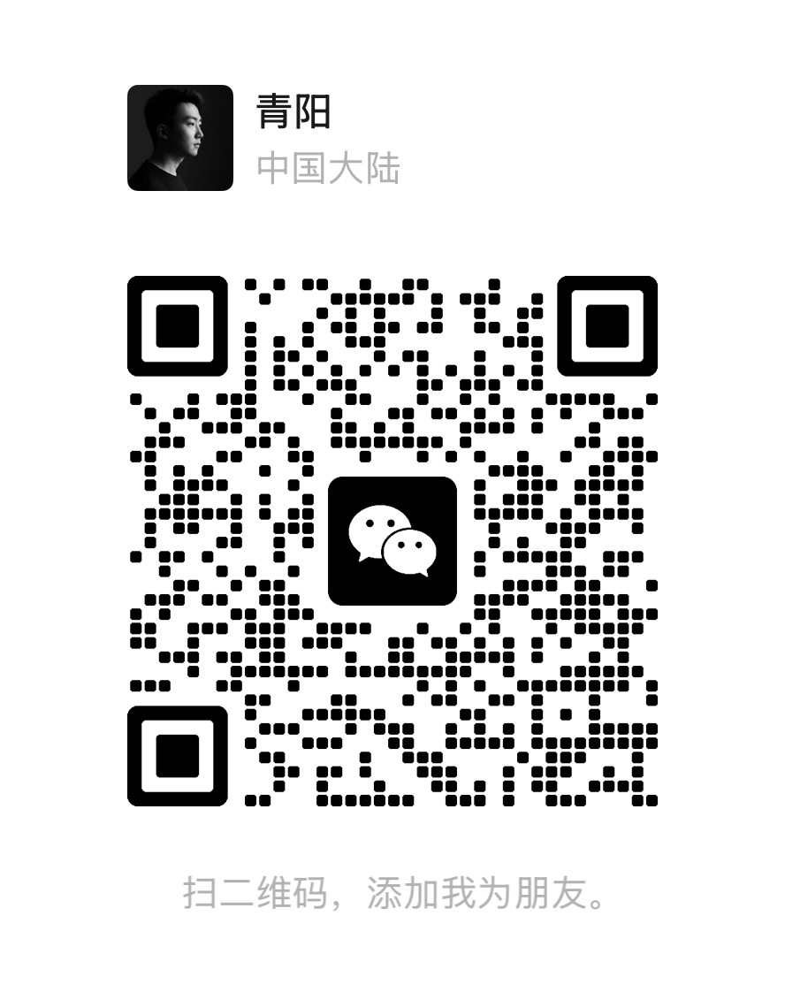

<p align="center">
  
</p>

<h1 align="center">Nomi</h1>

<p align="center">
  写剧本，生成图片，生成视频，剪辑导出。<br />
  <strong>在一个本地工作台里完成，素材不离开你的电脑。</strong>
</p>

<p align="center">
  <a href="README_EN.md">English</a>
  ·
  <a href="docs/quickstart.md">快速启动</a>
  ·
  <a href="docs/user-guide.md">使用指南</a>
  ·
  <a href="docs/provider-integration.md">接入模型</a>
</p>

<p align="center">
  <a href="https://github.com/aqm857886159/Nomi/stargazers"></a>
  <a href="https://github.com/aqm857886159/Nomi/releases/latest"></a>
  <a href="LICENSE"></a>
  
</p>

---

## 你可以用它做什么

在创作区写一段剧本，让 Agent 把它拆成 6 个镜头，自动在画布上创建图片节点和视频节点，并行生成，生成完成后按顺序放进时间轴。

你去倒杯水，回来视频已经排好了。

这是 Nomi 想解决的问题：**AI 视频创作的每一步都是割裂的**——写稿在一个工具，生图在另一个，生视频又是另一个，剪辑再换一个。Nomi 把这条流打通，放在本地，让 Agent 可以驱动整个过程。

---

## 三个核心差异

**全流程，不是单点工具**
剧本 → 图片节点 → 视频节点 → 时间轴剪辑 → 导出，数据在各环节之间自然流动，不需要手动导入导出。

**本地优先，数据在你手里**
项目文件、生成素材、剪辑记录全部存在本地。你决定哪些模型需要联网，哪些素材只留在自己的机器上。

**Agent 可以驱动整个工作台**
不只是聊天框里的 AI 助手。终端里说一句话，Agent 可以操作画布、触发生成、编辑时间轴，Web 界面实时展示变化。你也可以直接在 Web 上点。两种方式操作的是同一套状态。

---

## 快速开始

### 桌面版（推荐）

从 [GitHub Releases](https://github.com/aqm857886159/Nomi/releases/latest) 下载安装包：

- **macOS**：下载 `.dmg`，拖入 Applications，双击打开
- **Windows**：下载 `.exe`，安装后从开始菜单启动

无需 Docker，无需命令行，安装即用。

### 开发者版（源码启动）

需要 **Node.js 20+** 和 **Docker Desktop**。

```bash
git clone https://github.com/aqm857886159/Nomi.git
cd Nomi
corepack enable && pnpm install && pnpm start:local
```

打开 **http://localhost:5173**。

> 用 Claude Code / Cursor？把项目根目录的内容发给 AI，让它帮你执行。

---

## 配置

### AI 对话（创作区 / 终端 Agent）

编辑 `apps/agents-cli/agents.config.json`：

```json
{
  "apiBaseUrl": "https://api.deepseek.com/v1",
  "apiKey": "your-key",
  "model": "deepseek-chat"
}
```

支持 DeepSeek、OpenAI、Qwen、Ollama 等任何 OpenAI 兼容接口。国内推荐 DeepSeek，便宜且效果好。

### 图片 / 视频生成模型

在 Web UI 里配置：**右上角 → 模型管理 → 添加供应商 → 添加模型**。

支持即梦、可灵、Dreamina、Runway 等，也可以接入私有模型网关。详见 [docs/provider-integration.md](docs/provider-integration.md)。

---

## 项目结构

```
apps/desktop      桌面端（Electron，双击即用）
apps/web          Web 工作台（React + Vite）
apps/hono-api     本地 API（Hono + Prisma）
apps/agents-cli   终端 Agent
packages/schemas  共享协议
```

---

## 关于作者

**青阳** — AI 产品经理 / 创作者。微信：**TZ857886159**



---

Apache-2.0 License
