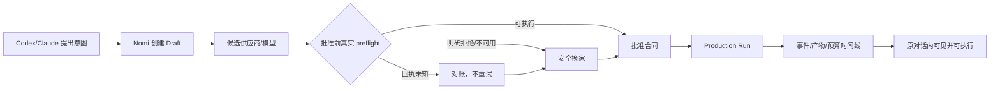

# Nomi MCP / Agentic 制作体验缺口审计

日期：2026-08-09  
范围：主仓当前 MCP、MCP Apps widget、Production Run、供应商选择、任务中心、设置与 Codex/Claude 外部宿主体验。  
方法：使用 `nomi-ux-audit` 固定尺子（入口重叠、两套心智、概念过载、字段未收纳、长尾占主路、文案/状态不一致、名实不符），并对照 MCP Apps 与 OpenAI 官方 UI 指南。

## 结论

当前缺口不是“再加几个按钮”，而是三条事实链没有闭合：

1. **供应商可选 ≠ 这一次真正可执行**：候选目录、批准合同和真实 taskKind/provider preflight 仍不是同一个硬门。
2. **MCP UI 现在是结果卡，不是对话内控制面**：widget 能展示、能深链，却不能在宿主对话里批准、换家、对账或继续运行。
3. **外部宿主没有持续的 Run 时间线**：`nomi_subscribe_run` 只是模型主动长轮询，widget 只取最后一条事件和一个预览，用户无法知道中间发生了什么。

因此目前体验是“Codex/Claude 发起 → Nomi 另一处处理 → 用户再去找 Nomi”，而用户期待的是“在原对话里看到同一件事，并能在同一张卡上完成下一步”。

## 证据与问题分诊

| 档 | 问题 | 证据 | 用户影响 |
|---|---|---|---|
| ⚫ D1 | **批准前供应商不可用没有安全换家出口** | 交接文档 §6.1、§6.2、§6.3；当前 `useProductionStatus.ts:162-179` 把批准失败统一引导到自动化设置 | 用户已经选了错误供应商，真正生成时才发现；随后只能停住，无法就地恢复 |
| ⚫ D2 | **MCP widget 与宿主对话不是同一个控制面** | `mcpAppWidget.ts:273-276` 只有“在 Nomi 打开”；`mcpAppWidget.ts:361-363` 只调用 `ui/open-link`，没有 `tools/call`、`ui/message` | 用户看到一张上下分离的结果卡，却不能在这张卡里确认、换供应商、对账或继续 |
| ⚫ D3 | **多个工具复用同一 widget，造成重复挂载/上下文割裂** | `mcpProtocol.ts:25-32` 给 `start/get/subscribe/artifact` 全部挂同一 UI；`mcpProtocol.ts:330-359` 每次工具结果都生成新的 UI payload | 每次查询都像出现一个新面板；对话没有一张持续更新的“当前 Run 卡” |
| ⚫ D4 | **外部宿主看不到完整发生过程** | `mcpProtocol.ts:182-201` 只有模型主动调用 `nomi_subscribe_run`；`buildNomiRunFromProjection` 只保留最后事件、最多一个预览（`mcpAppWidget.ts:86-109`） | 用户不知道哪个镜头完成、哪个失败、何时暂停、预算是否占用 |
| 🔵 B1 | **Durable 状态被压扁，宿主无法表达“等待批准/暂停/需处理”** | `mcpAppWidget.ts:57-69` 把 `awaiting_*`、`paused` 映射为 `available`；`mcpAppWidget.ts:281-282` 只有 5 个粗状态标签 | “等待人工确认”会看起来像“可查看/已完成”；用户不知道是否需要行动 |
| 🔵 B2 | **任务中心把所有非终态 Run 都显示为 running** | `productionRunTaskCenter.ts:21-34`：非 `completed/cancelled` 一律 `group: running`，`recoverable:false`，`action:null` | 等待批准、暂停、供应商故障被伪装成排队/生成中，用户无法从任务中心恢复 |
| 🔵 B3 | **模型目录的“可用”不是一次任务的可执行证明** | `availableModels.ts:94-100` 只从模型选项和 archetype 生成列表；`executableModel.ts:8-29` 主要检查 vendor/model/key，未在候选层完成完整 mapping + taskKind + 媒体能力 preflight | 供应商卡是绿的，具体镜头仍可能 401/402/422、缺 mapping 或类型不匹配 |
| 🔵 B4 | **主 Nomi、MCP widget、Task Center、Codex/Claude 四处各讲一半** | 设计稿规定“Nomi 是唯一编辑/批准/导出面”，但外部只收到摘要和深链；`ProductionStatusPanel.tsx:66-151` 的核心状态只存在 Nomi 内 | 用户需要在四个地方拼接事实；任何一个表面没刷新就会产生“到底有没有运行”的不信任 |
| 🟡 C1 | **供应商选择器缺少“为什么可执行”的证据** | 交接文档 §6.10、§6.11；候选当前按配置状态排序，未显示最近健康检查、taskKind 支持、预计费用来源 | 用户只能凭品牌名/绿点选择，无法判断这次镜头该不该交给它 |
| 🟡 C2 | **设置把连接、模型能力、自动化权限分开，却没有“按本次 Run 预检”入口** | `SettingsDialog.tsx` 已有 `ai` 与 `automation` 两 tab；`AiModelsSection.tsx` 展示 provider health，但不绑定当前 Run 的任务集 | 设置看起来都正常，运行时仍失败；用户不知道该检查哪一层 |
| 🟢 A1 | **widget 接收消息未限制来源，且 `postMessage` 使用 `*`** | `mcpAppWidget.ts:286`、`mcpAppWidget.ts:343-359`；OpenAI 官方示例要求校验 `event.source === window.parent` | 不是当前主用户痛点，但属于宿主兼容/隔离卫生项，应在正式交互动作前修掉 |
| 🟢 A2 | **widget 文案和状态是硬编码中文，不能跟随宿主 locale** | `mcpAppWidget.ts:174-179`、`mcpAppWidget.ts:261-282` | 在英文 Codex/Claude 中出现中文“等待中/生成中/在 Nomi 打开”，破坏可信度 |
| 🟢 A3 | **工具调用状态文案过于粗糙** | `mcpProtocol.ts:443-447` 所有带 widget 工具共用“生成中/已出图” | 制作草稿、查询 Run、对账、读取产物都被说成“生成”，用户误判当前动作 |

## 用户真实旅程中的断点

现在的断点在 `D`、`F/G`、`I/J`：后端安全状态正在补，但外部宿主 UI 没有消费这些状态；widget 只负责展示一帧，不能把下一步动作送回能力核。

## 别人怎么做

MCP Apps 官方的核心模式是“Tool + UI Resource”：工具声明 `_meta.ui.resourceUri`，宿主把 iframe **渲染在对话上下文里**，UI 通过桥双向调用工具。[MCP Apps 官方概览](https://modelcontextprotocol.io/extensions/apps/overview)

OpenAI 的官方实现给了几条直接可抄的交互原则：

- UI 只是渐进增强；没有 UI 的宿主仍能完成工作。
- 使用 `tools/call` 让 widget 内的按钮调用工具，使用 `ui/message` 把结果继续写回对话。
- 小结果用 inline card；需要持续可见的任务用 picture-in-picture；复杂编辑才进入 fullscreen。
- **数据工具和渲染工具分离**：不要给每个查询工具都挂 widget，否则 iframe 反复重挂；只让 render tool 产生 UI。[OpenAI “Add UI to your MCP server”](https://developers.openai.com/plugins/build/chatgpt-ui/)

这正好解释了当前“上下两个界面很扯”的根因：我们把 `start/get/subscribe/artifact` 都当成 render tool，并且 widget 只支持 `open-link`，所以宿主只能不断追加结果卡，无法形成一张连续的对话内控制面。

## 建议的目标交互

### 1. 原对话内的单张 Run 卡

卡片固定显示：

- `来自 Codex/Claude`、项目名、Run 名称、当前阶段。
- 一句当前事实：`正在生成镜头 03/08`、`等待你批准新的供应商合同`、`提交结果不明，先对账`。
- 镜头条带：已完成 / 进行中 / 等待 / 失败 / 未提交。
- 预算四项：已授权、已预留、实际、未决；未知时明确写“未能确认”，不显示假数字。
- 只放一个主按钮：批准合同 / 选择替代供应商 / 对账 / 查看产物 / 在 Nomi 继续。

### 2. 交互动作分层

- 只读：查看 Run、查看事件、查看产物、查看供应商健康。
- 可逆修改：编辑 brief、调整未提交镜头、选择替代供应商。
- 花费/不可逆：批准合同、再次提交未知任务、发布、覆盖、删除。

每个动作都通过 widget 的 `tools/call` 回到 Nomi capability core；批准仍由 Nomi 的 durable gate 决定，不能让 widget 自己绕过。

### 3. 时间线而不是“最后一条消息”

保留 durable cursor，但在宿主里维护一个 Run 卡状态：

`draft → preflight → waiting approval → running → provider accepted → validating → ready → adopted / needs attention`

每个节点至少显示发生时间、镜头、供应商、task id（有则显示）、花费状态和下一步动作。`subscribe_run` 应作为后台数据源，不能要求模型每次主动说“再查一下”。

## 设置应该怎么分

当前已有 `AI 与模型`、`自动化与权限` 两个方向，但还缺“本次运行预检”。建议最终 IA：

1. **AI 与模型**：供应商连接、模型能力、taskKind/mapping、最近一次健康检查、测试此模型。
2. **自动化与权限**：默认自动化模式、可信宿主、预算上限、重试/并发、敏感上传、通知。
3. **运行时合同**：只在当前 Run 展示本次 plan hash、供应商、任务集、预算和批准有效期；设置不能替代合同批准。
4. **通知**：等待批准、供应商拒绝、回执未知、任务完成、需要人工对账；每类可选系统通知/声音/仅应用内。
5. **诊断**：最近 preflight 结果、错误分类、providerTaskId、idempotency key、事件 cursor；默认折叠，出问题时可展开。

## 修复顺序

1. 先完成交接文档中的后端安全闭环：批准前 preflight、明确拒绝分类、`not_found` 对账后换家、部分完成镜头 rebind、task id 透传、预算 settle、restart recovery、WAL。
2. 同一提交内修正宿主投影：细分 widget 状态、显示事件时间线和任务集，不再只显示最后一条事件/一个缩略图。
3. 把 `nomi_start_playbook` / `nomi_get_run` / `nomi_subscribe_run` 改成数据工具；增加一个明确的 `nomi_render_run`（或等价单一 render tool），避免每次查询重挂 iframe。
4. 给 widget 增加 `tools/call` 与 `ui/message`：只暴露安全动作，批准/换家/对账由能力核再次校验。
5. 把“在 Nomi 打开”降为复杂详情的次级入口，而不是唯一出口。
6. 最后做 Codex、Claude、Cursor 三个宿主的真实走查：同一 Run 从发起到失败恢复，截图逐帧对账；不支持 MCP Apps 的宿主仍要有诚实文本兜底。

## 参考实现

- MCP Apps 官方规范与 quickstart：<https://modelcontextprotocol.io/extensions/apps/overview>
- MCP Apps 官方 API/示例：<https://apps.extensions.modelcontextprotocol.io/>
- OpenAI 组件、双向桥、inline/fullscreen/PiP、数据工具与渲染工具分离：<https://developers.openai.com/plugins/build/chatgpt-ui/>
- Nomi 当前能力核与生产设计：`docs/superpowers/specs/2026-08-08-agentic-production-experience-design.md`
- Nomi 当前恢复交接：`/Users/aoqimin/Desktop/Nomi-production-budget-ux/docs/handoff/2026-08-09-production-mcp-provider-recovery-handoff.md`

本审计只修改了审计文档和 backlog，没有修改业务代码、没有提交、没有触发供应商调用。
