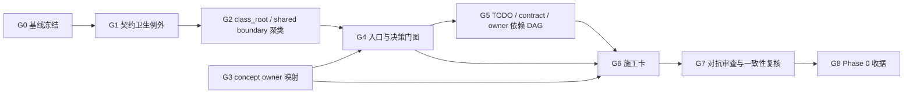

# Phase 0 依赖与迁移闸门

> 状态：✅ Phase 0 账本包完成；迁移准入：BLOCKED
> 基线：`origin/main@1f39ea3cf` · 日期：2026-09-26

## 已冻结的施工默认值

| 决策 | Phase 0 默认值 | 为什么先这样定 | 何时才允许改 |
|---|---|---|---|
| 画布远程/付费生成 | 强制进入 `ProductionRun`；本地非付费才可保留 bounded context | 先消灭重复扣费与未知提交的双生命周期 | 只有真实 provider、授权、outbox、reconcile 和重开证据齐全后 |
| 分镜 ledger B | 禁止新的 Agent 写入；Run projection parity 后退休，现有目标 2026-10-16 | 作者正文与执行计划各有生命周期，长期双写会继续分叉 | 既有消费者迁完且可重建 projection 后 |
| 模型参数 | catalog 声明/校验 + `ExecutionContract/compileParameters`；UI 只读派生能力 | 把 default、unsupported、strictness 放在最早共享边界 | 新字段有 schema/type/parity/red-test 收据后 |
| 出价/待决身份 | durable identity = `projectId + operationId`；`quoteId` 只是报价版本指纹 | 报价会变，操作身份不能跟着报价漂移 | ProductionRun owner 和现有消费者迁完后 |
| 画布缩放 | React Flow transform 是 live zoom；`workbenchStore.categoryViewports[*].zoom` 只是持久化偏好 | 交互实时状态与记住的视角不是同一生命周期 | 五个直接 store reader 迁移并完成性能验证后 |
| terminal guarantee | 共享代数/guard policy；Run/session 仍各自拥有生命周期 | 共享规则，不共享两个不同生命周期的状态机 | 统一 crash/replay 与 provider 证据后 |
| skill loading | pi framework 管 discovery/format；Nomi 管 identity/language/orchestration | 不重造框架加载器，也不把 Nomi 业务身份交给外部框架 | framework-surface 对照有新字段时 |

上述是 Phase 0 的施工默认值，不代表运行时代码已实现。它们把真正的不可逆选择显式化，避免 Phase 1 边写边改方向。

## 执行 DAG

| 闸门 | 输出 | 状态 | 放行含义 |
|---|---|---|---|
| G0 | 基线 SHA、tree、工作树、禁止新增 owner 的范围 | COMPLETE | 后续差异可归因 |
| G1 | 606 合同的版本/字段/证据例外账 | COMPLETE | 历史债和新债分开 |
| G2 | 七个结构簇、误报规则、606 条 contract→cluster 映射与 graph evidence | COMPLETE_WITH_EXCEPTIONS | 16 条合同标记人工复核；宏簇是派工索引，不替代 class_root/shared boundary 语义审查 |
| G3 | 38 个概念 owner 映射；两个 pending 有边界例外 | COMPLETE_WITH_EXCEPTIONS | 现有消费者可读，新写口禁止 |
| G4 | door map 与 decision gate 分离；入口对等矩阵 | COMPLETE_WITH_EXCEPTIONS | 可计算写 owner 与投影边界 |
| G5 | TODO/合同/owner 的依赖 DAG 与 V0/V1/V2 分层 | COMPLETE | 不把后置工作提前混进 pilot |
| G6 | 七簇完整施工卡与 red-test/rollback 要求 | COMPLETE | Phase 1 可按卡开工；真实实现仍受各卡 blockers 约束 |
| G7 | 独立 agent 报告 + 主会话自审 | COMPLETE | 反方意见已进入本账本 |
| G8 | 本文档、逐合同映射、例外账、七张施工卡、簇索引、契约卫生、Phase 0 计划 | COMPLETE | ledger package 完成；16 条人工复核和生产迁移仍 blocked |

`COMPLETE_WITH_EXCEPTIONS` 不是生产代码通过：它表示例外已被命名、绑定 owner/条件，且不会被隐藏成“全绿”。

## Phase 1 准入条件

以下任一项未满足，Phase 1 只能做治理门和 red tests，不能切换生产 writer：

- `check:concept-owners` 可对新增概念和第二写口 fail-closed；TODO T-QA-24 仍未实现。
- direct canvas remote/paid 路径有同一 `ExecutionContractV1 → authorization → outbox → observation → artifact` 的真实 Electron/provider 证据。
- Run journal、intent log、approval/budget side-ledger 有 commit marker、崩溃点恢复矩阵和 crash-injection 测试。
- 冷重启、重开项目、切换项目、跨宿主和 Windows storage evidence 能用稳定身份重建同一 Run。
- 画布缩放的五个 store 直接读取者完成迁移，或明确成为长期设计实验室例外并有到期日。
- `mcpGenerationToolCatalog.ts` 五个手写工具完成统一 registry 评估，未统一前不得继续扩充第二套工具描述。
- 每张施工卡有 red test、门表、旧路径删除点、回滚方式和真实证据 owner。

## 不做的捷径

不新增第三套 `GenerationIntent`，不建立全局万能 store，不用长期双写，不用 renderer fallback 掩盖缺失的 owner，不用 fixture、静态门岗或本地 green 代替真实 provider/Electron/冷重启/Windows 证据，也不把 `doors` 数量当成架构质量分数。
