# 左侧栏 · 画布节点 · 过程反馈（2026-09-08 用户裁决成文）

> **状态**：✅ 设计已拍板；2026-09-10 完成离线画布成文与 14 张浏览器 PNG 导出。设计归档不等于全组已实施。
> **本单实施范围**：B 组第一项 `shot_table`；A 左侧栏、B 节点菜单收束与框工具、C 过程反馈均不在本单实施。
> **来源**：用户保存的 `~/Desktop/Nomi-handoff-20260909/design/left-sidebar-canvas-nodes-process-feedback.canvas.html` 与 `left-sidebar-extracted/*.dc.html`，共 14 画板。源板页头仍写 09-06，本文日期按用户 09-08 裁决，不篡改原图。
> **上位约束**：[拆解表节点方案](../plan/2026-09-07-storyboard-table-node.md)、[表是节点的投影](../lessons/shot-table-is-a-projection-of-canvas-nodes.md)、[分镜表 v6 合同](2026-09-05-storyboard-table-v6-design-contract.md)、[设计系统](nomi-design-system.md)。
> **截图性质**：同名目录 PNG 是本地画板在 Chrome 中的真实渲染；其中嵌入的 Electron 截图是源画布保存的历史证据，不能冒充本次改前/改后产品走查。

## 来源、导出与裁决优先级

PNG 于 2026-09-10 经 web-access CDP 在本任务创建的本地标签页导出；CSS 画板宽 1440，DPR 2，PNG 宽 2880。超过视口的画板按滚动位置截图、裁掉视口外空白并无损拼接；未重画、缩放或替换源板内容。离线文件虽引用缺失的 `support.js`，原生 HTML、内联 CSS/SVG 与内嵌图片均可直接渲染，不需要补运行时；原文件未修改。所有临时标签页已关闭。14 板接触表与 TableNode 全图已人眼检查。

原稿有数处演进痕迹，不能把每句历史描述同时当合同：

| 源板痕迹 | 成文处理 |
|---|---|
| Main 标题/DeconNow 写“两个新节点”；LinkNode、TableNode、Nodes 又明确导入不新增 kind、两表同一骨架 | 按详细板与 09-07 方案：只新增 `shot_table`；导入复用现役视频/素材载体 |
| TableNode 对比表末尾残留“手动补/三条路”，空态却已删“手动加一行” | 按其修订后空态和 Nodes：只有原稿拆镜、参考片拆解两条来源；不放自由建空表入口 |
| Surfaces 标题写 `<1180` 自动收起，末段又写 `1180–1400` mini、`≥1400` 展开，`900–1180` 未闭合 | 原图保留，断点冲突登记；A 实施前需收敛为完整区间，本单不任选数字写生产代码 |
| Surfaces 示意画面横向账使用 Agent 300，Creation 与接缝合同为 390 | 390 是已引用的 Agent v4 合同值；300 只作旧示意尺寸，不另造固定宽度 owner |
| Flow3 对旧 badge/row 的留改处置，与 09-07 方案删除清单不同 | 接线与删除以 09-07 方案及实际调用关系为准，截图仅保存设计演进证据 |
| Frame 写“值得排在拆解轨之前” | 本单最新用户顺序是先 `shot_table`，框工具另单，不让旧建议改写本单范围 |

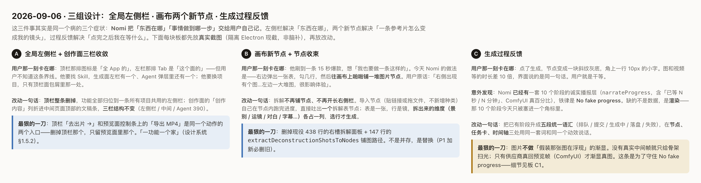

## A · 全局左侧栏与创作面三栏

本组把“当前项目”“项目内资源”“跨项目共用资源”分清，将创作内容列表移入中间编辑面。以下是归档规格，本单不改左侧栏。

### 画板截图

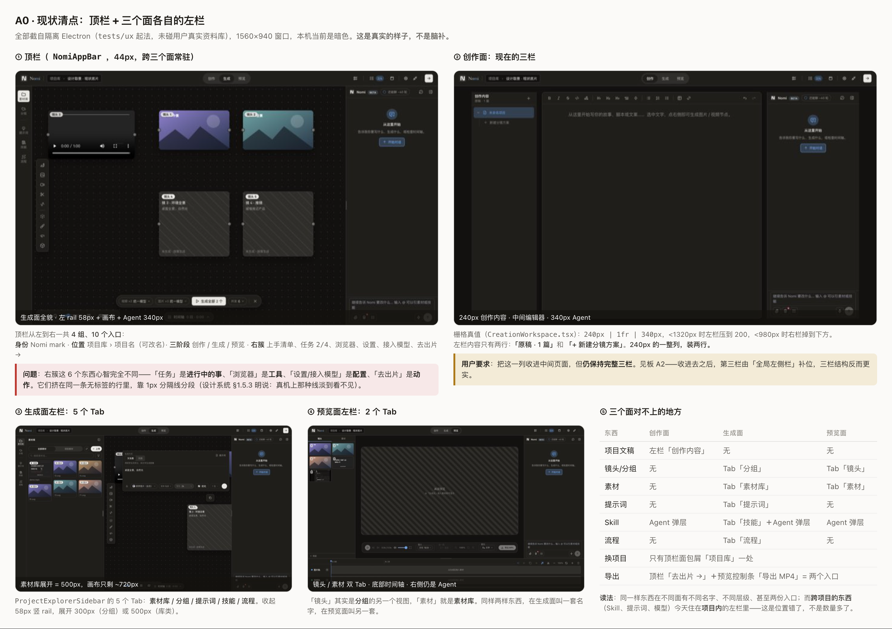

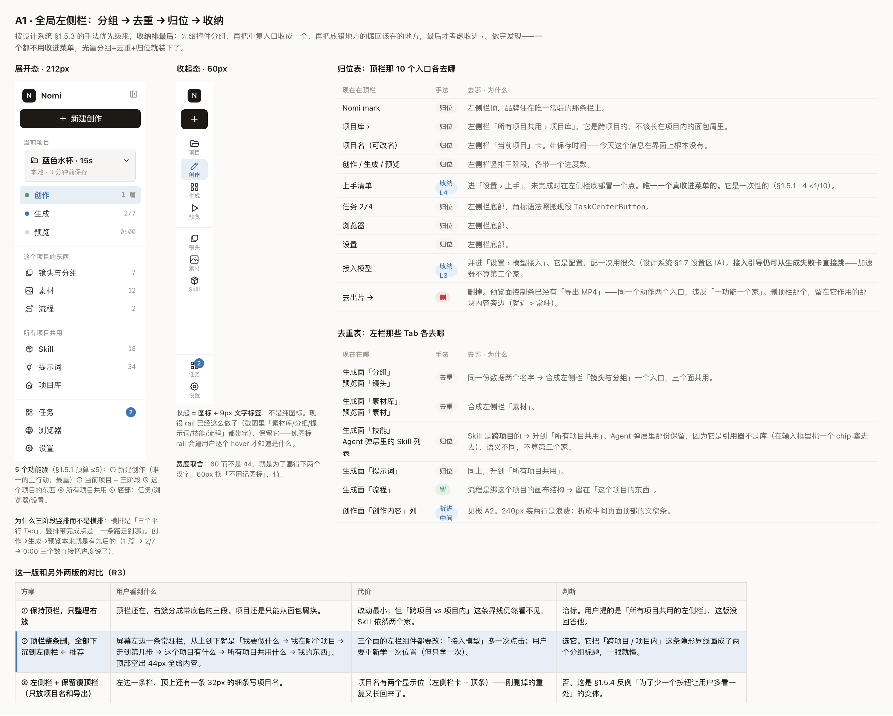

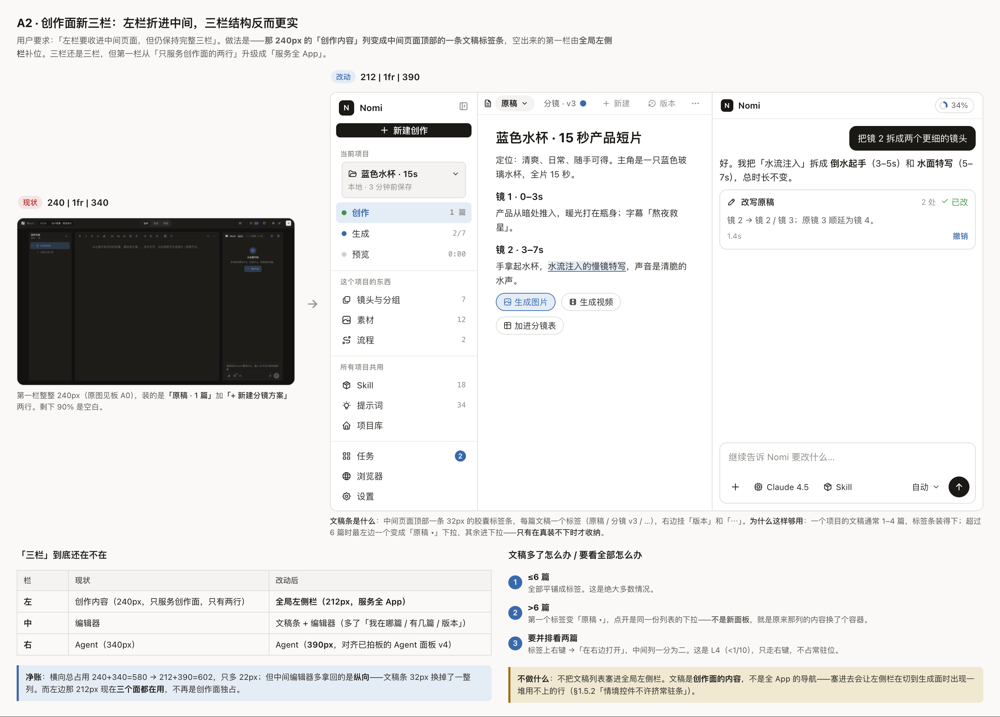

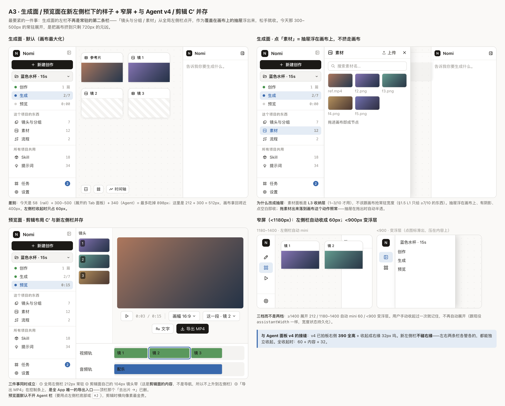

### 规格表

| 项 | 拍板规格 | 边界/依据 |
|---|---|---|
| 常驻导航 | 展开 212px，收起 60px；收起保留图标和短文字 | Rail；不用纯图标迫使用户逐一 hover |
| 五个功能簇 | 新建创作；当前项目与创作/生成/预览；项目资源；跨项目共用；底部任务/浏览器/设置 | Rail；阶段携带真实进度数，不伪造 |
| 项目资源 | 镜头与分组、素材、流程 | 生成与预览同物同名；流程仍绑项目 |
| 全局资源 | Skill、提示词、项目库 | Agent 输入框 Skill 选择器是引用器，保留，不当第二个库 |
| 顶栏归位 | 品牌/项目名/阶段/任务等移至左栏；接入模型归设置，上手归设置 | 留失败卡直达接入的情境加速器 |
| 导出 | 只留预览面控制条“导出 MP4” | 删除旧顶栏“去出片”重复入口 |
| 创作中栏 | 顶部 32px 文稿条，≤6 篇平铺；>6 篇转同列表下拉；右侧版本/更多 | 文稿不上升为跨面导航；右键并排阅读是低频入口 |
| 三栏 | 左全局栏 / 中编辑器 / 右 Agent；Agent 按 v4 的 390 与右缘 32 坞 | 两边可独立收起，不复制宽度状态 |
| 生成资源面板 | 素材/镜头等变覆盖画布的抽屉，点空白收起，拖出半透 | 不让第二条常驻栏继续挤画布 |
| 预览 | 保留剪辑 C′ 的 104px 镜头带；默认 Agent 不开 | 镜头带是内容，非全局导航 |
| 窄屏 | mini / 浮层，手动收起记忆优先 | 源板断点有冲突，见上表，A 实施前单独收敛 |

### 与现状差异

NowShell 的宽度账与节点次数是源板当时的观察，不是本次重新读取用户资料库所得。本次只核对源码：`src/workbench/WorkbenchShell.tsx:359` 仍挂 `ProjectExplorerSidebar`，`:364` 在创作资源树模式挂 `DocumentListSidebar`；`src/workbench/creation/CreationWorkspace.tsx:19` 明确资源树由 Shell 跨 creation/storyboard 持有，`:30` 的右栏使用现役 `assistantPaneWidth`。因此 A 实施应围绕现役宿主收敛入口，不能照历史截图重新造一套三栏状态。

### 实施顺序

A 另单先闭合窄屏区间与现役宿主差异，再做全局导航归位及去重，随后文稿条、资源抽屉、预览接缝，最后做宽窄屏/折叠记忆/键盘与真实任务验收。本单仅保存规格和截图。

## B · 拆解表节点、节点收束、框工具

用户本单的“B 第一项”指 `shot_table` 实施，不是把源板 B1–B5 全部交付。源画布编号保留：LinkNode=B1、TableNode=B2、Flow3=B3、Nodes=B4、Frame=B5。

### 画板截图

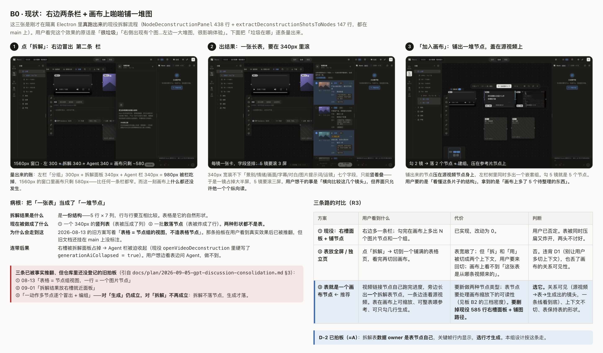

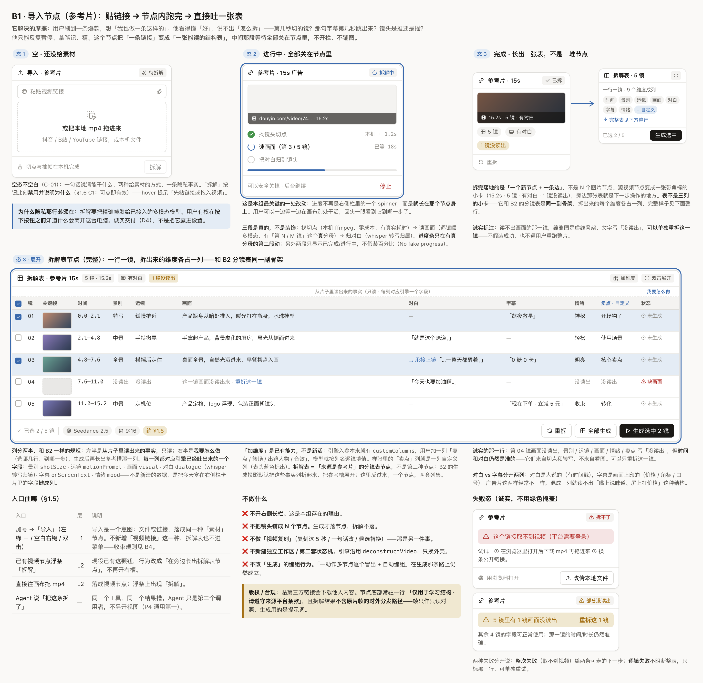

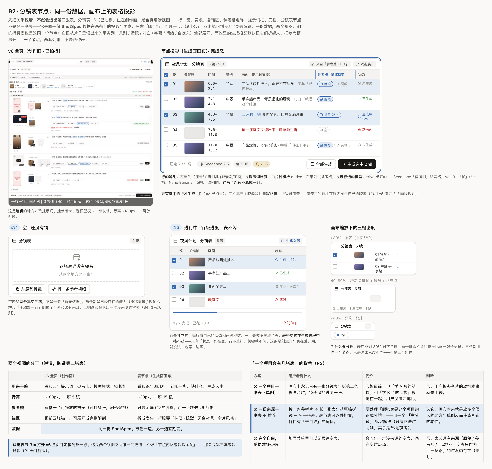

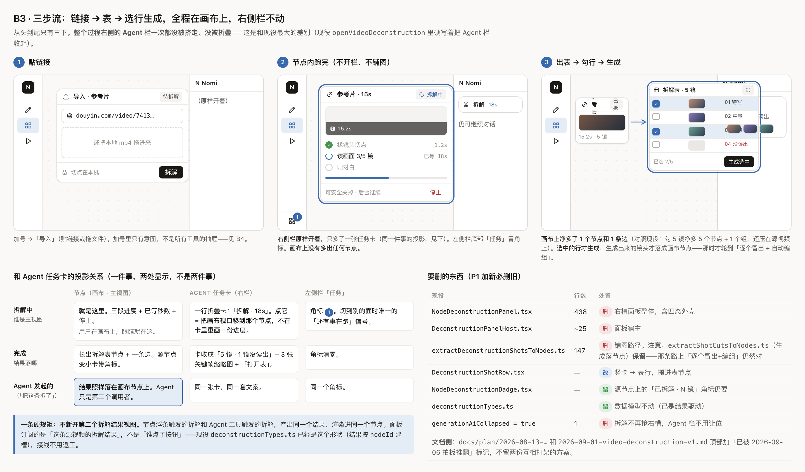

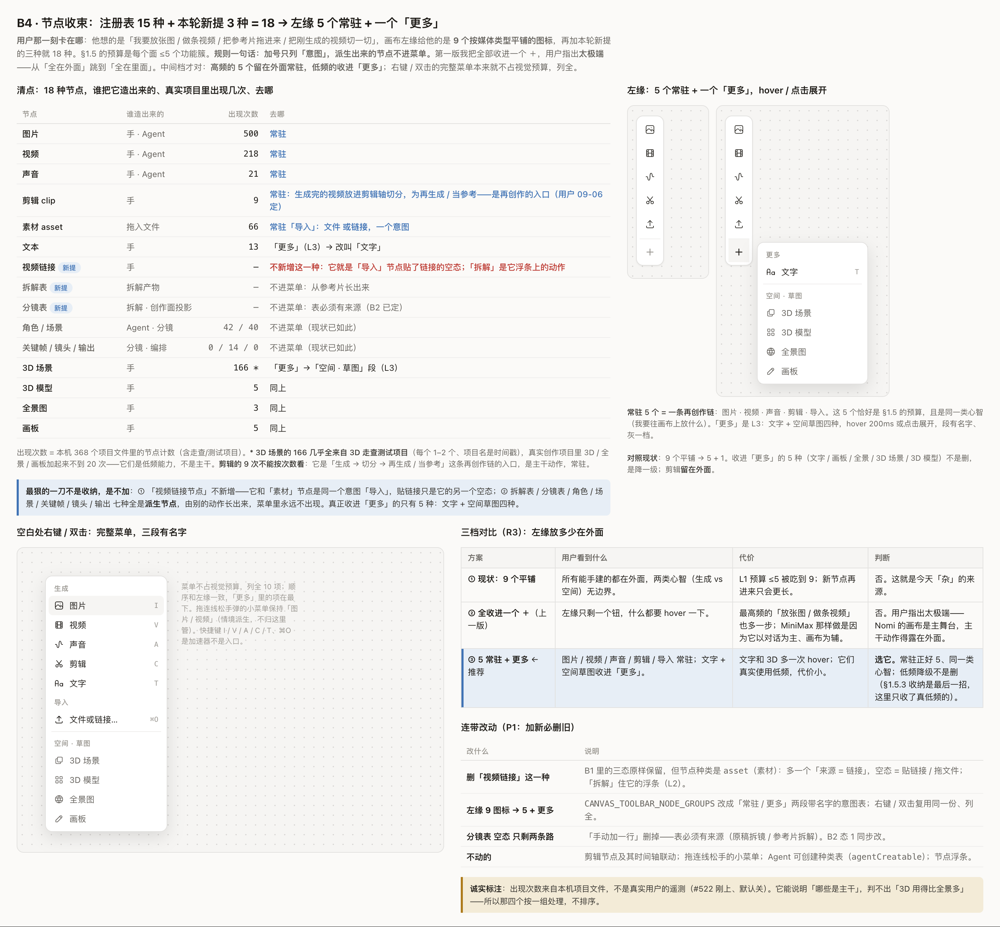

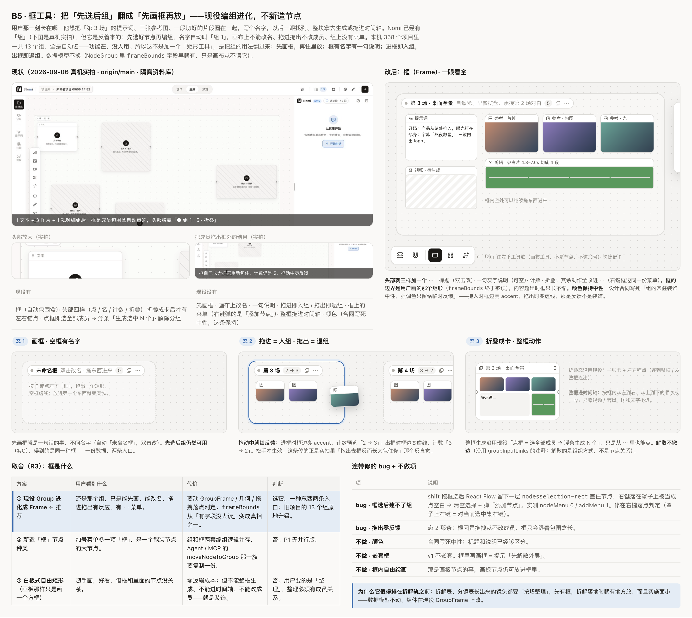

### 规格表

| 项 | 拍板规格 | 数据与交互边界 |
|---|---|---|
| 唯一新增 kind | `shot_table`，来源为文稿或参考片 | 表不进入自由建节点菜单；不新增“视频链接” kind |
| 两 owner 零复制 | storyboard 读穿方案与绑定镜头有效值；deconstruction 自持事实行 | storyboard 节点只存来源、列集、密度、选中与尺寸，不存 rows；事实不能硬塞进 PlanShot |
| 来源关系 | 一份来源一张表，源视频→表一条边 | 拆解只长出一张表；选行生成后才落镜头节点和组 |
| 事实列集 | 镜号、关键帧、时间、景别、运镜、画面、对白、字幕、情绪、自定义、状态 | 对白与画面字幕分列；未读出字段诚实标注，保留可靠时间和对白 |
| 生产列集 | 提示词维度与参考输入槽分两半；模型决定该行 slots | 消费现役声明式槽；表只显示满/空胶囊，复杂编辑仍在 v6 |
| 稠密表壳 | 约 30px 行高，一屏约 15 镜；固定列宽、sticky 表头、内滚、可调整尺寸 | 目标密度不是给生产添加任意 px token 的许可 |
| 缩放密度 | ≥80% 全表；40–80% 关键帧/镜号/状态；<40% 摘要卡 | 同一节点同一组件；状态变化不重排行、不闪关键帧 |
| 编辑通道 | 双击行打开 v6 并定位该行；参考槽胶囊定位相应格 | 不新增节点内联提示词编辑器；改一行后表和绑定镜头同步 |
| 空态 | 从原稿拆镜 / 拆参考视频两条真实路径 | 不加任意空行与“确认落画布”中间关卡 |
| 生成 | 生成选中 N 镜，批量默认值可行级覆盖 | 复用现有生成、落地、编组与整批撤销；不新造阶段机 |
| 参考片三段 | 本机找切点→逐镜读画面→归对白 | 只有真实分母才给进度；单镜失败可重拆，整次失败给可走下一步 |
| 源片完成态 | 时长/镜数/对白/失败镜数角标；表旁连线 | 不占第二条右栏、不挤走 Agent；Agent 只是同能力第二调用者 |
| B4 菜单收束 | 图片/视频/声音/剪辑/导入 5 常驻 + 更多；右键/双击完整菜单 | 本单不实施；派生表/角色/场景等不进手建菜单 |
| B5 框 | 现役 Group 进化，F 先画框、双击改名、说明、拖进出成员预览、整框动作 | 本单不实施；不新增框 kind、不造第二套编组、不做嵌套/彩色常驻装饰 |

### 与现状差异

开工源码仍有 `src/workbench/NomiStudioApp.tsx:779` 的 `DeconstructionPanelHost` 与 `src/workbench/generationCanvas/store/canvasStoreTypes.ts:152` 的右槽状态。它们是替换参考片拆解外壳时要清掉的旧入口，不是保留一个右槽再并排加表。旧节点注册与主进程镜像要一致，详见 09-07 方案 §6。

**投影 owner 需按现役代码理解。** [lesson](../lessons/shot-table-is-a-projection-of-canvas-nodes.md) 第 6 行声明它记录产品意图，不能据此把方案 owner 全搬到 canvas。`src/workbench/creation/storyboard/shotRow/shotRowModel.ts:78` 的 `effectiveShotValue` 已定义未标记字段归 plan、手改字段归绑定原始节点；表只读 raw plan 会漏掉用户手改。`src/workbench/workbenchDocumentSlice.ts:300` 已在方案写入后调用投影桥；`src/workbench/creation/storyboard/exec/storyboardProjection.ts:68` 负责更新绑定镜头并保留 override。新表复用这条链，不缓存另一份镜头数据，不写第三套同步。

行状态沿用 `src/workbench/creation/storyboard/exec/storyboardRowStatus.ts:102` 的 `deriveShotRowExec`；参考槽继续来自该行模型 mode，不能把源图举例中的 Seedance/Veo 列数写成固定列数。表在 React Flow 内消费现役 `nowheel`、`nodrag` 与 `generation-canvas-react-flow__no-pan`，后者配置在 `src/workbench/generationCanvas/reactFlow/GenerationCanvasReactFlowViewport.tsx:187`。

### 实施顺序

1. 本单：先把 `shot_table` kind、来源/schema 与零复制投影落实，再接现役稠密表壳、选择、定位与文稿写入链；参考片路径遵守 09-07 方案的两 owner 契约与删旧边界。
2. 本单：设计实验室 specimen/基线；隔离资料库 R13 跑“文稿拆解→表节点→全页改一行→镜头节点同步”，同时证明表没有落盘 rows、手改 override 不被覆盖。真实改前/改后截图进 PR，本文设计截图不代替它们。
3. 后续独立任务：B4 节点菜单收束、B5 框工具，分别对现役菜单与 Group 做局部替换和走查。本单不按旧 Frame 的优先级建议插入框实施。

“主分镜”名称与时间轴选择规则、节拍/情绪进入 planner 的新语义仍按 09-07 方案的开放取舍处理；画板里的示例不构成本单扩展模型 schema 的授权。

## C · 生成过程反馈

本组规格是对既有真实阶段数据的呈现合同。本单不实施 C，也不能把历史 C0 当成 09-10 的代码现状。

### 画板截图

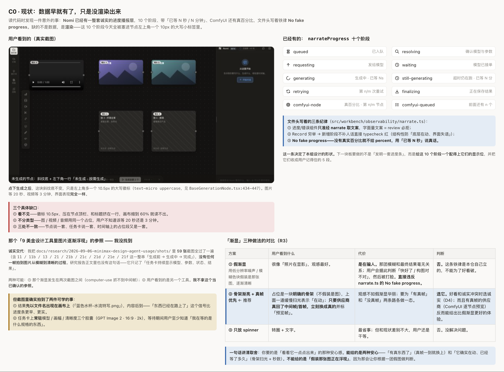

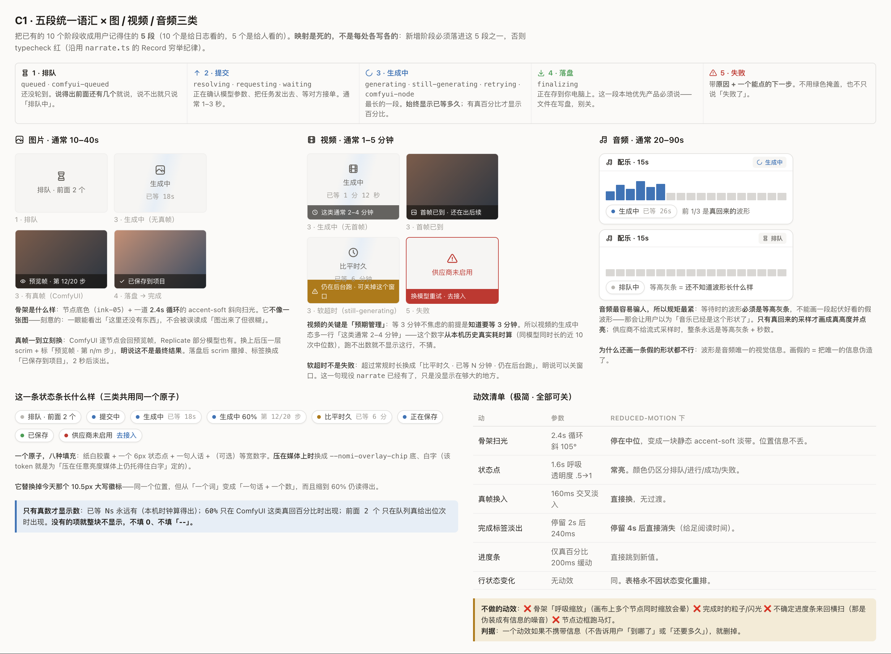

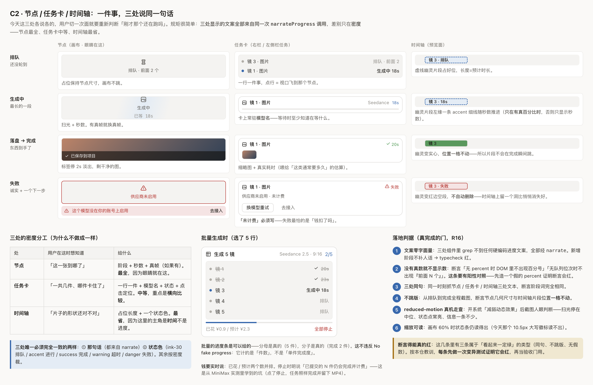

### 规格表

| 项 | 拍板规格 | 诚实边界 |
|---|---|---|
| 五段语汇 | 排队 / 提交 / 生成中 / 落盘 / 失败 | 既有阶段穷举映射；成功是结果，不新造另一套任务状态机 |
| 排队 | 有真实队列位次才说前面 N 个，否则只说排队 | 不填 0 或假队列数 |
| 生成中 | 已等时长；真百分比/真预览帧可附加 | 不用假模糊图伪装最终图逐渐生成 |
| 图片 | 明确骨架 + 缓慢扫光；真帧到就显示并标“预览帧” | 最终保存后撤遮罩，不提前报完成 |
| 视频 | 无首帧保留骨架；有首帧说明后续仍在出；软超时说明后台继续 | 常规耗时仅从同模型同时长近 10 次真实中位数得出，无样本不显示 |
| 音频 | 无真实样本只用等高灰条，有真采样才画真实波形 | 禁伪造起伏波形 |
| 通用状态条 | 状态点 + 人话 + 可选等宽数字，媒体上用 overlay token | 缩到 60% 仍可读；不存在的数据整项省略 |
| 三处同句 | 节点最全，任务卡中等并支持定位，时间轴最省 | 同一反馈 derive；状态色一致，密度可不同 |
| 几何 | 排队到完成节点尺寸/时间轴片段位置保持 | 失败留可见空段，不悄悄消失 |
| 批量 | 完成件数/总件数、已花/预计并列 | 有真实分母才画条；停止诚实说明已提交任务仍可能完成并计费 |
| 动效 | 扫光 2.4s、状态点 1.6s、真帧淡入 160ms、完成标签 2s 后淡出 240ms | reduced-motion 下静态扫光/常亮/直接换帧；标签停 4s 后消失 |
| 失败 | 具体原因与可执行下一步 | 计费状态只显示有凭据的事实，不凭失败猜“未计费” |

### 与现状差异

C0 记录“10 阶段塞进小角标”是源画布观察时的历史。09-10 开工基线已存在 `src/workbench/observability/generationFeedback.ts:18` 共享 derive，`:15` 以节点/时间/语言缓存同次播报；`src/workbench/generationCanvas/nodes/NodeGenerationStatus.tsx:8`、`src/workbench/taskCenter/taskCenterEntries.ts:85`、`src/workbench/timeline/TimelineGenerationFeedback.tsx:7` 已消费该反馈。`NodeGeneratingOverlay.tsx` 与 `GenerationStatusBar.tsx` 也已存在，因此不能再派“从零实现 C”或复制 narrate。本文只归档规格；是否每条动画/数值/软超时/三面同句均达到设计，需独立按真实旅程验收，不能靠文件存在宣称完成。

### 实施顺序

C 后续先按当前共享 derive 对账源板，确认缺口再局部补齐；依次核对真实数字与预览素材、三面呈现与几何、错误下一步、reduced-motion/60% 缩放。不得重复造文案 owner；同句/无假数/不跳版的断言要有能变红的阳性对照。本单不动这些实现与测试。
