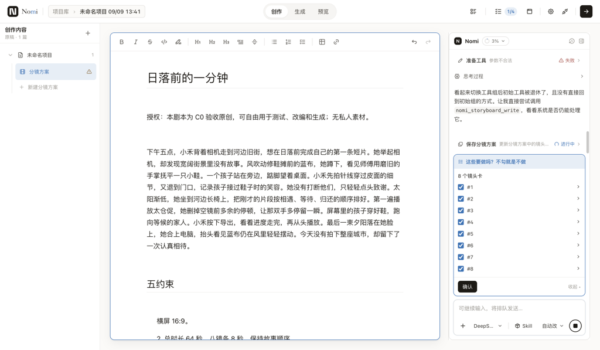
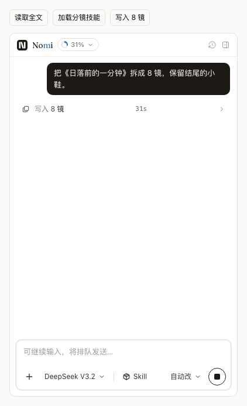
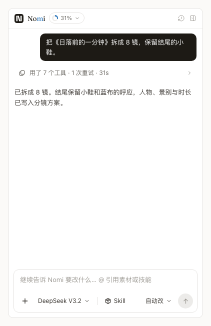
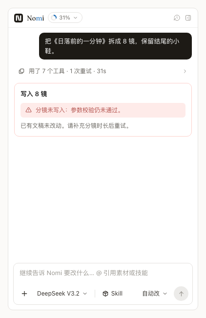
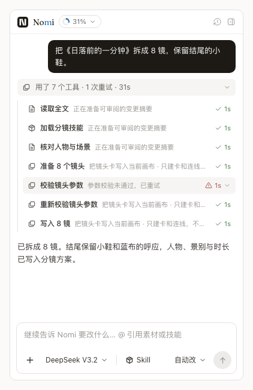
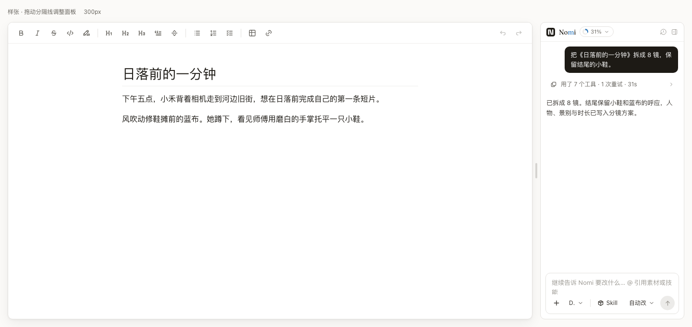
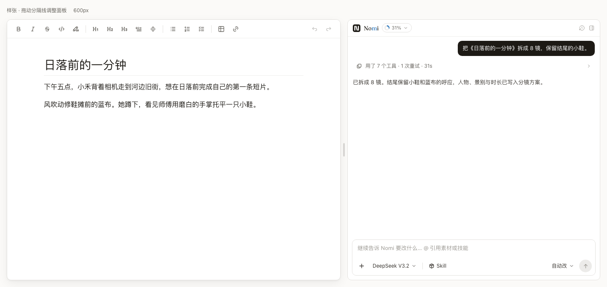
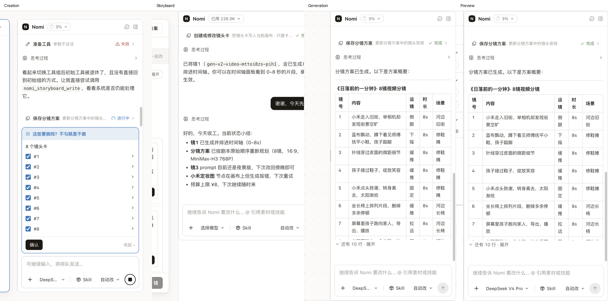
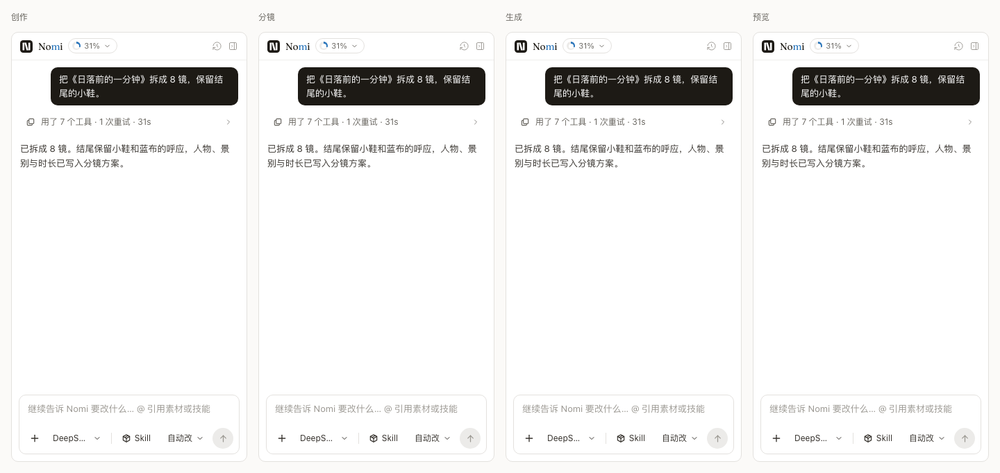
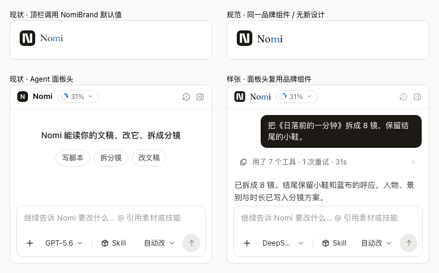

# Agent 过程区、面板外框与品牌 · B2b 样张

状态：📋 方案待拍板。**仅设计实验室，未实施到产品。**
基线：`b657d5c6907e7fbc64291540c7cb21c9969b5626`。任务分支 `design/agent-process-and-panel-frame-20260909`。

所有提案图均为浏览器渲染的 React 实验室组件截图，不是手画 SVG。现状来自用户指定的真人走查目录；[来源、哈希与裁剪范围](2026-09-09-agent-process-state-and-panel-frame/current-sources.json)。现状图片因篇幅等比缩小，原文件保持只读。

## C34 · 进行中一行，结束后一条

**为什么：用户等的是现在进行到哪一步、最后做成了什么；历史过程不应挤走回答。**

现状：思考、工具收据、过程正文和确认卡混在一条流中，顶部没有随步骤替换的活状态。

| 进行中：原地推进 | 结束后：摘要 | 失败：单独成卡 |
|---|---|---|
|  |  |  |

进行中原位三步：[读取全文](2026-09-09-agent-process-state-and-panel-frame/process-running-0.png) → [加载分镜技能](2026-09-09-agent-process-state-and-panel-frame/process-running-1.png) → [写入 8 镜](2026-09-09-agent-process-state-and-panel-frame/process-running-6.png)。图上方三个按钮是实验室取景控制，不是产品控件。秒数来自冻结回合时间点，非真实生成耗时；交互版 shimmer 随 running 生效，减少动态效果时静止。静态图不能证明动效。

状态规则：running 只显示当前步骤；终态摘要给出调用次数、重试与总耗时；展开才查看明细。已恢复的历史错误只留明细，仍需处理的失败独立成卡。需用户介入时沿用 v4 介入槽，不再复制普通步骤。最终回答始终摊开。停止/暂停/跨回合归并等生产语义不在本轮接线。

### 来源四列表（R29）

2026-09-09 实查 [Beautiful UI](https://www.beautifului.dev/) 页面及 [MIT License](https://www.beautifului.dev/license)。本轮只参考形态，未导入上游源码或包。

| 它提供 | 我们用了 | 我们另写了 | 我们拆散了 |
|---|---|---|---|
| [Thinking State](https://www.beautifului.dev/#thinking-state)：折叠步骤链 | 单个可展开入口的交互思路 | 实验室 `Process` 两态组合，调用现役 `V4FlowRow` | 无，上游代码未复制 |
| [Loading State](https://www.beautifului.dev/#loading-state)：文字 shimmer / 时间感 | 当前动词与已用秒数同排 | 实验室 CSS token 渐变 + Web Animations 演示；不是产品计时器 | 无 |
| [Task Rows](https://www.beautifului.dev/#task-rows)：运行、完成、失败同行反馈 | 活状态/终态收敛的思路 | 失败卡组合现役 `V4ErrorBar` | 无 |
| [Tool Chips](https://www.beautifului.dev/#tool-chips)：工具紧凑展示 | 无；不新增一套 chip | 明细直接用现役 `V4ToolReceipt` | 无 |

未引入框架、新 SDK 层或公开字段，因此没有新增 framework-surface 裁决项。后续若实际 vendor 上游组件，需重新做源码与框架接触面评审，不能把本表当接线验收。

## C30 · 在原位拉宽

**为什么：同一段长回答，用户应该拉宽读完，而不是切一个面就换一套宽度规则。**

现状见上方创作截图：`CreationWorkspace.tsx:27` 固定 340px；分镜读 assistantWidth 但没有拖手柄；生成面已有手柄（`GenerationWorkspace.tsx:163`）；预览使用 react-resizable-panels（`PreviewWorkspace.tsx:270`）。因此 C30 是跨面不一致，不是全仓缺能力。

样张中左侧为现役 WorkbenchEditor，右侧复用 v4 组件。拖柄在两者之间，向左拖加宽；键盘左右键也可调。沿用 `assistantWidthBounds.ts:15` 的最小 300、最大 600、窗口内容区底线 760；异常窄窗口的钳制规则也沿用现役。演示使用独立 `nomi-lab-b2b-width` 存储键，不写产品宽度偏好。产品实施应在共同宿主保存一份宽度。

取舍：面板越宽，文稿越窄。300 是现役允许的最小宽；真实 composer 在 300 时模型名仍截断，样张如实保留，不能把这张图说成 C02 模型名问题也已解决。用户当前要审的是拖拽和空间分配。

## C31 · 四面一个面板外框

**为什么：切换工作面时，助手的边界与顶部不应跳位置，也不应出现直角底座包圆角卡片。**

### 先看现状并排（真实截图裁剪）

从左到右：创作、分镜、生成、预览。全图：[创作](2026-09-09-agent-process-state-and-panel-frame/current-creation.png)、[分镜](2026-09-09-agent-process-state-and-panel-frame/current-storyboard.png)、[生成](2026-09-09-agent-process-state-and-panel-frame/current-generation.png)、[预览](2026-09-09-agent-process-state-and-panel-frame/current-preview.png)。分镜截图本身右侧存在裁切，未重画补齐。

| 面 | 现役外层 | 顶部/高度来源 |
|---|---|---|
| 创作 | 直角 aside + 内层 rounded-nomi | 工作面 pt 22 / pb 24；面板随文稿内缩 |
| 分镜 | 直角 aside + 内层 rounded-nomi | aside 顶到工作面边缘；文稿本身另有 pt 22 |
| 生成 | 独立停靠 aside + 内层 rounded-nomi | 顶到画布工作区；下界受时间轴行影响 |
| 预览 | Panel 内直角 aside + 内层 rounded-nomi | Panel 决定高度，与创作 inset 不同 |

### 统一后样张

四列是**同一提案面板的四个工作面投影**，不是已经运行的四个 Workspace。统一标准：只一层可见边框；面板用 `rounded-nomi`（panel token = 10px），不把 field=6 / modal=14 混进外框；同一宿主给顶部与可用高度。实验室四列实测 y=46、height=620、radius=10px。620 是取景高度，不是拟写死的产品高度。内容区各自滚动，输入框保持底部。统一 inset 方案为 16px，四面同值；需用户拍板后再改宿主布局。

## C32 · Logo 品牌核对

**为什么：品牌资产只有一份，界面应复用它，不能让文字 N 冒充标记。**

依据：`Design.md` 指向完整版；`nomi-design-system.md` §3.9，`src/design/identity.tsx:61` / `:95`，顶栏调用 `src/ui/app-shell/NomiAppBar.tsx:119`。

| 项 | 规范 | 顶栏现状核对 | Agent 面板头 |
|---|---|---|---|
| 标记形状 | 28×28 viewBox，rx 恒 7；双竖+斜笔 | NomiBrand 共用 NomiMarkShapes，符合；截图不是普通文字 N | 用文字 N 的方块，明确偏离；提案复用 NomiBrand |
| 字体 | Fraunces Variable 字标，中央 m 用 accent | **偏离：声明 Fraunces，但 CDP 实际渲染 Songti SC**；运行时字栈漏 Variable | 普通 UI 字体文本，偏离；提案复用 NomiWordmark + 规范字栈 |
| 字重 | 400 | 实测 400，符合 | 外壳 font-semibold；提案由品牌组件恢复 400 |
| 字距 | -0.02em | 17px 字号实测 -0.34px，符合 | 非品牌字距；提案 14px 时 -0.28px |
| 标记/字标间距 | gap-2 = 8px | 实测 8px，符合 | 提案复用组件 8px |
| 色彩 | 深色固定标底+白笔画；仅字标 m 用 accent | 与现役品牌组件一致 | 提案沿用同一资产，不设计新 logo |

结论：**顶栏标记形状符合，字标的实际字体偏离；Agent 面板头同时偏离标记与字标。** `tailwind.config.ts:152` 运行时为 `Fraunces, Inter, serif`，规范镜像 `src/theme/nomi-tokens.css:69` 与设计系统 §2.6 要求 `"Fraunces Variable"` 在最前；已打包字体也使用 Variable 族名。CDP `CSS.getPlatformFontsForNode` 实测左列 Songti SC，而规范列真正加载 Fraunces。不能只看 getComputedStyle 就说字体对了。提案仅在实验室局部覆写这条既有 token，生产 token 与品牌几何均未改。`Design.md` 的 Light-only 旧原则与完整版双模式文本存在历史漂移，本轮以其明确指向的完整版为准，未改规范。

## 夹具与证据边界

- `b2bSpecimens.tsx`：冻结的 ProjectAgentItem / HostState → 现役 `projectV4Flow` → 现役 `V4FlowRow`，用户气泡、助手正文、收据都走真实组件。
- 缓存展示字段镜像 `ResidentToolProjection`；操作标识只取既有 document.read / skill.read / canvas.write；不是新工具协议。
- 新的 Process 聚合、失败卡外层、面板框与宽度演示仅在 devlab；全部标为 component-only，不冒充 ShellStage 已接线。
- 现役面板头对照直接渲染 AgentPanelV4Panel；顶栏签名沿真实调用点使用 `<NomiBrand />` 默认参数；宽窄文稿由 workbenchDocuments 驱动真实 WorkbenchEditor，并按 WorkbenchShell 调用点加载同一 workbench.css；不手写文稿排版。
- 真实调用点逐条登记在 `states/06-b2b-specimens.tsx` 的 mirrors。C34 提案没有声称现役已经能聚合；四面布局提案不声称真实宿主已统一。
- 问题分类、跨面同类扫描与未来共享 owner 见 [任务计划](../plan/2026-09-09-b2b-specimens.md)。生产代码、冻结区、旧基线均未修改。

## 验证与复现

启动本 worktree renderer：`pnpm exec vite --host 127.0.0.1 --port 5197 --strictPort`；先 `node scripts/build-tailwind.mjs`。打开 `design-lab.html?screen=agent-panel-v4&state=b2b-process-running`。运行 `node tests/ux/design-lab/b2b-capture.mjs` 定向截图与交互验证；脚本不访问 baseline 目录。

[截图与交互收据](2026-09-09-agent-process-state-and-panel-frame/capture-receipt.json)：一行原地推进、完成展开 7 条、失败独立、宽度 clamp/刷新恢复/键盘、四框几何与品牌计算样式。所有截图人工查看；不将截图通过等同生产接线完成。完整 contracts 状态在 SPECIMEN-LAST.md 与 PR 中报告。

新增样张挂入已有待拍板的 agent-panel-v4 屏，只提交文档证据，不录入或改写任何已有基线。费用：本轮截图和交互零模型调用。

## 六视角自审（本轮单代理，非独立多人签字）

| 视角 | 审查结论 |
|---|---|
| CTO | 只在 devlab 组合；生产投影、宿主与协议零改动，批准后再统一 owner |
| 设计 | 沿用 token；面板统一 10px；品牌复用 identity，不创造新标志 |
| PM | 本轮交付可拍板证据，不把“样张完成”叫“问题解决” |
| 前端 | 真实 WorkbenchEditor / V4FlowRow / Composer；提案外壳明确标为 component-only |
| 后端 | 冻结宿主夹具不调用真实工具；调用数、错误和耗时仅为设计示例 |
| 真实用户任务 | 看当前一步、展开历史、识别失败、拖宽阅读四项已通过浏览器交互验证；最终仍需用户看图拍板 |
