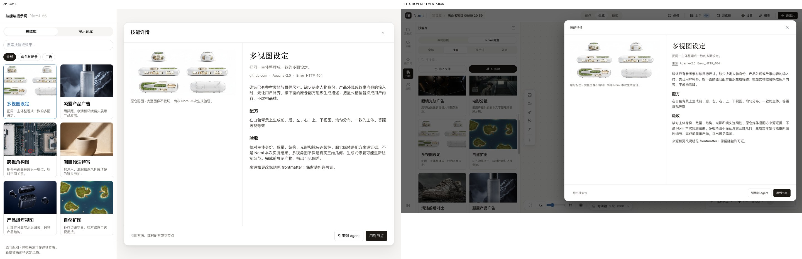
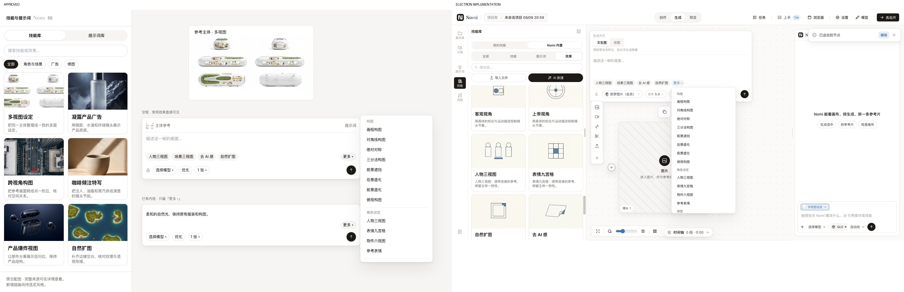

# 技能库改版：获批源码与实现对账

依据：`docs/design/mockups/2026-09-08-skill-library-cards/library-cards.html`、`style.css`、`node-effects.html`、`capture-detail.tsx`。获批 PNG 仅用于并排核对；未更新设计实验室基线。

| 项目 | 获批稿 | 实现 / 核对结果 |
| --- | --- | --- |
| 卡片网格 | 两列、12px 间距、16:10 真实配图 | `SkillCard` / `SkillLibraryContent`；gap-3、p-3、同图同裁切，截图 01 与 specimen-library |
| 卡片文字 | 标题 16px/22px、简介两行 12px/16px、8px 间隔 | title/caption token、leading-snug/leading-4、mt-2、line-clamp-2；无附属信息贴右边 |
| 发现入口 | 来源、搜索、全部/技能/提示词/效果 | 四分面使用真实 DTO 分类；保留宿主原有导入/AI 新建行，非截图中的虚构数据 |
| 详情位置 | 972px 大窗、距顶48、右24 | 复用 DesignModal，右对齐；左侧卡片仍可见，截图02 |
| 详情分栏 | 44% 大图 / 56% 正文、24px 内边距 | 同比例、p-6；图片 contain、最大440px；正文独立滚动 |
| 详情内容 | 标题、摘要、来源许可作者、完整 Markdown | 复用 Agent 消息的 NomiMarkdown；不显示 frontmatter；普通提示词正文完整保留，不被去重清空 |
| 详情动作 | 引用到 Agent / 用到节点 | 已走通真实 Skill chip、效果节点应用；导出/删除从旧卡片移入详情 |
| Composer | 封面、分面、完整 hover 预览 | 截图03；分面筛选已断言；缩略行允许省略，hover 保留完整描述与媒体 |
| 无封面 / 视频 | 中性占位 / 视频预览 | 共享 SkillMedia；旧技能兼容与视频 DTO 单测通过，不把视频 URL 塞入 img |
| 空节点 | 四个效果 chip + 更多 | 截图04；人物三视图、场景三视图、去 AI 感、自然扩图 |
| 有内容节点 | 只保留更多 | 截图06；应用后切换状态，撤销恢复原提示词及四 chip |
| 更多分组 | 按效果组展示，可滚动 | 截图05；沿用 WorkbenchMenu；菜单紧跟触发点，不受画布 transform 二次偏移 |
| 加新删旧 | 生产只有一版 | 旧列表卡片和旧节点 picker 已替换；不改技能正文、不触碰冻结目录 |

## 验证边界

- `tests/ux/skill-library-cards.walk.mjs` 在本地构建 Electron 中执行完整引用、分面、悬停、应用、撤销与菜单定位任务；`journey.json` 为成功收据，付费调用 0。
- `tests/ux/skill-library-specimen.walk.mjs` 用真实宿主数据渲染生产组件，输出 specimen 两图；不执行 design-lab:update。
- 人眼复核：最终详情布局、卡片、悬停媒体、菜单均可读，无裁断操作。宿主顶栏/画布布局与静态样张不同，保留现役宿主；详情使用真实模态遮罩，静态样张无此遮罩。
- Feel 自动发现包含模态/菜单背后的背景文字重叠及遮挡（预期）、宿主既有字体 token、列表刻意省略（完整 hover 可读）；这些不作为新 UI 缺陷，也未添加豁免或降低门岗。
- 红绿证据：旧 Skill IPC 缺封面；菜单横向偏移507px，修复后在普通与额外 transform 祖先下均小于32px；普通 Markdown 提示词去重清空的单测先红后绿。
- 第一轮完整 gates 的 contracts 检出夹具坐标/测试等待/缺少消失前的存在证明，已修正：菜单夹具从真实锚点派生视口坐标（不更新 PNG），测试用共享 stationTimeout 与 proveProbe/expectAbsent；specimen 增加真实卡片操作和正文标题断言。
- 完整 gates 的最终结果以任务交付收据和 PR 为准；此文件不预先声称通过。

合并基线 f708568dfc19 后再次构建并执行 Electron 完整任务，exit 0。六张真机图与并排图已替换为合并后的结果；宿主节点控制区沿用 main 的现役布局。

最终 Ponytail 复核再清除旧技能筛选器和 curation 转发文件；名称、供应商中英文别名、多词搜索覆盖迁入新 gallery，44 条相关测试通过。保留共享 SkillMedia 和跨库选择状态，二者有真实调用者。

旧路径清理后的最终 build 与 Electron 全流程再次 exit 0，六张真机图为该次结果。

通知策略基线 d3fa258883c6（#679）合并后，build 和 Electron 全流程再次 exit 0；合并同时保留 inline feedback 接口与节点效果撤销，图为最新合并树。第四轮完整测试曾有一条未改动的协调器测试超时，独立复跑83条通过；未改超时或跳过，完整 gates 继续重跑。

面板外形基线 ad95ab47e（#683）合并后，保留 V4Row 新外壳与本任务真实分面状态。build、Electron 三条任务再次 exit 0，六张真机图与并排图为此合并树结果。
