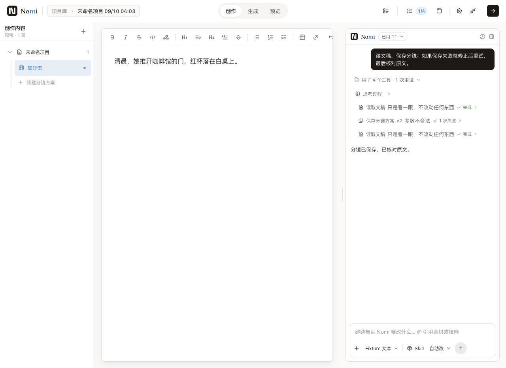
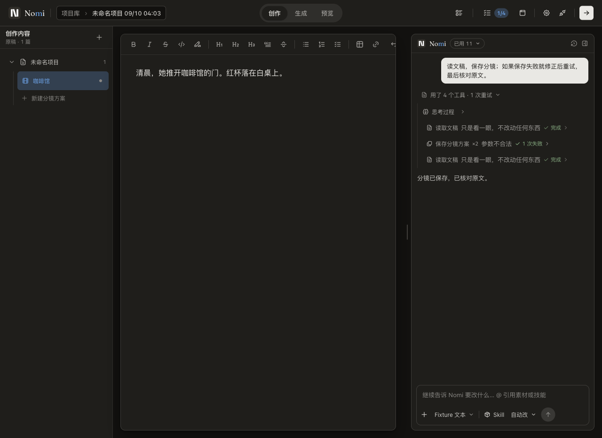
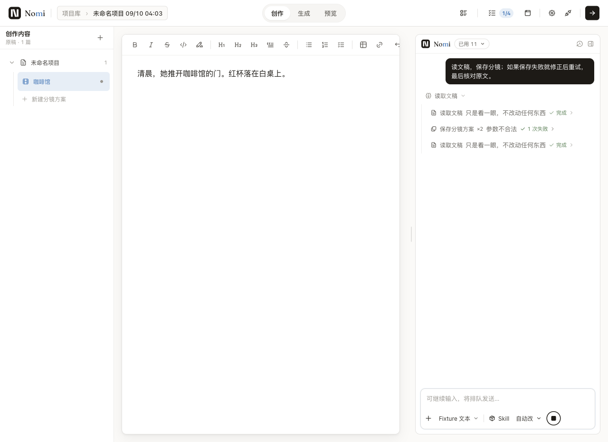
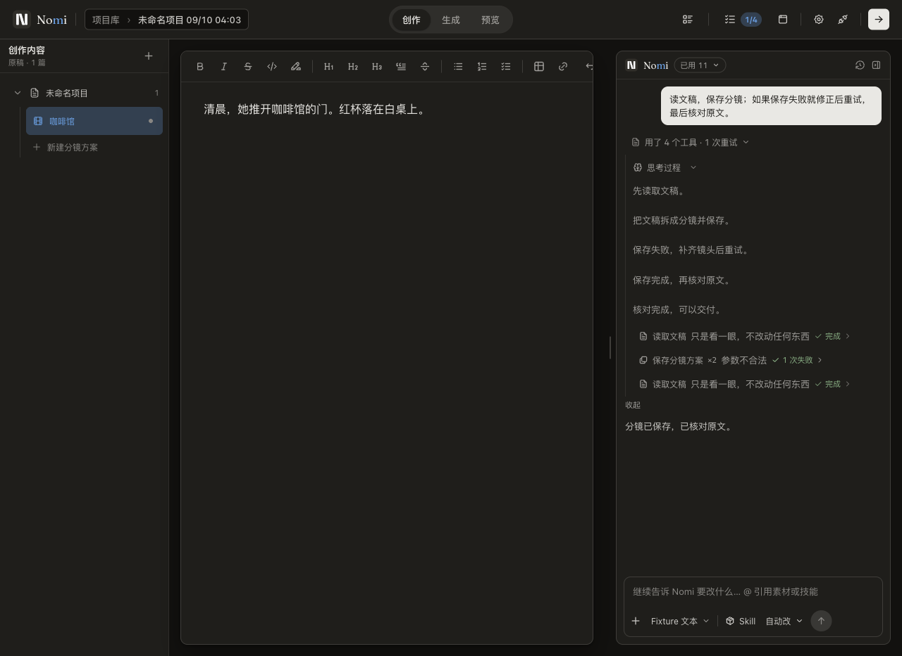

# C77 · 真实 Electron 过程思考行

零额度 loopback，仅供应商 HTTP 为夹具；编辑文稿、输入指令、SDK、读取文稿、保存分镜失败、修正重试、确认计划、落盘与 UI 均为真实路径。改前构建为 `807c475d68f023ff4e4670bc35507b6e04048a51`，改后为本 PR 源码叠加 `c6fe8c608`（#692）构建，整合后同一旅程复验通过。

| 指标 | 改前 | 改后 |
|---|---:|---:|
| 运行中思考子项 | 5 | 0 |
| 完成后思考子项 | 5 | 1 |
| 工具调用 / 重试 | 4 / 1 | 4 / 1 |
| 工具成功 / 总调用 | 3 / 4 | 3 / 4 |
| 预设失败后的保存成功 | 1 / 1 | 1 / 1 |
| 回合完成 | 1 / 1 | 1 / 1 |
| 付费调用 | 0 | 0 |

工具写对率是 loopback 夹具数字（故意一条空 shots 失败），不是模型能力评测。`before.json` 的 failed 是 C77 不变量先红，业务回合本身已成功；`after.json` 全通过。`unit-red.txt` 记录未修改生产代码时四条 C77 回归先红。feel 的 repeated-rows 是复用的通用连续重复检测，本例思考/工具交错，改前该规则也未命中；因此用明确的过程子项基数与顺序断言补足，未改动 feel 规则或基线。

| 主题 | 改前 | 改后 |
|---|---|---|
| Light |  |  |
| Dark |  |  |
| 运行中 |  |  |

合并详情展开后五段正文全部可读，仍按原始顺序，收据在其后：

人眼复核：完成态减少四条重复标题，工具不再被打断；正文收起时四次工具/一次重试与最终回答可直接读完。浅暗两色均沿用现有文字、间距和层级；展开长正文可使用既有「展开」显示完整过程。测试断言工具 action index 保留，未改变 undo/retry 路由。
