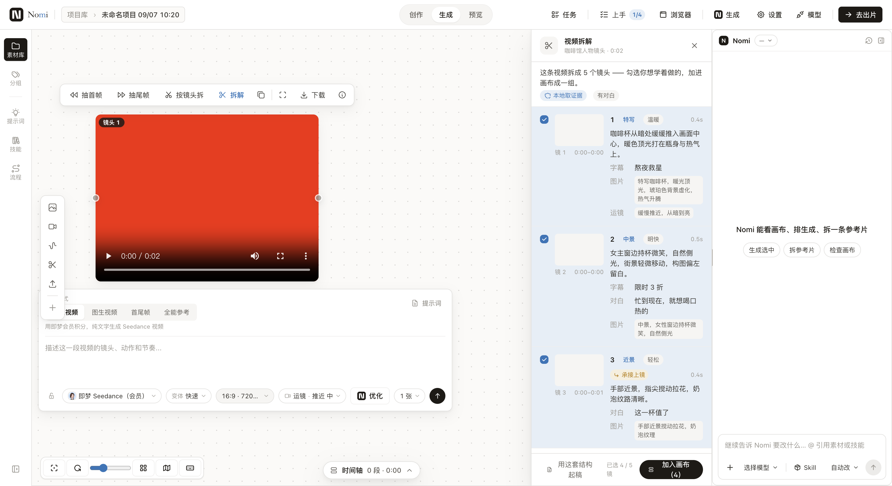
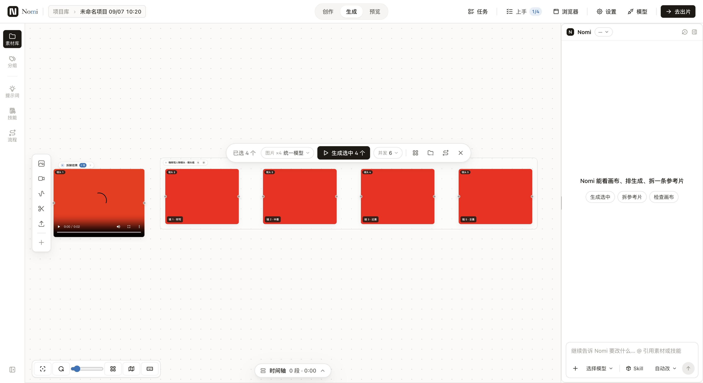

# 分镜表节点（画布上的表格表示版）实施方案

> 日期：2026-09-07 · 状态：📋 方案待拍板 · **仅方案，本分支不含任何生产代码**
> 样张（用户 2026-09-06 已拍板）：设计画布 `B1 导入节点（参考片）` / `B2 分镜表节点`，源在会话 scratchpad 的 `LinkNode.body.html` / `TableNode.body.html`
> 上位合同：[分镜表 v6 设计合同](../design/2026-09-05-storyboard-table-v6-design-contract.md) · [视频拆解表节点重做](2026-09-06-video-deconstruction-table-node.md)（本方案**取代**其 §2.1 的「两个对象、单向拷贝」结论，理由见 §3.4）

---

## 0. 一句话

画布上长出**一个** `shot_table` 节点：它是**同一份镜头数据的表格视图**——来源是原稿时它投影 `storyboardDesignsByDocumentId` 的方案（不复制一份），来源是参考片时它自持从片子里读出来的事实列（`PlanShot` 上根本没有这些字段的家）。一个节点、一个表格渲染器、两套列集，不是两种表。

---

## 1. 摩擦（D1）：用户现在拆解完，看到的是什么

### 1.1 现役路径（实核，带 file:line）

| 步 | 现在发生什么 | 证据 |
|---|---|---|
| 入口 | 视频节点浮条上一颗「拆解」钮 | [`NodeVideoFrameToolbar.tsx:76-80`](../../src/workbench/generationCanvas/nodes/NodeVideoFrameToolbar.tsx) → `openVideoDeconstruction(nodeId, …)` |
| 结果 | 结果 **Portal 到画布右缘**的一条窄栏，宽度＝AI 栏宽度（`--generation-assistant-target-width`），与 Agent 栏**互斥共占**同一个右槽 | [`NodeDeconstructionPanel.tsx:1-14`](../../src/workbench/generationCanvas/nodes/NodeDeconstructionPanel.tsx)（文件头自述）、[`DeconstructionPanelHost.tsx:1-24`](../../src/workbench/generationCanvas/nodes/DeconstructionPanelHost.tsx)、`generationCanvasStore.ts:75`（开 Agent 即 `videoDeconstructionOpenNodeId = null`） |
| 一镜的样子 | **竖排卡片**：镜号 / 景别 / 情绪 / 时长 / 画面 / 字幕 / 图片提示词 / 运镜，各占一行 | [`DeconstructionShotRow.tsx`](../../src/workbench/generationCanvas/nodes/DeconstructionShotRow.tsx)（143 行，整块是纵向堆叠） |
| 落画布 | 勾选的镜 → **N 个 image 节点**逐个冒出 + 自动编组，整批一个 Cmd+Z | [`extractDeconstructionShotsToNodes.ts:106-116`](../../src/workbench/generationCanvas/nodes/extractDeconstructionShotsToNodes.ts)（`addNode({kind:'image'})`）、`:127-140`（`createGroup`） |
| 结构去哪了 | 全部塞进 `node.meta.videoAnalysis`（`shotSize/mood/imagePrompt/motionPrompt/onScreenText/dialogue`），**画布上看不见** | `extractDeconstructionShotsToNodes.ts:63-72`（`ShotNodeMeta`）、`:117`（`meta: { videoAnalysis: meta }`） |
| 存哪 | `videoDeconstructions: Record<nodeId, DeconstructionEntry>` 会话槽 + 源视频 `node.meta.videoDeconstruction` | `canvasStoreTypes.ts:142,144`、`deconstructionTypes.ts:65`（`NODE_DECONSTRUCTION_META_KEY`） |

### 1.2 真机截图（隔离 profile，零额度）

跑法：`pnpm run build && node tests/ux/deconstruction-panel.walk.mjs`（无 `APIMART_API_KEY` = 注入确定性结果，不花钱）。本轮 2026-09-07 实跑，9 项断言全绿。





### 1.3 卡在哪（读这两张图读出来的，不是推测的）

1. **表不是表，是一摞卡。** 一镜七个字段纵向堆叠，1020px 高的屏幕只放得下 3 镜。用户拆参考片的动机是**比较**（「这条片子的景别是怎么走的」「哪几镜有字幕」），而「扫一列」这个动作在竖排卡片里**做不到**——只能上下滚五次，靠脑子记。
2. **结果和画布是两个世界。** 右栏关掉，表就没了；落到画布上的是 4 张图节点，`景别/运镜/对白/字幕/情绪/自定义` 六个字段**一个都不显示**（图 2：节点标题只剩「镜 1 · 特写」）。用户刚读懂的结构，在他要用它的地方消失了。
3. **它和 Agent 抢同一块地。** 右槽互斥（`generationCanvasStore.ts:75`）——想一边看表一边让 Agent 改，做不到。
4. **画布被挤窄。** 图 1 里画布只剩约 1190px：两条右栏各吃掉一块。

> **一句话摩擦**：用户拆完一条参考片，读懂结构的地方（右栏）和使用结构的地方（画布）是断开的，而且读懂结构本身就很累——因为那不是一张表。

---

## 先查别人（本文 §2 · 依赖 / 仓库 / 生态 / 自媒体四问）

> 四问：依赖里已有？仓库里已有？生态里已有？TikHub 自媒体怎么说？（R27/R29 · `check:prior-art`）

### 2.1 依赖里已有（不许再造一份）

- **React Flow 的滚动/拖拽/选中豁免类是现成的，不要自己写事件拦截。** `nowheel` = 节点内滚动时不缩放画布（官方原话给的就是 `<div className="nowheel" style={{overflow:'auto'}}>` 这个写法）；`nodrag` = 该元素不触发拖拽；`nopan` = 不平移视口。出处 https://reactflow.dev/learn/customization/utility-classes 。**本仓的坑**：`noPanClassName` 已被改名成 `generation-canvas-react-flow__no-pan`（[`GenerationCanvasReactFlowViewport.tsx:157`](../../src/workbench/generationCanvas/reactFlow/GenerationCanvasReactFlowViewport.tsx)），所以裸 `nopan` 在本画布**是失效的**，表节点必须用项目类名。
- **`nodrag` 挡不住选中——这是 12.11.5 的真实行为，文档说错了。** `NodeWrapper` 另挂了一个不受类名过滤的 React `onClick`（`@xyflow/react/dist/esm/index.mjs:2282-2292`），而 `nodeDragThreshold` 默认 1、本仓没传（`GenerationCanvasReactFlowViewport.tsx:142-160`），条件恒真 → **点表格里任何一个复选框都会顺带选中整个节点**。官方自家 Slide 示例的做法是在元素自己的 `onClick` 里 `stopPropagation()`。表节点的规矩因此是三件套：`nodrag` + `stopPropagation()` + 滚动容器 `nowheel`。
- **缩放分档不要用 `useViewport()`**：官方明写「用了它的组件会在**视口每次变化**时重渲染」（https://reactflow.dev/api-reference/hooks/use-viewport ）。官方 LOD 示例 Contextual Zoom（免费，https://reactflow.dev/examples/interaction/contextual-zoom ）用的是 `useStore`；正确写法是**选一个派生布尔**（`useStore(s => s.transform[2] >= 0.8)`），只在档位翻转时重渲染。
- **节点尺寸持久化本仓已有单一写法**，不要引第二套：[`GenerationCanvasReactFlowNodes.tsx:177-200`](../../src/workbench/generationCanvas/reactFlow/GenerationCanvasReactFlowNodes.tsx) 用 `NodeResizer` 的 `onResize` 写进自家 store 的 `size`（`persist:false, emit:false, history:false`），`onResizeStart` 打历史点。表节点直接复用，**不写 React Flow 的 `node.width/height`**。
- **参考槽是档案里的一等声明式数据，已经有渲染器**：六种 `ArchetypeReferenceSlotKind`（[`electron/shared/videoCapabilities/types.ts:31-37`](../../electron/shared/videoCapabilities/types.ts)）+ `AssetReference` 吃 `slots[]`（[`src/workbench/assets/AssetReference.tsx:63-75`](../../src/workbench/assets/AssetReference.tsx)）。表节点右半列**只消费它，不新建抽象**。
- **行状态只有一份 derive**：[`exec/storyboardRowStatus.ts:99`](../../src/workbench/creation/storyboard/exec/storyboardRowStatus.ts) 的 `deriveShotRowExec` / `:313` `deriveStoryboardBatch`。v6 合同 §3.1 已写死「行/组/footer 的计数必须同一份 derive」——节点投影**必须调它**，不许再算一遍。

### 2.2 仓库里已有

- **拆解引擎已经吐出这六个事实列，不用新增任何模型能力**：`shotSize`/`mood`/`visual`/`onScreenText`/`dialogue`/`custom` 都在 [`electron/video/deconstructVideo.ts:44-53`](../../electron/video/deconstructVideo.ts)，自定义列入参 `DeconstructColumn { name, hint }` 在 `:32-34`、`customColumns` 在 `:65`，`hint` 直接拼进 VLM 的输出 schema。样张里那列「卖点」就是一列自定义列——**是已有能力，不是新活**。
- **画布节点是插件式注册表**：[`nodes/registry.ts:61-277`](../../src/workbench/generationCanvas/nodes/registry.ts)（15 个 kind，`GENERATION_NODE_PLUGINS`），加一个 kind 是登记一条声明 + 一个 `component` 懒加载，不是改分支。主进程有两张镜像表，`electron/capabilityCore/nodeKindDomain.equivalence.test.ts:17-41` 守恒。
- **⚠️ 已有一个在途的表格渲染分支**：PR #564 的 `agent-artifact` 节点带 `fileType: 'table'` 的只读渲染（`ArtifactBody`）。那是「AI 手艺产物」的只读表；本方案的 `shot_table` 是可交互的镜头表。**两者不得共用组件，但必须共用 token 与表格视觉**，否则画布上会出现两种长得不一样的表（R14.1）。
- **「批量产出逐个冒出 + 自动编组 + 整批一个 Cmd+Z」已拍板已实现**，生成侧照旧走它，不改：`extractDeconstructionShotsToNodes.ts:1-10` 的文件头 + `multiShotCanvasLanding.ts`。

### 2.3 生态里已有（同任务同媒介）

- **Krita Storyboard Docker**（https://github.com/KDE/krita ）——分镜表里「用户自己加列」的最接近实现。列定义住在**文档级**、和行分开：`StoryboardComment { name; visibility }`（`libs/ui/StoryboardItem.h:28-35`）由 `StoryboardCommentModel::m_commentList`（`plugins/dockers/storyboarddocker/CommentModel.h:71`）持有，行只存值。**该抄**：列定义与单元格值分离、可见性挂在列定义上。**别抄**：单元格身份是**位置**——`childType` 前 4 个是内置字段、`index ≥ 4` 是第 N 个自定义列（`StoryboardItem.h:181-203`），同步靠 `insertRows(4 + first, …)` 硬算偏移（`StoryboardModel.cpp:1210-1243`，源码注释就是 `//four indices are already there`），且序列化不带列名（`StoryboardItem.cpp:87-94`）——删一列会把后面所有单元格静默左移一格。**我们的单元格必须按 `columnId` 键存。**
- **Shotly**（https://github.com/YanikKendler/shotly ，⚠️ PolyForm Noncommercial，只读设计不抄代码）——列定义最小面就是 `name + position`（`backend/.../ShotAttributeDefinitionBase.java:17-32`），值挂 `definition` 外键（`ShotAttributeBase.java:14-23`），投影时按 `definition.position` 排序（`Shot.java:52-55`）。**别抄**：新建 shot 时为每个列定义**预先物化一行空值**（`Shot.java:41-45`）——本地优先的 JSON 文档里这会让「加一列」变成全表回填。稀疏 map 才对。
- **Wonderunit Storyboarder**（https://github.com/wonderunit/storyboarder ，同为 Electron）——`board.uid = util.uidGen(5)`（`src/js/models/board.js:79-82`）把镜头身份和行序解耦；时长是**可空的行级覆盖 + 场级默认**：`board.duration != null ? board.duration : scene.defaultBoardTiming`（`:68-71`）——这正是 v6 §2.4.1 已拍板的「画幅项目级默认 + 行级覆盖」同一个形状。**别抄**：`updateUrlsFromIndex`（`:94-103`）把行号编进资产文件名，重排就要改盘上文件。
- **Teable / Baserow**（自定义列的最小形状）——Teable 的 `model Field` 只要 `id / name / type / order Float / options?`（`packages/db-main-prisma/prisma/postgres/schema.prisma:329-366`）；**`order` 是 Float 不是 Int**，插队 = `(prev+next)/2`，不用全表重编号。Baserow 的 `Field` 需要 5 个字段（`backend/src/baserow/contrib/database/fields/models.py:122-206`），但它把每列变成一个真实 Postgres 列（`db_column` `:227-228`）——那是 SQL 产品的选择，对我们的 JSON 快照是错的。
- **TanStack Table + Virtual 官方虚拟化示例**（https://tanstack.com/table/latest/docs/framework/react/examples/virtualized-rows ）——sticky 表头 + 绝对定位行的最小写法（容器 `position:relative`、`table` 与 `thead/tbody` 都 `display:grid`、行 `transform: translateY()`）。示例源码自带一句提醒：**「把 virtualizer 放在尽可能低的组件里，避免不必要的重渲染」**。⚠️ 本方案**第一版不引入虚拟化**（见 §7 取舍 T3）。

### 2.4 TikHub 自媒体：真实用户怎么说（2026-09-07 实抓，`scripts/research/tikhub-search.mjs`）

两组关键词、三平台，抓到 60 条；产物在会话 scratchpad（`tikhub-a/` = 「AI 分镜表」，`tikhub-b/` = 「漫剧 分镜 节奏」，小红书那组第二次 HTTP 400，明说没查成，不当成「没有」）。

- **「AI 把每句话平均切一镜」是被反复点名的核心病，不是我们推测的。** 抖音 · 小陈AIGC（2026-07-21，https://www.douyin.com/video/7664920212981992739 ）：「AI最常犯的错误，就是把每句话平均切成一个镜头，结果整部片子**没有轻重、没有停顿、没有情绪爆点**……先拆剧情节拍，再按冲突、反转和情绪去设计镜头。」这条已被 [`docs/research/2026-09-07-radar.md:104-111`](../research/2026-09-07-radar.md) 收录，并与本轮两篇论文（KathaTrace「语义轨迹坍缩」、PersonaShot「情绪突变」）指向同一诊断。
- **「情绪」是他们已经在用的一列，而且是和景别联动的。** 抖音 · AIGC大马（2026-06-12，https://www.douyin.com/video/7650423851502849322 ）：「第二，**景别跟着情绪递进**，拒绝两极镜头。」小红书 · 晨楠（2026-07-02，https://www.xiaohongshu.com/explore/6a46802e000000000f006df9 ）贴的提示词模板逐字是：「【镜头类型】+【景别】+【场景】+【时间/光影】+【人物/主体】+【动作】+【情绪状态】」——**七个槽位，和我们样张的列几乎一一对应**，其中「情绪状态」是他们自己列进去的。
- **表本身就是他们公认的解法。** 抖音 · 六万的旅行（2026-07-05，https://www.douyin.com/video/7658695151618952474 ）：「镜头、角色、场景、道具、台词、音效，这些东西如果还是分散着处理，后面很快就会拧在一起。Shot list（分镜表）……就是专门用来解决这个问题的工具。」——**「分散着处理」正是 §1.3 第 2 条**（结构落到画布上就散成了 N 张图节点）。

**结论：用已有 + 加一列。** 表格骨架、参考槽渲染、行状态 derive、缩放分档、编组落地，全部用仓库/依赖里已有的；真正新增的只有「节点里的表格外壳 + 列定义模型 + 两套列集的切换」。唯一需要用户拍板的新维度是「节拍/情绪」（§4.4）。

---

## 3. 数据模型：谁是 owner

### 3.1 一句话答案

**一个节点 kind，两个来源，两个 owner，零份复制。**

| 来源 | 行数据的 owner | 节点自持什么 |
|---|---|---|
| `storyboard`（从原稿拆镜） | `storyboardDesignsByDocumentId[documentId][i].plan`（#499 已收敛成单 owner，`check:storyboard-owner` 守着） | **只有视图态**：指向哪张方案、列集、密度、行选中、节点尺寸 |
| `deconstruction`（拆一条参考片） | **节点自持**（D-2 = B），住 `node.meta.shotTable.rows` | 事实行 + 列定义 + 来源视频引用 + 视图态 |

### 3.2 为什么必须是两个 owner（这是本方案最重要的一处判断）

样张 B2 逐字写着「**同一份 ShotSpec。改任一边，另一边立刻变。**」——所以 storyboard 来源的表节点**不能复制 shots**：复制了就有两份，两份就会漂移，漂移了就要写同步，写了同步就是第二真相源（违 P1）。它必须是**读穿投影**。

但 deconstruction 来源的表**没法投影到 `PlanShot`**——因为那六个事实字段在 `PlanShot` 上**没有家**：

| 事实列 | 引擎字段 | `PlanShot` 上对应什么 |
|---|---|---|
| 景别 | `deconstructVideo.ts:44` `shotSize` | ❌ **无**（只被 `ffDesc` 的自由文本描述里提到，不是结构字段） |
| 运镜 | `:52` `motionPrompt` | 🟡 `storyboardPlan.ts:165` `motionDesc?`（语义对得上，但那是"我要怎么动"不是"它当时怎么动"） |
| 画面 | `:46` `visual` | 🟡 `:163` `ffDesc?` / `:143` `prompt`（同上，指令 vs 事实） |
| 对白 | `:48` `dialogue` | ❌ **无**（落轴时才有：`adoptStoryboardBatch.ts:79` 读 `node.meta.dialogue`） |
| 字幕 | `:47` `onScreenText` | ❌ **无**（同上，`node.meta.subtitle`） |
| 情绪 | `:45` `mood` | ❌ **无** |
| 自定义 | `:53` `custom` + `:32` `DeconstructColumn` | ❌ **无** |
| 承接上镜 | `:50` `carriedOver` | ❌ **无** |
| 时间起止 | `:39-41` `startSeconds/endSeconds` | 🟡 只有 `:130` `durationSec`（时长，没有在源片里的位置） |
| 单镜读图失败 | `:55` `visionFailed?` | ❌ **无** |

**十项里六项完全映不上、三项只是语义近亲、一项半对。** 硬塞进 `PlanShot` 就是给"我要拍什么"的方案对象挂上"那条片子当时是什么"的证据——两种语义混住一个类型，正是 R14.1 要横扫的东西。所以：**拆解事实是节点自持的只读证据，不是分镜方案。**

### 3.3 类型草案

```ts
// 一个 kind，两种来源。渲染器只有一个。
type ShotTableNode = GenerationCanvasNode & {
  kind: 'shot_table'
  meta: { shotTable: ShotTableDocument }
}

type ShotTableDocument = {
  schemaVersion: 1
  source: ShotTableSource
  /** 列集：内置列可隐藏不可删；自定义列可增删改。order 用 float，插队不重编号（Teable 学的）。 */
  columns: ShotTableColumn[]
  /** 只有 source.kind==='deconstruction' 才有；storyboard 来源恒为 undefined（投影不落盘）。 */
  rows?: ShotTableFactRow[]
  /** 视图态（两种来源都有）。行选中持久化，重开项目还在。 */
  view: {
    selectedRowIds: string[]
    density: 'full' | 'compact' | 'card'   // 由 zoom derive 的**默认值**，用户可钉住
    columnSetId: 'facts' | 'production'
  }
  revision: number
  updatedAt: string
}

type ShotTableSource =
  | { kind: 'storyboard'; documentId: string; designId: string }
  | { kind: 'deconstruction'; sourceNodeId: string; sourceAssetRef?: string;
      title: string; durationSeconds?: number;
      status: 'idle' | 'running' | 'ready' | 'failed'
      phase?: 0 | 1 | 2; failedShotIndexes?: number[]; errorMessage?: string }

type ShotTableColumn = {
  columnId: string          // 稳定键；单元格按它取值，**绝不按位置**（Krita 的坑）
  kind: 'builtin' | 'custom'
  /** builtin 时是词表键（shotSize|motion|visual|dialogue|onScreenText|mood|…），走 i18n；custom 时是用户输入的原文。 */
  labelKey: string
  order: number             // float
  visible: boolean
  /** 只有 custom 列有：拼进 VLM 输出 schema 的那句话（= 引擎的 DeconstructColumn.hint）。 */
  hint?: string
}

type ShotTableFactRow = {
  rowId: string             // 与行序解耦（Storyboarder 学的）
  order: number
  startSeconds: number; endSeconds: number; durationSeconds: number
  carriedOver: boolean
  visionFailed?: boolean
  keyframeRef?: string      // 项目内资产引用，**不存 base64、不存远端 URL**（check:heavy-path）
  /** 稀疏 map，键 = columnId。内置列和自定义列同一个桶，读时按 columns 排序。 */
  cells: Record<string, string>
  /** 引擎给的、可直接喂模型的两句提示词，用于「生成选中」时编译 candidate。 */
  imagePrompt?: string; motionPrompt?: string
}
```

`storyboard` 来源的行由一个 selector 现算：

```ts
// 唯一入口。它不缓存、不落盘、不写回；写回只走 workbenchDocumentSlice 的既有 action。
selectShotTableRows(node): ShotTableRowView[]
//   source.kind==='storyboard'  → 读 storyboardDesignsByDocumentId[documentId] → 找 designId
//                                 → plan.shots.map(shot => ({ shot, exec: deriveShotRowExec(...) }))
//   source.kind==='deconstruction' → node.meta.shotTable.rows（自持）
```

行状态一律来自 `deriveShotRowExec` / `deriveStoryboardBatch`（`exec/storyboardRowStatus.ts:99,313`），**表节点不新增第二份状态推导**（v6 §3.1 已写死）。

### 3.4 与 [2026-09-06 视频拆解表节点方案](2026-09-06-video-deconstruction-table-node.md) 的差异（必须显式看见）

那份方案 §2.1 写的是「创作区『分镜计划』和画布『视频拆解表』是**两个对象**……只做一次性拷贝，不做双向同步」。**本方案在「表节点是不是同一个 kind」这一点上取代它**，依据是 09-06 晚用户拍板的样张 B2 逐字写着「一个节点，两套列集，不是两种表」+「同一份 ShotSpec，改任一边另一边立刻变」。

**但两份方案在数据上并不冲突**，因为拆分点不同：
- 那份方案说的「两个对象」= **拆解事实 vs 分镜方案**，这一点本方案完全同意并强化了（§3.2 的映射表就是它的证据）；
- 本方案说的「一个节点」= **表格外壳/渲染器/列机制只有一份**。

所以「拆解表 → 分镜表」仍然是**一次性拷贝、单向、不双向同步**（那份方案 Task 6 原样保留）；而「分镜表节点 ↔ v6 全页」是**同一份数据的两个视图**（读穿投影，无同步可言）。这两句话不打架。

### 3.5 固定列 ↔ 引擎字段逐一映射

**A. 事实列集（`columnSetId: 'facts'`，拆解来源默认展开）** — 全部来自 `electron/video/deconstructVideo.ts`，一列一字段，零新增：

| 列 | 引擎字段 | file:line | 落进 |
|---|---|---|---|
| 镜 | `index` | `:38` | `row.order` |
| 关键帧 | `sourceFrameUrl`（该镜中点那帧，只读对照） | `:43` | `row.keyframeRef`（**转成项目资产 ref 再存**，不存原 URL） |
| 时间 | `startSeconds` / `endSeconds` / `durationSeconds` | `:39-41` | 同名字段 |
| 景别 | `shotSize` | `:44` | `cells['shotSize']` |
| 运镜 | `motionPrompt` | `:52` | `cells['motion']` + `row.motionPrompt` |
| 画面 | `visual` | `:46` | `cells['visual']` |
| 对白 | `dialogue`（whisper 转写按时间戳归镜） | `:48` | `cells['dialogue']` |
| 字幕 | `onScreenText`（画面上印的字，与对白分开两列） | `:47` | `cells['onScreenText']` |
| 情绪 | `mood` | `:45` | `cells['mood']` |
| 承接上镜 | `carriedOver` | `:50` | `row.carriedOver`（行内 ↳ 标记，不占一列） |
| 没读出 | `visionFailed` | `:55` | `row.visionFailed`（该行相关格写「没读出」，时间/对白仍然准） |
| 自定义 N 列 | `custom[name]` ← 入参 `customColumns: DeconstructColumn[]` | `:53` / `:32-34,65` | `cells[columnId]`，列的 `hint` 原样送引擎 |

**没有一列映不上。** 引擎今天已经吐出全部九个维度，现在只是被塞在竖排卡片里（§1.1）。

**B. 生产列集（`columnSetId: 'production'`，分镜来源默认展开）** — 全部来自 `storyboardPlan.ts`：

| 列 | `PlanShot` 字段 | file:line | 说明 |
|---|---|---|---|
| 镜 | `index` / `shotId?` | `:109,111` | 缺 shotId 时 derive `shot-${index}` |
| 画面（提示词摘要） | `prompt` / `ffDesc?` | `:143,163` | 节点里**只读摘要**，编辑回 v6 全页 |
| 时长 | `durationSec` | `:130` | 图片镜是停留时长，走 `effectiveShotDurationSec` |
| 参考槽 | `referenceBindings?: Record<slotKind, PlanReferenceBinding[]>` | `:141` | 由该行 `modeId` derive 出显示哪些槽 |
| 模型 / 模式 | `modelKey?` + `modelVendor?` + `modeId?` | `:147,152,154` | 身份唯一键是 `(vendor, key)` |
| 画幅 | `params?.aspect_ratio` ← `StoryboardPlan.aspectRatio` | `:156,217` | 项目级默认 + 行级覆盖，读写只走 `storyboardAspectScope.ts` |
| 场 | `sceneId?` ← `StoryboardPlan.scenes` | `:117,210` | 组头 |
| 状态 | — | `exec/storyboardRowStatus.ts:99` | `deriveShotRowExec` 派生，不存 |

**映不上的（必须明说）**：事实列集的 `景别/对白/字幕/情绪/自定义/承接/时间起止/visionFailed` 在 `PlanShot` 上**无家**（§3.2 表）。因此「拆解表 → 分镜表」的一次性拷贝会**丢掉这些列**——这不是 bug，是两种语义的边界。拷贝时把它们写进新 plan 的 `PlanShot.continuity`（`:178`，本来就是 opaque 的续接证据槽）作为**来源存根**，并在 UI 上明标「已从参考片拷贝 5 镜，情绪/字幕列不随行（它们是那条片子的事实，不是你的计划）」（D4：缺口明着标）。

### 3.6 自定义列的存储与投影

- **存**：列定义在 `ShotTableDocument.columns`（文档级、有序、有名——Krita 学的对的那半），值在 `row.cells[columnId]`（稀疏 map、按 id 键——Krita 学的错的那半的反面）。
- **删一列**：删 `columns` 里那条 + 惰性丢弃 `cells` 里的孤儿键（下次写快照时清）。**不做位置偏移运算。**
- **插队**：`order` 用 float，`(prev+next)/2`（Teable 学的）。
- **投影给引擎**：`columns.filter(c => c.kind==='custom').map(c => ({ name: label(c), hint: c.hint }))` → `DeconstructVideoPayload.customColumns`（`deconstructVideo.ts:65`）。**一行代码，不是新能力。**
- **投影给 MCP**：compact 投影只出 `columnId / labelKey / order / visible`，**不出缩略图二进制**。
- **storyboard 来源能不能加自定义列？** 第一版**不能**（列集是 `production` 固定集）。理由：`PlanShot` 上没有承载它的地方，加了就要改分镜 owner 的 schema，那是另一件事。空间留着，判据写在 §7 T4。

---

## 4. 交互与视觉（逐项对照样张 + 设计系统）

### 4.1 逐项对账表（样张 B2 / B1 → 规格 → token）

| 样张里的东西 | 规格 | token / 组件真源 |
|---|---|---|
| 表容器圆角 | `rounded-nomi`(10px) | 设计系统 §2.4；v6 合同 §6.2「表容器/锚卡/媒体框 `rounded-nomi`」 |
| 表内字号 | 11–13px（`text-micro` 11 / `text-caption` 12 / `text-body-sm` 13）。**不引入 ≥14px 正文** | v6 §6.2 逐字：「分镜表历来活在 11–13px」 |
| 行高 | 节点表 ~30px（一屏 15 镜）；v6 全页 ~180px（一屏 5 镜） | 样张 B2 对比表逐字 |
| 列宽 | 用 `<colgroup>` 固定像素（样张 B1 逐列给了值：26/30/72/72/46/96/auto/212/150/44/88/84）；「画面」列 `auto` 吃剩余 | 样张 B1 `<colgroup>` |
| 表头 | sticky，深一档底色；事实列上方有一条分组头「从片子里读出来的事实（只读）」/「我要怎么做」 | 样张 B1 `tr.grp` |
| 内滚动 | 滚动容器 `className="nowheel"` + `overflow:auto`；**表头 sticky 留在容器内** | React Flow 官方写法（§2.1） |
| hover 行 | `--nomi-ink-05` 底；不出现浮层按钮压在内容上 | 设计系统 §1.5.3「动作不许压在内容上」 |
| 行选中（复选框） | 左首列 24–26px；`nodrag` + `onClick` 里 `stopPropagation()` | §2.1 的三件套 |
| 行编辑 | **节点内不编辑提示词**。双击行 = 打开 v6 全页并定位到该行 | 样张 B2 callout 逐字：「不做『节点内联编辑提示词』——那会是第三套编辑逻辑（P1 无并行版）」。事实列是只读的（它是证据） |
| 参考槽列 | 只显示 **满/空** 胶囊 + 计数（`参考 2/14`）；点一下跳去 v6 全页那格。**扇形叠放不在节点里画** | 样张 B2 对比表逐字；扇形叠放（t2 `rotate(13deg)` / t3 `rotate(26deg)`、`transform-origin:20% 100%`）是 **v6 全页**的规格（v6 §6.3），节点里 30px 行高放不下也不该放 |
| 状态列 | 未生成 / 已生成 / 生成中 + 已等秒数 / 缺画面 / 排队·前面 N。**生成过程中表格结构一格不动**，只有状态列变 | 样张 B2 态 2 逐字：「行不重排、关键帧不闪」 |
| 底栏 | `已选 N / M 镜` + 批量默认值三胶囊（模型/画幅/预估花费）+ 两颗按钮「全部生成」「生成选中 N 镜」 | 样张 B2/B1 footer |
| 多选浮条 | 沿用现役 `StoryboardSelectionToolbar`：纸白 `#fff` + `border 1px #e3e1de` + `shadow-workbench-pop`，**不是黑条** | v6 §6.3 逐字（09-05 已核对现役截图改回） |
| 红/绿 | `--workbench-danger` / `--workbench-success`，**不是** `--nomi-danger/-success` | v6 §6.1 逐字 |
| 缩放三档 | ≥80% 全表 / 40–80% 关键帧条 + 镜号 + 状态点 / <40% 一张卡。**同一个组件，三种密度，不是三个组件** | 样张 B2 逐字；实现用 `useStore(s => s.transform[2] >= 0.8)` 派生布尔（§2.1） |
| 节点缩放 | `NodeResizer`，宽度可拉（表要宽），最小宽按列集算 | 复用 `GenerationCanvasReactFlowNodes.tsx:177-200` 的既有写法 |
| 空态 | 不写「暂无数据」；给两条真实的路：「从原稿拆镜」「拆一条参考视频」。**没有「手动加一行」** | 样张 B2 态 1 逐字：「表必须有来源」 |
| 合规行 | 拆解来源的节点底部常驻「仅用于学习结构 · 请遵守来源平台条款」 | 样张 B1 callout |

### 4.2 控件按 §1.5 归位

| 控件 | 层 | 住哪 | 依据 |
|---|---|---|---|
| 行复选框、「生成选中 N 镜」 | **L1 常驻** | 表节点内（左首列 / 底栏） | ≥7/10：这是这个节点存在的理由 |
| 列集切换（事实 ⇄ 生产） | **L1 常驻** | 表头右侧一颗分段钮 | 两套列集是这个节点的主干语义，收起来就没人知道有另一套 |
| 「加维度」（加自定义列） | **L3 收纳** | 表头 `⋯` 里一项，或最右一列的 `+` | 1–3/10 |
| 「重拆」「重拆这一镜」 | **L2 情境** | 整表重拆在底栏；单镜重拆在**那一行的失败格里**（就近） | §1.5.3「就近」优先于「收纳」 |
| 「双击展开 v6 全页」 | **加速器**（不占预算） | 双击行 + 表头一个 `maximize` 提示图标 | 快捷键/手势不算入口 |
| 「拆解」入口 | **L2**，行为改变 | 视频节点浮条那颗钮**保留**，但**不再开右槽**，改成「在旁边长出表节点 + 一条边」 | 样张 B1「入口住哪」表；一功能一个家 |
| 「导入」（贴链接/拖 mp4） | **L1** | 加号菜单里的「导入」一项 | 样张 B1 逐字：**不新增「视频链接」这一种 kind**，导入是一个意图，落成同一种素材节点 |

> **⚠️「视频链接节点」的处置**：样张 B1 的标题虽然叫「导入节点（参考片）」，但它的「入口住哪」表里逐字写着「**不新增『视频链接』这一种**」。所以本方案**不新增节点 kind**：贴链接/拖 mp4 都落成现役 `video`（或 `asset`）节点，样张里那个「参考片 · 15s」小卡 = **现役 video 节点在『已拆过』时的角标形态**（`5 镜 · 有对白 · 1 镜没读出`），不是新 kind。新增的 kind **只有 `shot_table` 一个**。

### 4.3 「进度长在节点身上」（样张 B1 态 2）

三段进度是真的：找切点（本机 ffmpeg，有真实耗时）→ 读画面（**有真分母**「第 N / M 镜」）→ 归对白。**只有第二段有百分比**，另两段只显示完成/进行中，不假装（No fake progress）。这与现役引擎「整批返回」的事实不冲突——`deconstructVideo` 内部逐镜并发（`concurrency` 默认 4，`deconstructVideo.ts:67`），把已完成镜数上报即可，**不需要改引擎的返回形状**，只需要加一路进度事件。

### 4.4 「节拍/情绪」列：三档对比（R3）

**这一维度要解决的摩擦**（大白话）：AI 现在是「一句话切一个镜」，所以 20 个镜头长得一样平——用户看到的是一部没有轻重的片子。自媒体三家、论文两篇独立指向同一诊断（§2.4）。问题是：这个「节拍」要以什么身份进产品？

| 档 | 具体做什么 | 用户看到什么 | 代价 / 风险 | 判断 |
|---|---|---|---|---|
| **① 不加** | 事实列集里已有 `情绪`（引擎的 `mood`）；生产列集不加任何东西 | 拆参考片时能看到那条片子的情绪走向；自己拆镜时看不到，AI 仍然平均切 | 零成本 | ❌ 三个独立来源都在说这是**真实摩擦**，装看不见等于把已知问题留给用户 |
| **② 加为一列（推荐）** | 生产列集加一列 `beat`，取值是**受控枚举**（`铺垫 / 推进 / 转折 / 爆点 / 留白`）+ 可空；它只做两件事：(a) 表里能一眼扫出全片轻重（列有颜色阶）；(b) 进 planner 的**输出 schema**，让模型先想节拍再切镜 | 拆完镜，表上多一列写着每镜是什么节拍；能一眼看出「我这 20 镜全是『推进』」——问题被**看见**了 | 要动 `PlanShot`（加一个可选字段）与 planner 的输出 schema；不动时长、不动镜数、不动任何已生成的东西 | ✅ **选它** |
| **③ 加为驱动拆解的结构字段** | `beat: { role, intensity: 1–5 }` 反向驱动**每镜时长与镜数**：爆点镜自动加长、留白镜自动缩短、连续同节拍自动合并 | 拆出来的分镜天生有轻重 | 它改的是**用户已经拍板过的生成参数**（时长/镜数）。没有评测数据证明我们的自动配比比用户自己定更好；一旦装上，用户改一行时长会被下一次重拆覆盖 | ❌ **现在不做**，但留判据 |

**推荐 ②，理由（D2/D3）**：
1. **先让问题可见，再让机器代劳。** 用户的原话是「没有轻重、没有停顿」——他现在**根本看不出来**自己的 20 镜全是同一个节拍。一列受控枚举把这件事变成可扫的一眼，这已经解决了摩擦的大半，而成本是三档里最低的。
2. **枚举而不是自由文本。** 自由文本列看着更"灵活"，实际是把归纳的活推给用户（D1：让用户多学多写的默认砍掉），而且模型填出来的值不可聚合——「紧张」「焦虑」「悬着」是三个词一个意思，扫不出走向。枚举五档能上色、能计数、能进 schema。
3. **不碰时长和镜数。** 档 ③ 动的是钱和结果（每镜时长 = 生成参数 = 真实花费）。D4/P2：在没有真实评测证据之前，把用户拍过板的参数交给一个我们没验证过的启发式，是拿用户的额度赌我们的猜想。

**升到档 ③ 的判据（写死在这里，防下次凭感觉重开）**：R16 真实任务走查里出现「用户拿到分镜后**手动改了三行以上的时长**去造轻重」这个行为，或用户明确提出；到时按 R3 出对比表，并且**必须先有一次离线评测**（同一剧本、档②ד人工配比" vs 档③"自动配比"，人眼盲评）。在此之前本方案不预留半个实现。

---

## 5. 与 Agent 的关系：契约对接点

### 5.1 现状（必须先说清，否则会接在一个坏面上）

`canvas.write` 的 `shots` 参数今天对模型说的是「一个由任意对象组成的数组」——[`electron/shared/agentCapabilities/canvasWrite.ts:143-144`](../../electron/shared/agentCapabilities/canvasWrite.ts)，25 个字段名一个都没告诉它，**真实一次写对率 0/18**（[Agent 运行时重做方案](2026-09-07-agent-runtime-rebuild.md) §8.2 S1 / §7 G2）。

**所以本方案不在这个面上加东西。** 表节点的 Agent 通路**等阶段 2 的工具契约重做**，并在那次重做里作为**第一个消费者**验证它。

### 5.2 对接点（三条，都指向已有/在建的面，不新开）

1. **建表**：阶段 2 的 `nomi_storyboard_write`（rebuild 方案 §7「拆分」那行：`canvas.write` 的 9 个 operation 拆成 3 个语义工具，分镜三个归 `nomi_storyboard_write`）。它的 `shots[]` **就是本方案 `production` 列集的行**——一列一字段，全部带 `.describe()`。这正好是把「schema 对模型说清楚」这件事**变得可验证**的用例：模型填 8 行 × 8 列，对不对一眼看得出来。
2. **拆参考片**：Agent 说「把这条拆了」→ 走**同一个** `deconstructVideo` 桥、写**同一个** `shot_table` 节点。Agent 只是第二个调用者，不另开视图（P4；样张 B1「入口住哪」表逐字）。
3. **读 / 定位**：`nomi_read(target='canvas')` 返回表节点的 compact 投影（`tableNodeId / source 摘要 / revision / columns / 行 id+时间+状态 / selectedRowIds`），**不带缩略图二进制**（`check:mcp-payload`）。Agent 任务卡只持 `{ tableNodeId, runId?, status }`，按钮只发「在画布中查看」深链。

### 5.3 三条硬边界

- Agent **不能**替用户勾选行然后直接生成：勾选写进 `view.selectedRowIds`（用户看得见），生成仍走 `nomi_operation_plan/preview/gate/execute` 的真人确认与收据。
- Agent 对 `storyboard` 来源的表**只能**改 owner（`storyboardDesignsByDocumentId`），不能改节点；节点是投影。
- Agent 对 `deconstruction` 来源的表**只能**改 `cells` 与 `columns`，**不能**改 `startSeconds/endSeconds/keyframeRef`——那是从片子里量出来的事实，模型无权改写证据。

---

## 6. 范围 / 不动项 / 回滚 / 验收门

### 6.1 范围（做什么）

1. 新增 `shot_table` 一个 kind（registry + 两张主进程镜像表）。
2. `ShotTableDocument` 领域类型 + schema + 快照归一化 + 旧 `node.meta.videoDeconstruction` 一次性迁移。
3. 表格外壳：sticky 表头、`nowheel` 内滚、`colgroup` 固定列宽、三档密度、`NodeResizer`、行选中、hover。
4. 两套列集 + 自定义列增删改（列定义 float order、单元格按 columnId 稀疏存）。
5. `selectShotTableRows` 投影 + 复用 `deriveShotRowExec` 的状态列。
6. 拆解桥接进节点：三段进度上报、逐镜失败标注、单镜重拆。
7. 「双击 → v6 全页并定位到该行」的唯一通道。
8. 「生成选中 N 镜」接现有 ProductionRun/landing（逐个冒 + 编组 + 整批一个 Cmd+Z，行为不变）。
9. **同 commit 删**：`NodeDeconstructionPanel.tsx`(438) / `DeconstructionPanelHost.tsx`(24) / `DeconstructionShotRow.tsx`(143) / `NodeDeconstructionBadge.tsx`(85) / `extractDeconstructionShotsToNodes.ts`(147) / store 的 `videoDeconstructions` + `videoDeconstructionOpenNodeId` 及其右槽互斥分支。

### 6.2 不动项（明确不做）

- ❌ **不新增「视频链接」节点 kind**（§4.2 的告示）。新 kind 只有 `shot_table` 一个。
- ❌ **不在节点里编辑提示词**（样张 B2 callout）。编辑只在 v6 全页。
- ❌ **不在节点里画参考槽的扇形叠放**（那是 v6 全页规格）。节点只显示满/空胶囊。
- ❌ **不改 v6 全页的任何视觉**（57 张视觉基线一张不动）。
- ❌ **不做完整 Excel 式表格**（任意单元格可编辑 / 公式 / 列排序 / 单元格选区）——v6 §8 已写死不做项。
- ❌ **不引入虚拟化**（第一版，见 T3）。
- ❌ **不做「视频复刻」**（复刻这 5 秒 / 一句话改 / 候选替换）——样张 B1「不做什么」逐字。
- ❌ **不做字幕节点**；字幕提取仍是 Agent Skill（V-08）。
- ❌ **不新建独立工作区/第二套状态机**；引擎沿用 `deconstructVideo`，只换外壳。
- ❌ **不改 `canvas.write` 现有 schema**（等阶段 2 重做，§5.1）。

### 6.3 回滚

- **代码**：新 kind 是 registry 里的一条声明，回滚 = 撤销该 commit；但**旧快照里已存在 `shot_table` 节点**时，加载器按 `schemaVersion` **拒绝并保留原始项目备份**，绝不把表静默降级成图片节点。
- **数据迁移**：迁移前保留源视频节点的 `meta.videoDeconstruction`；迁移是**一次可撤销的画布写入**，失败不删源节点、不删历史 meta。
- **生成**：撤销只撤画布 landing（节点删除事实为准），已提交给供应商的任务按 ProductionRun 真实状态显示，**不假装撤回或退费**。
- **投影侧**：`storyboard` 来源的表节点被删 ≠ 分镜方案被删（owner 在 `storyboardDesignsByDocumentId`）。删节点只删视图，必须在 UI 上说清楚。

### 6.4 验收门

**A. 结构门**
- [ ] `shot_table` 是画布上唯一的镜头表；旧右槽 Portal / 旧铺图函数 / 右槽互斥状态同 commit 删除；`rg` 搜不到旧入口。
- [ ] 单元格取值全部按 `columnId`；`git grep` 搜不到任何「内置列个数 + N」形式的位置偏移。
- [ ] 行状态只有一个 derive（`deriveShotRowExec`）；`check:vocabularies` 不新增词表 owner。
- [ ] 每个新文件 ≤800 行（`check:filesize`）；`check:boundaries` 无新增反向依赖。

**B. 数据门**
- [ ] 事实行 / 列定义 / 自定义列 / 选中行 / 来源引用 / revision 全部可序列化、重启恢复、可撤销。
- [ ] `storyboard` 来源的节点**不落 rows**（结构测试：快照里那个节点的 `meta.shotTable.rows === undefined`）。
- [ ] 在 v6 全页改一行提示词 → 画布表节点那一行立刻变；反之双击回全页定位正确（这是「同一份数据」的机器判据）。
- [ ] 加一列自定义列 → 删掉它 → 其余列的值一格不移（Krita 那个坑的回归测试）。
- [ ] `keyframeRef` 是项目资产引用；`check:heavy-path` 无 base64 入 store。

**C. R13 真实用户任务走查脚本清单**（隔离 profile、零额度档必须能跑）

| 脚本 | 走的真实任务 |
|---|---|
| `tests/ux/shot-table-deconstruct.walk.mjs` | 贴一条链接/拖本地 mp4 → 节点上跑三段进度 → 长出表 + 一条边 → 读表（含 1 镜「没读出」诚实标注）→ 加一列「卖点」→ 勾 3 行 → 生成 → 结果逐个冒出并编组 → Cmd+Z 撤整批，表还在 |
| `tests/ux/shot-table-storyboard-projection.walk.mjs` | 从原稿拆镜 → 画布上出现分镜表节点 → 在 v6 全页改第 3 镜提示词 → 回画布，节点第 3 行**已变** → 双击第 5 行 → 全页打开并定位到第 5 行 |
| `tests/ux/shot-table-density.walk.mjs` | 缩放画布过 80% / 40% 两个门槛，三档密度各截一张；断言表格结构在生成过程中不重排（态 2） |
| `tests/ux/shot-table-interaction-guards.walk.mjs` | 表内滚轮**只滚表不缩画布**；点行内复选框**不选中整个节点**；拖表头**不拖动节点**（§2.1 三件套的机器判据） |

走查纪律：隔离 profile（默认）· 禁 `win.reload()` · 探针先行（`clickOrFail`/`proveProbe`）· `expectAbsent` 必带 `provenBy` · 截图走 `screenshotSettled` · 主题翻转走 `applyColorSchemeForShot` · 禁私有墙钟轮询。

**D. R16 完成标准**：上面四条走查全部跑通，且**过程中冒出的体验/设计/UI/产品感问题全部修完**才算完成，不留半成品。截图人眼对账（不是 `expect` 断言）：表读得动吗？一屏能看几镜？「没读出」那行诚实吗？扫「情绪」这一列扫得出走向吗？

**E. 视觉基线 / 设计实验室**：新增状态族 `shot-table-*`（`empty` / `deconstructing` / `facts-ready` / `production-ready` / `selected` / `generating` / `partial-failed` / `density-compact` / `density-card`），走 `check:design-lab` + 视觉基线；**v6 全页的 57 张基线一张不动**（动了 = 顺手改了设计）。

**F. 质量门**：`pnpm run gates:contracts` 全绿；`check:i18n`（全部新增文案走 zh-CN/en）、`check:tokens`（无任意 px 字号/圆角、无 hex）、`check:controls`（C1 可点即有效：拆解钮无素材时禁用并说明）、`check:storyboard-owner`、`check:mcp-payload`、`check:test-waits`、`check:walkthroughs`、`check:mockup-contracts`。

---

## 7. 仍然开放的取舍（R3）

| # | 取舍 | 方案 A（推荐） | 方案 B | 用户看到的差异 | 关闭判据 |
|---|---|---|---|---|---|
| **T1** | 一个项目几张表 | **一份来源一张表**（样张 B2 已推荐）+ 一个「主分镜」标记（只有它进时间轴） | 单例，全部追加进同一张 | A 能并排比两条参考片的结构（用户拆参考片的动机本来就是比较）；B 心智更简但比不了 | 样张已推荐 A，**待用户在本方案上确认「主分镜」这个标记的名字与位置** |
| **T2** | 表节点行数上限 | 先定 **48 行硬上限**，超出时分段并显示总数与「继续拆」 | 无上限 | A 一眼读得完常见 15–30s 短片；B 长片完整但要翻页 | 用 60/120 行夹具测滚动、选行、MCP payload 与内存；实现前定案 |
| **T3** | 要不要虚拟化 | **第一版不做**。48 行 × 12 列 = 576 格，远在 DOM 承受范围内；TanStack 那套 sticky+grid 的形变代价现在买不到东西 | 一上来就上 TanStack Virtual | 用户看不出差别 | 触发条件写死：T2 上限提到 >200 行，或性能走查里表节点单帧 >8ms |
| **T4** | 分镜来源能不能加自定义列 | **不能**（列集固定） | 能 | B 更灵活，但要改 `PlanShot` schema 和分镜 owner | 真实使用中出现「用户为了记一列信息把它写进提示词里」这个行为时重开 |
| **T5** | 「节拍/情绪」进哪一档 | **档 ②**（受控枚举列 + 进 planner schema） | 档 ①/③ | 见 §4.4 | **本方案唯一需要用户拍板的产品决策** |

---

## 8. 体量估算与分 PR 切法

每个文件 ≤800 行（R9/R12）。估算是**新增生产行数**，不含测试。

| PR | 内容 | 新增文件（估算行数） | 删除 | 小计 |
|---|---|---|---|---|
| **P1 · 契约与迁移**（无 UI） | `shot_table` kind 登记、领域类型、schema 解析、快照归一化、旧 meta 一次性迁移 | `electron/shared/canvas/shotTable.ts`(≈180，跨进程唯一 schema owner)、`shotTableSchema.ts`(≈150)、`shotTableMigration.ts`(≈160)、registry+镜像表(≈40) | — | ≈530 |
| **P2 · 表格外壳**（只读，接投影） | 节点壳、表格、行、三档密度、`nowheel`/`nodrag`/`stopPropagation` 三件套、`selectShotTableRows` | `ShotTableNode.tsx`(≈260)、`ShotTableGrid.tsx`(≈300)、`ShotTableRow.tsx`(≈220)、`ShotTableDensity.tsx`(≈120)、`selectShotTableRows.ts`(≈130) | — | ≈1030 |
| **P3 · 列机制** | 两套列集、自定义列增删改、float order、稀疏 cells、投影给引擎的 `customColumns` | `shotTableColumns.ts`(≈200)、`ShotTableColumnMenu.tsx`(≈180) | — | ≈380 |
| **P4 · 拆解接线 + 删旧**（P1 的那一刀） | 拆解桥、三段进度、单镜重拆、视频节点浮条行为改为「长出表节点」 | `shotTableDeconstructBridge.ts`(≈220)、`ShotTableStates.tsx`(≈200) | −837（§6.1 第 9 条五个文件）+ store 字段 | ≈420 新 / −837 旧 |
| **P5 · 生成选中 + 落地** | 「生成选中 N 镜」接 ProductionRun、来源 provenance、逐个冒 + 编组（复用现有 landing，不新建状态机） | `shotTableGeneration.ts`(≈240)、landing 边界扩展(≈80) | — | ≈320 |
| **P6 · 走查 + 设计实验室 + 基线** | 四条 R13 走查、九个 lab 状态、视觉基线 | 走查 ≈700（测试，不计生产）、`shotTableStates.tsx`(≈180) | — | ≈180 生产 |

**生产代码合计 ≈2860 行新增 / ≈900 行删除**。P1→P2→P3 可连做；P4 必须与 P2/P3 都合入后再动（它删旧）；P5 依赖 P4；P6 收尾。

**「节拍/情绪」档 ②** 若拍板通过，另起一个小 PR（`PlanShot.beat?` + planner 输出 schema + 列定义 + 上色，≈150 行），**不塞进上面任何一个**——它是产品决策，要能单独回滚。

---

## 9. 六角色评审（R7）

**CTO** — 这份方案真正的技术风险不在表格，在**「同一份数据两个视图」这句话有没有被落成读穿投影**。只要有人图省事在节点里缓存一份 rows，六个月后我们就会有一个「为什么全页改了节点没变」的幽灵 bug，而且它会先被当成渲染问题查三天。所以 §6.4 B 那条结构断言（`rows === undefined`）不是形式主义，它是这份方案的承重墙。第二件：`nodrag` 挡不住选中这件事（§2.1）是从 12.11.5 的源码里读出来的、和官方文档相反的行为——它必须进走查断言（`shot-table-interaction-guards.walk.mjs`），否则下次升级 React Flow 时没人知道这里有个坑。

**设计** — 样张里最容易在实现时丢掉的是两条：①「生成过程中表格结构一格不动」——很多人会顺手让完成的行跳到上面或让缩略图淡入，那会让「一边等一边读」这件事作废；② 三档密度**是同一个组件**——一旦拆成三个组件，三个月后它们的字号就会各走各的。另外我要求「情绪」列（无论档②与否）在事实列集里**必须上色阶**，否则它和其它文本列长得一样，扫不出走向，那这列就白加了。

**PM** — 用户 09-06 点名的三件事里，这一项服务的是「分镜」那件。它的价值密度很高：拆解引擎的九个维度**今天就已经产出了**，只是被塞在一条窄栏里没人看得见——这是纯粹的「已付出成本没兑现」。所以我支持 P1–P4 尽快走完（那一刀之后用户立刻能感知到），P5/P6 可以稍后。唯一要用户拍板的是 T5，而且它值得单独问：它是这一项里唯一一个动产品语义的决定。

**前端** — 三个具体的坑：① 表头 sticky 必须在 `nowheel` 容器**内**，放外面会在缩放时错位；② 三档密度用 `useStore` 选**布尔**不是选 zoom 数值，否则每帧 pan 都重渲染整张表（官方 performance 页明写「不要在组件里直接访问 nodes」是同一族问题）；③ 节点尺寸走本仓已有的 `onResize → store.size`，**不要**写 React Flow 的 `node.width/height`——v12 把那两个字段的语义从「量出来的」改成了「设死的」，写了就锁死内容自适应。

**后端 / 主进程** — 拆解引擎不用动返回形状，但要加一路进度事件（第二段有真分母）。跨进程 schema 必须只有一份（`electron/shared/canvas/shotTable.ts`），渲染层的那份只做表单校验、不许复制持久化 schema——`check:boundaries` 会盯着。另外 `keyframeRef` 必须在主进程侧就落成项目资产，别让渲染层拿着远端 URL 存进快照（过期 + 隐私 + `check:heavy-path`）。

**真实用户**（拆参考片做漫剧的那位）— 我拆一条 15 秒的片子，我想干的事就一件：**看出它是怎么排的**。现在我得在一条窄栏里滚五次，滚完还是记不住第几镜有字幕。给我一张能横着扫的表，我一眼就知道「哦，它前三镜全是特写，第四镜才拉开」。**但你们那个「情绪」列如果只是灰字，我还是扫不出来**——给它上色，或者按情绪把行的左边缘染一条。还有：我加的那列「卖点」，下次拆另一条片子的时候能不能记住？（→ 记进 §7 T4 的重开判据。）

---

## 10. 需要用户拍板的三件

1. **T5「节拍/情绪」进哪一档** — 本方案推荐档 ②（受控枚举列 + 进 planner schema，不碰时长/镜数）。这是唯一动产品语义的决定。
2. **T1 的「主分镜」标记** — 一份来源一张表已由样张推荐；但「哪张表是这个项目的正式分镜（只有它进时间轴）」这个标记叫什么、放哪，需要确认。
3. **§3.4 的方向确认** — 本方案把 09-06 那份拆解表方案的「两个节点」改成「一个节点两套列集」，依据是 09-06 晚的样张。请确认以样张为准。
