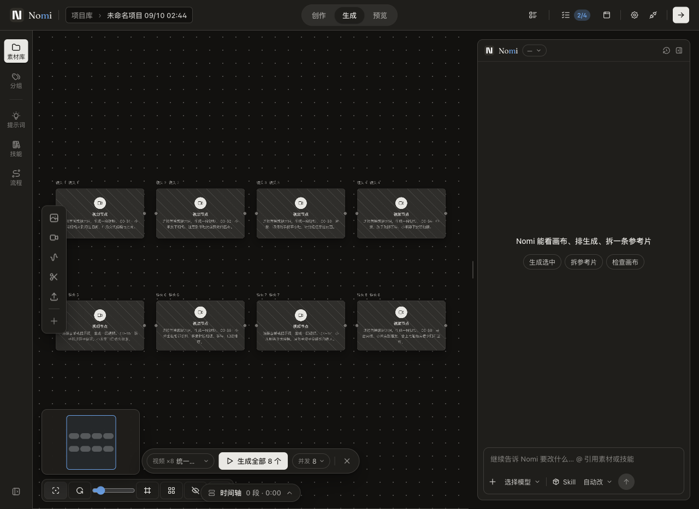
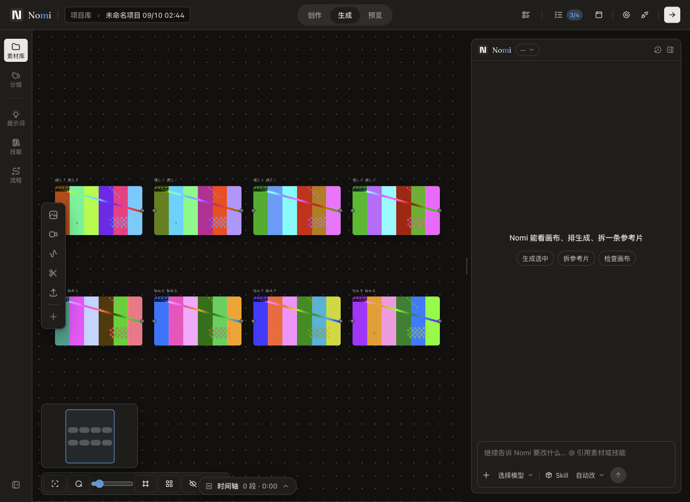

# C71 · 速度很慢：先量后修

> 状态：🚧 已实现且完整 gates 通过，PR 交付；未合并。
> 基线：origin/main `5c507a5cc3ee74f5fa25706165cb94cd3d2e8165`（含 #646）。
> 范围：仅媒体生成站的本地排队；零付费媒体，文本预算 ≤¥1。

## 测量口径

现场：`~/Desktop/Nomi-merge-gate/tests/ux/shots/g1-c0-gate-r2/attempt-1UrYyt/`。
station-ledger 为独占站耗时；transport-evidence 的 started + streamEndElapsedMs 为网络跨度；native-session JSONL 的 entry.timestamp 为完成落盘、message.timestamp 为开始。网络与工具细项嵌套在站内，不能再次相加。UI 没有独立 profiler，不将残差伪称渲染时间。

| C0 站 | 秒 | 口径 |
|---|---:|---|
| 空项目 | 1.817 | 操作+截图 |
| 导入 | 1.136 | 文稿写入+操作+截图 |
| 分镜规划 | 137.851 | Agent+审阅操作+截图 |
| 分镜物化 | 1.518 | 画布写入+操作+截图 |
| 视频生成 | 487.489 | 本地排队+供应商排队/计算+轮询+落盘 |
| 落轴与预览 | 11.181 | 写入+媒体加载+操作+截图 |
| 导出 | 23.546 | 编码与落盘+操作+截图 |
| 冷启动恢复 | 9.738 | 进程启动+数据加载+操作+截图 |
| 合计 | 674.276 | 八站相加，不含站外自动审片 |

规划四回合网络总跨度 42.208 / 1.801 / 84.043 / 7.234 秒（合计 135.286 秒）。响应头等待 1.796 / 0.921 / 0.872 / 1.295 秒；请求体 108676 / 123276 / 127902 / 152420 字节。任务书所举 61KB 和 4–5 秒并非本次 gate-r2 的请求值。响应头到达不是首个有效文字 token，不把两者混同。

工具完成间隔：首回合 read_full_text+nomi_request_tools 0.126 秒，第二回合 nomi_read 0.002 秒，第三回合 nomi_storyboard_write 0.774 秒（包含审批/落盘边界，不宣称纯 CPU）。无证据支持把优化目标放在并行读或 UI 渲染。

媒体提交前六镜仅相差 14ms，第七/八镜在首镜提交后 150.072 / 151.140 秒才开始。供应商 actual_time 分别 200/211/192/146/147/159/331/208 秒，最长镜恰好在第二批。轮询为生产 3 秒基准加抖动与网络，video-progress 的 30 秒是走查采样，不是供应商轮询。每镜最后轮询带 provider completed 时间，可分离完成发现延迟；供应商排队与计算缺少独立开始时间，不可进一步精确分解。

## 先查别人

- 本地生产并发真相源：[canvasProductionScope.ts](../../src/workbench/generationCanvas/components/canvasProductionScope.ts) 默认 6，上限 8；既有 UI 已提供 8。最晚两镜由本地队列延迟提交。
- 本地生产 worker：[generationRunController.ts](../../src/workbench/generationCanvas/runner/generationRunController.ts) 占槽直到生成完成，波间仍遵守依赖顺序；不得拆成无界提交。
- 本地轮询：[catalogTaskActions.ts](../../src/workbench/generationCanvas/runner/catalogTaskActions.ts) 视频 3 秒并有抖动、429 退避；缩短轮询最多省数秒，无法解释 150 秒队列延迟。

- [Claude Code SDK streaming](https://code.claude.com/docs/en/agent-sdk/streaming-output)：默认整条消息，includePartialMessages 转发增量事件；首个可见输出与回合完成时间不同。
- [Anthropic parallel tool use](https://platform.claude.com/docs/en/agents-and-tools/tool-use/parallel-tool-use)：同回合多工具由宿主执行；独立读可并行，有依赖/副作用需保序。
- [pi 0.85.1 agent README](https://github.com/earendil-works/pi/blob/v0.85.1/packages/agent/README.md)：与安装源码核对，默认 parallel，任一 sequential 工具使整批串行；steer 在本轮工具完成后注入，不取消在途工具。
- [APIMart development](https://docs.apimart.ai/en/development)：示例 2 秒轮询，429 降频、瞬态故障指数退避。[任务状态](https://docs.apimart.ai/en/api-reference/tasks/status) 提供 created/completed/actual_time；[webhook](https://docs.apimart.ai/en/api-reference/tasks/webhook) 需公网 URL，不为秒级收益引入公网桌面回调。

独立反方核对日期 2026-09-10：官方未公布通用并发上限，不能把 8 写成供应商推荐。拒绝盲目并行工具、缩短轮询或扩大现有上限；采用现有可选范围内的默认策略调整，实网收益仍受供应商队列影响。

## 单点方案与取舍

| 方案 | 用户感知 | 代价/判断 |
|---|---|---|
| 默认并发在现有 1–8 边界内由 6 调到 8 | 未保存偏好的八镜独立批次首批全提交 | 最多多两个在途任务，可能触发供应商限流；保留显式低并发偏好 |
| 缩短轮询 | 完成发现可能少等数秒 | 增加请求，非主因，不做 |
| 裁剪 Agent 请求 | 或减少文本延迟 | 非最大站，需独立质量评估，不做 |

保持既有 worker、取消、退避、审批、依赖波次与用户已保存的并发偏好。仅改共享默认常量，不扩上限、不造调度器。回滚通过 PR revert 恢复默认 6。

## 验证

首先原封不动运行完整 C0 dry-run，记录其基线失败；再在同一台 macOS 上运行独立媒体站重放，使用相同八镜延迟（供应商 actual_time 按 1:10 缩放），保留真 Electron 截图。此重放只证明本地排队收益，不声称重新跑了付费供应商，不以预测数字冒充真片加速。

补充生产 batch 边界回归：默认独立八任务并发、显式低并发、更多任务限流、依赖波次。最终运行 `python3 scripts/with-gates-lock.py -- pnpm run gates`，通过后按 hook 提交、推分支、开 PR。不合并。

## 同口径细分与限制

逐镜原始数字见 [gate-r2-timing.json](../evidence/c71-speed/gate-r2-timing.json)。完成发现延迟约 0.592–3.270 秒（供应商整秒时钟与本地时钟不同，非亚秒精确测量）。八镜 452 次轮询；平均请求起点间隔 3.435–3.730 秒。最慢第七镜：本地待发 150.072 秒 + 提交至发现完成 332.820 秒 = 482.892 秒，余下至视频站完成约 4.597 秒包含操作、落盘/加载和截图，无法独立拆成 UI render。供应商自身排队/计算 331 秒不可由本地代码消除；本修复针对最大站中最大的可控等待。

原始完整 C0 dry-run 在未修改生产代码的基线上因 `Unexpected text request: no unconsumed expected match` 卡在规划匹配（60 秒超时）。原失败留在 `tests/ux/shots/c71-speed/before/attempt-Jx9qmy/`；C0 原脚本/夹具/断言保持原样。本任务改用新增媒体站隔离走查 `tests/ux/g1/c71-media-latency.walk.mjs`，不把媒体站通过说成完整 C0 通过。它经项目保存 API 预置测试节点，实际点击批量生成及夹具缺报价时的逐节点确认；只使用 loopback 供应商，原始八镜 actual_time 1:10 缩放保持一致。完整素材/截图位于 task worktree，提交仅脱敏汇总与选定截图，不提交 profile 或凭据。

## 六视角复核

- CTO：复用既有有界 worker，单一默认 owner，无新增调度层。
- 设计：现有并发下拉显示 8，布局与选项不变；改前看真 Electron 外壳截图。
- PM：只改善最大站的本地待发；完整 C0 基线失败如实保留。
- 前端：保存过的 1/2/4/6/8 均不迁移；缺省与直接 runner 调用保持统一。
- 后端：不变更供应商协议或轮询策略；并发增加的 429 风险不能靠重放消除。
- 真实用户视角：新批次无需手动把 6 改为 8，但多两个请求更早提交，取消窗口相应减少。

## 修后实测

| 指标（同一 macOS / 相同本地供应商延迟） | 默认 6（改前） | 默认 8（改后） |
|---|---:|---:|
| 批量确认点击 → 八镜成功落盘 | 51.705s | 34.776s |
| 第七镜请求开始（从批量确认计） | 16.732s | 0.924s |
| 第八镜请求开始 | 16.768s | 0.958s |
| 唯一媒体请求 / 成功产物 | 8 / 8 | 8 / 8 |
| 保存的并发偏好 | null | null |
| 付费媒体 / 付费文本调用 | 0 / 0 | 0 / 0 |

媒体站重放减少 16.929 秒（32.74%），包括真实 UI 确认、生产 worker、loopback HTTP、原 3 秒抖动轮询及项目落盘。两轮各一次，不是统计显著性或真实供应商 SLA。第七/八镜显著提前说明本地排队被去除；真实供应商服务时长可能随并发变化，不把 32.74% 外推为真片保证。

[改前数据](../evidence/c71-speed/media-before.json) / [改后数据](../evidence/c71-speed/media-after.json)。两份 sourceSha 都是未提交改动所在基线；改前使用原常量 6 的 build，改后重建常量 8，实际 UI concurrencyText 和截图证实两者区别。

人眼复核：外壳、八镜排列、生成坞和并发选择器均在原位置，默认标签 6→8；测试信号产物为合成色块，不冒充真实成片。完整 C0 规划基线失败保留，未改断言。真实模型工具写对率/回合成功率本轮 N/A（无 Agent/工具契约改动、无付费文本）；媒体请求成功率 8/8。

执行：`node tests/ux/g1/c71-media-latency.walk.mjs tests/ux/shots/c71-speed/<label>`（先 build；输出目录仅测试 profile）。定向测试 30/30；新增默认与保存偏好/实际 worker admission 回归在旧常量下 4 红、改后全绿，根因合同门通过。完整 gates 第三轮 rc=0：76 contracts / 0 阻断，Vitest 11887 passed / 2 skipped，原生测试组 13+412+8+13 全过，build 成功。

最终验证基线 `807c475d68f0`：等待期间 #689 合入，已快进整合；该 PR 仅新增创作区设计样张，未改媒体调度生产路径。第一轮 gates 唯一阻断为新增脚本固定等待，已改用共享 stationTimeout 并保持成功断言；第二轮被新鲜基线闸挡住；第三轮完整通过。日志 `tests/ux/shots/c71-speed/gates-r3.log`。3 项 advisory 为 docs-index/doc-status/research-sources，按仓库当前规则不阻断；未改基线换绿。
