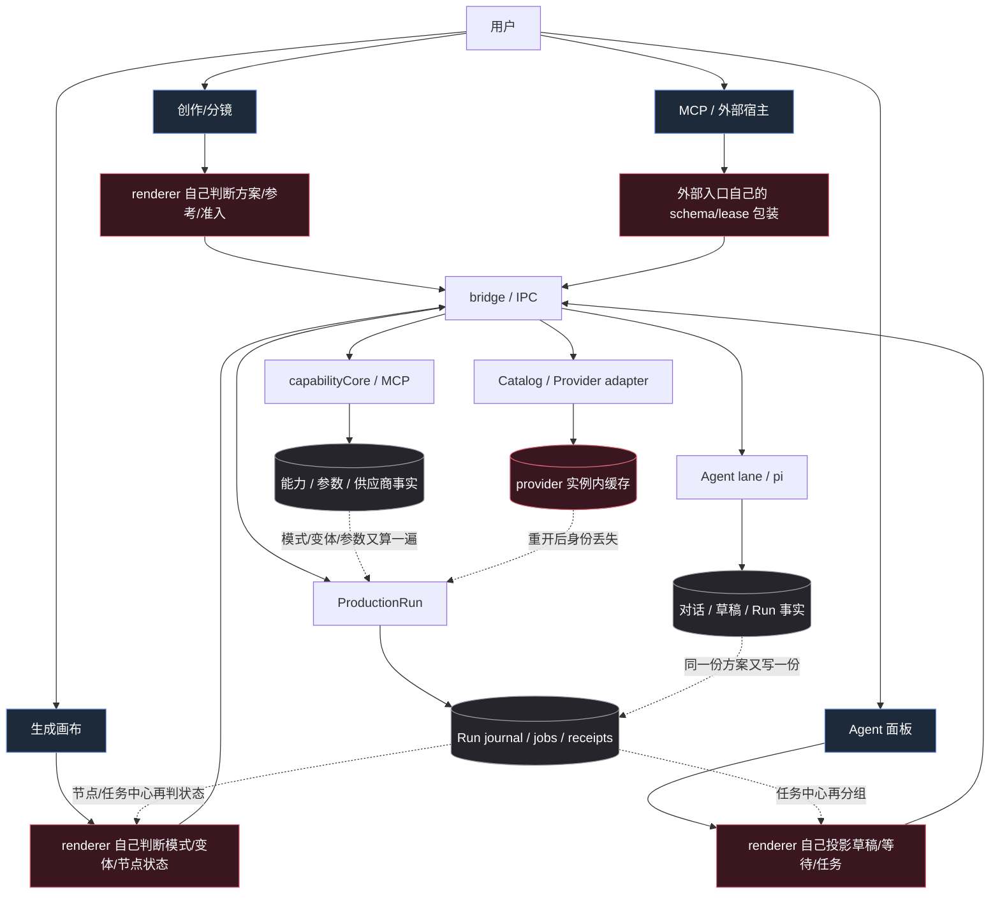
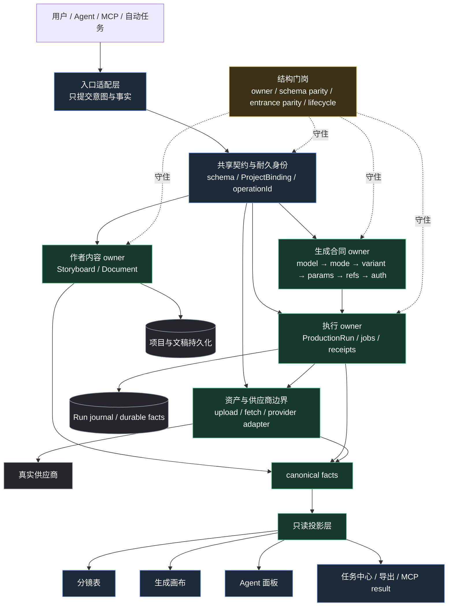

# Nomi 全仓架构治理方案：单一事实、单向投影、入口收敛

> 状态：⏳ 已拍板·未开工（架构定稿 v1.0）。本稿已完成问题定义、目标架构、生命周期映射规则、耐久提交策略、迁移/回滚方案和验收门槛；Phase -1 只读审计已完成，生产实施从 Phase 1 开始。
> 审计基线：`origin/main@1f39ea3cf`，证据窗口：2026-09-20 至 2026-09-26；已纳入制作镜头重开修复、Windows 付费走查 harness 和素材物化边界修复。
> 质量审查：见 [`2026-09-26-architecture-solution-quality-checklist.md`](2026-09-26-architecture-solution-quality-checklist.md)。结论是“方案层可施工，实施证据尚未产生”。

## 定稿决策（本稿冻结）

1. 不新增第三套 `GenerationIntent`。作者草稿复用 `PlanCandidate`/generation operation，冻结执行复用 `ExecutionContractV1`，花费授权复用 `ProductionGenerationAuthorizationEnvelopeV1`。
2. “唯一 owner”按 `(concept, lifecycle, authority_kind, trust_domain)` 计数。不同生命周期、不同信任域或框架内核与应用租约可以各有 owner，但必须用稳定身份和单向协议连接。
3. `ProductionRun` 的 durable commit 复用现有 intent log、Run journal、submission outbox 和 artifact replay；不新造 EventStore、Operation DB 或全局 store。
4. 迁移采用 single write：旧数据允许 legacy read 和一次性 adapter，不能出现无期限双写、隐形 fallback 或两个可写 owner。
5. 先完成一条从分镜行到真实 provider、物化产物和画布/任务投影的 vertical pilot，再扩展其他入口；A/B/C 不是三条可以各自验收的平行工程。
6. 观察态必须显式保留 `submission_unknown`/`reconciling`；未知不自动当失败，也不自动重提可能已扣费的请求。
7. 所有投影只读 canonical facts；投影可以排序、格式化和做显示适配，但不能重新决定模式、变体、准入、状态或是否缺依赖。
8. 本稿完成后只代表“可以按此施工”，不代表生产代码已经迁移，也不代表真实 Electron、provider、Windows 或冷重启验收已经通过。

## 先给判断

现在的问题已经不是“某个 bug 没修干净”，而是系统里存在多台同时回答同一个问题的发动机：画布 runtime、`capabilityCore`/`productionRun`、Agent lane、MCP、分镜编辑器、任务中心和各自的 renderer projection，都在局部保存、解释或再判断同一事实。

因此每次修复通常只能把一个入口接回正确零件，另一个入口仍保留旧判据。测试能证明这一条路变绿，却不能证明下一条路不会再建一份事实。真正要治理的是“概念 owner 缺失或未接线”，而不是继续增加调用点的条件分支。

## 证据和问题簇

- `docs/fixes/` 按日期筛出的 2026-09-20 至 2026-09-26 根因合同有 113 份；最近的合同反复命中 owner、schema 漂移、投影重复派生、跨边界丢身份和生命周期混用。
- `docs/audit/2026-09-24-v022-feedback-structure-review.md` 已记录“入口统一后，旧判据仍在拦”；连线、项目打开、媒体能力各自还有旧 owner。
- `docs/audit/2026-09-25-generation-canvas-ownership-review.md` 在同一周列出手势寿命、视频播放、媒体封面、引用语义、缩放五组双 owner。
- `docs/audit/2026-09-25-agent-run-canvas-projection-structure-review.md` 证明 Run 身份、节点状态、产物取回在持久账本、进程内记忆和 renderer 投影之间断开。
- `docs/audit/2026-09-26-generation-derived-facts-two-engines-structure-review.md` 明确指出画布引擎与 `capabilityCore`/`productionRun` 是两台生成发动机；变体只是刚收掉的一份副本，模式和参数面仍在同一风险带。
- `docs/audit/2026-09-26-storyboard-false-alarms-structure-review.md` 同时记录 IPC 类型/schema 双写和分镜对画布参考槽判据的重抄。
- 第一轮 Phase -1 实扫又确认：语义/分镜路径已经走 `PlanCandidate → ExecutionContractV1 → AuthorizationEnvelope → ProductionRun`，但旧画布直生成仍由 `generationRunController → catalogTaskActions → runtime.runTask/submissionLedger` 直接提交 provider，不创建 `ProductionRun`/授权 envelope/ProductionJob；这是第二条真实的付费执行生命周期，必须先登记边界或迁移目标。
- `docs/engineering/concept-owners.json` 当前登记 34 个概念，其中“出价/待决身份”和“画布缩放”仍是 `pending`；登记表目前能提示风险，但还不能阻止第二个写口。
- 2026-09-25 至 2026-09-26 的 main 提交连续出现 `agent-run-node-state-single-owner`、`generation-variant-single-owner`、`storyboard-planned-first-frame-slot`、`storyboard-resolve-vendor-rejected`、`open-fit-reopen-remembered-echo`、`spend-card-patch-json-values`，说明发现速度很快，但系统仍在靠反复发现后收口。

## 先查别人

| 问题 | 已查证据 | 结论 |
|---|---|---|
| 依赖里已有？ | `electron/productionRun/productionRunIntentLog.ts:1-260`、`electron/productionRun/submissionOutbox.ts:1-240` 和 [`docs/audit/2026-08-22-agent-runtime-source-review.md`](../audit/2026-08-22-agent-runtime-source-review.md) 已对照 | 复用 intent/outbox/receipt/replay；不把框架内核当领域 owner，也不新造 EventStore |
| 仓库里已有？ | `PlanCandidate`/`ExecutionContractV1`（`electron/capabilityCore/executionContract.ts:1-120`）、授权 envelope（`electron/productionRun/productionGenerationAuthorization.ts:1-100`）、Run journal/reducer（`electron/productionRun/productionRunRepository.ts:450-640` / `productionRunReducer.ts:718-738`） | 扩展既有 owner，禁止新建第三套 `GenerationIntent` |
| 生态里已有？ | Automerge 单文档/派生视图（https://automerge.org/docs/concepts/）、IETF Idempotency-Key（https://datatracker.ietf.org/doc/draft-ietf-httpapi-idempotency-key-header/）、OpenTimelineIO（https://opentimelineio.readthedocs.io/）、Temporal workflow/replay（https://docs.temporal.io/workflows） | 采纳稳定业务 ID、不可变执行规格、幂等命令、可重建 projection；不引入对应的外部运行时服务 |
| TikHub 自媒体怎么说？ | 本方案是仓库内部持久化、契约和恢复架构，不是竞品或内容策略；TikHub 资料不会提供比源码、协议和真实故障测试更强的证据，因此本轮不查，并把理由留在这里 | 不用自媒体观点替代代码/协议/真实运行证据 |
| 结论 | 上述四问都落到现有文件、已有研究或明确的未查理由 | “复用已有 + 在最早共享边界收口”是冻结决策 |

## 统一的类根因

### 1. 领域事实没有先成为一等对象

“这一镜由谁生成”“这一笔用哪个变体”“首帧落哪个槽”“这行是否缺参考”“这条任务属于哪个分组”等事实没有从输入到持久化、执行、投影建立一条完整的 owner 链，于是各入口按当时可见的数据再算一次。

### 2. 两台生成发动机没有共同的编译链

画布侧和 `capabilityCore`/`productionRun` 侧各自做档案解析、模式选择、变体选择、参数准入和出站编译。对等矩阵只能事后发现分裂，不能阻止新副本出现。

### 3. 跨边界契约允许“半份事实”通过

散字段、手写 TS 类型、手写 Zod schema、JSON `unknown`、模型/供应商/变体的隐式推导，让新增维度可以只改一侧而编译继续通过。`authScheme`、`modelVendor`、生成 patch 的 JSON 值都属于同一类。

### 4. 投影层承担了本应由领域层回答的问题

任务中心、分镜参考列、节点卡、Agent 卡各自决定状态、标签、是否存在、是否缺少依赖。UI 看到的不是同一个 read model，而是多份局部解释。

### 5. 耐久身份被进程内状态替代

异步查询、重开、重启、跨宿主执行时，有些路径重新从当前 renderer、provider 实例、当前页面或旧快照猜目标；一旦实例更换，事实就失去关联。

### 6. 入口统一只统一了第一层

一个入口或组件被收口后，调用它的路由、旁边的准入闸、失败映射、投影和任务显示没有一起收口，所以“有一个入口”并不等于“只有一个语义 owner”。

## 反方架构审查后的必要修订

独立审查指出，原方案方向正确，但有四个地方如果不先补定义，会把“收口”变成新的集中化风险：

1. **不得直接新造 `GenerationIntent` owner。** 仓库已有 `electron/capabilityCore/executionContract.ts` 的 `PlanCandidate/ExecutionContractV1`，以及 `electron/productionRun/productionGenerationAuthorization.ts` 的 `productionGenerationAuthorizationEnvelopeV1`。A 线开工前必须先做对象映射：作者意图、冻结执行合同、花费授权分别由谁负责。如果现有合同能承载目标，就扩展现有 owner，不另立第三套。
2. **canonical facts 不能抹平生命周期。** 至少要分开 `desired/author intent`、`frozen execution contract`、`provider observation`、`materialized artifact`。它们可以通过稳定 ID 关联，但不能共用一个状态枚举或互相覆盖。`submission_unknown/reconciling` 是观察态，不等于执行失败；artifact materialized 也不等于 provider 任务完成。
3. **入口对等要比较语义合同，不要求整报文逐字节相等。** 去掉 actor、trace、auth、lease、transport、idempotency 等合法包装后，canonical command 和领域参数必须相等；这些合法差异必须进入显式 allowlist，不能靠测试里的随意 `omit` 忽略。
4. **唯一 owner 还要有耐久提交语义。** `productionRunRepository.executeUnlocked` 当前会分别处理 approval/budget ledger、event、command index 和 snapshot；方案必须补充 commit marker、单事务日志或可重建副本的恢复规则，并用 crash-injection 验证重启后只有一个可解释结果。否则持久层也可能出现“一个事实两个版本”。

因此“唯一 owner”应理解为：**每个 bounded context、每种生命周期各有一个写 owner，并由稳定身份和明确的转换协议连接**，不是把所有事实压成一个全球单例。

## 目标架构

目标不是把所有东西塞进一个巨型模块，而是让每个概念沿固定方向经过一次决策：

### 现在：入口很多，而且每层都在重新解释事实



红色虚线就是“一个事两个口”的位置。当前不是没有 owner，而是 owner 之间没有形成完整的事实链：入口、编译、持久化、状态投影和恢复各自补了一段。

### 完成后：入口可以很多，但决定只发生一次



目标图的关键不是“所有东西合并成一个模块”，而是：作者方案、生成合同、执行 Run、供应商适配各自拥有自己的事实；它们通过稳定身份和 canonical facts 连接；所有界面只读投影，不再重新判定。

```text
用户 / Agent / MCP / 自动任务
            │ 只提交事实与意图
            ▼
入口适配层（GUI / Agent / MCP）
            │ 统一命令与统一 schema
            ▼
领域 owner（唯一写口、唯一状态机、耐久身份）
            │ 产生 canonical facts / receipts
            ▼
执行编译层（模式、变体、参数、参考、鉴权、出站 body）
            │
            ▼
供应商适配与持久化边界
            │
            ▼
只读投影层（画布、分镜、任务中心、Agent 面板、MCP result）
```

每个概念必须明确五件事：按 `(concept, lifecycle, authority_kind, trust_domain)` 计数的唯一决策 owner、唯一写口、耐久身份、允许的只读消费者、禁止重新派生的规则。`canonical facts` 只在 bounded context 内成立；跨 context 通过版本化事件、窄引用或 anti-corruption adapter 连接，不能造一个跨域万能 DTO。投影只能消费本 context 的 canonical facts；入口只能提交事实，不能带着自己的副本替代 owner。这样不会误报 React Flow/kernel 与应用租约、运行时 predicate 与持久化 owner 这种合法的分层 authority。

这里要区分“多个入口”和“多个 owner”：GUI、Agent、MCP、批量任务可以有多个入口，只要最后调用同一个 command/handler；画布、分镜表、任务中心也可以有多个投影，只要它们只读同一份 canonical facts；作者方案和生产 Run 可以分开持久化，只要前者是作者正文、后者只持有执行引用，生命周期和写权限清楚。真正要消灭的是第二个能写、能决定或能重新解释同一事实的地方。

跨进程的值对象、JSON schema 和 TS 类型要从同一份声明派生；确实必须分层时，必须有双向编译期守卫。异步链路一律携带 `ProjectBinding`/`operationId`/`runId` 等耐久身份，不能在 `await` 之后从 ambient UI 或 provider 实例重新解析。

## 完成后用户会感受到什么

- 在分镜、画布、Agent 和任务中心之间切换时，看到的是同一镜、同一参数、同一运行 ID 和同一产物，不会出现“卡片说 Fast、实际发 Standard”这种分裂。
- 用户可以在任意入口开始任务，在另一个入口继续；关闭应用、重开项目或切换窗口后，任务仍回到原来的 Run，不靠当前页面猜身份。
- 供应商回执丢失时，界面会明确显示“需要对账/正在恢复”，而不是把任务伪装成失败或悄悄再扣一次费用。
- 失败会给出唯一原因和可执行动作：重试、重新授权、等待对账或人工处理，不会让用户在多个入口重复试错。
- 新增模型或供应商只改变能力声明和适配层；用户继续使用同一套生成、审批、等待和恢复交互。
- Agent/MCP 与 GUI 共享同一命令和错误事实，用户不需要为“聊天入口”和“画布入口”学习两套规则。

## 现有对象的生命周期映射（施工前冻结）

这张表先于任何代码迁移。它把“统一”限定在语义边界内，避免为了消灭重复而把作者意图、执行合同、供应商观察和产物硬压成一个状态机。

| 生命周期 | 现有对象/代码锚点 | 唯一 owner 与写口 | 稳定身份 | 可变性与转换 | 明确禁止 |
|---|---|---|---|---|---|
| `author/desired` | `PlanCandidate`、`GenerationOperation`；`electron/capabilityCore/executionContract.ts`、`generationOperationTypes.ts` | generation operation store / `generationPlanPatch` | `projectId + operationId + candidateId + revision` | seal 前可编辑；patch 必须 CAS 当前 revision；seal 后产生不可变执行合同 | renderer、Run、provider 不得改作者草稿或回写默认值 |
| `frozen execution` | `ExecutionContractV1`；`compileExecutionContract` | capabilityCore contract compiler；授权准备由 `prepareProductionGenerationAuthorization` | `candidateId + candidateRevision + contractHash` | 合同封存后不可修改；修改必须产生新 candidate/revision/contractHash | 不得在 Run、MCP 或 provider adapter 重新推导 mode/variant/parameters |
| `spend authority` | `ProductionGenerationAuthorizationEnvelopeV1`；`electron/productionRun/productionGenerationAuthorization.ts` | production authorization / gate owner | `runId + gateId + authorizationDigest + expiresAt` | 一次授权、可过期、submit-time 必须重新校验 project/run/plan/hash/target | 入口不能把 actor、grant 或 auth 当作普通参数覆盖领域合同 |
| `execution` | `ProductionRun`、`ProductionJob`、Run journal；`productionRunRepository.ts`、`productionRunReducer.ts` | `ProductionRunRepository.execute` 与 reducer | `projectId + runId + revision + jobId + attempt` | 只能按状态转换表前进；命令以 `commandId + expectedRevision` 幂等/CAS | UI、Agent、provider 实例不得直接写 job status 或 budget ledger |
| `provider observation` | `providerTaskId`、`providerStatus`、`providerState`、`submission_unknown/reconciling` | provider adapter + reconcile service | `runId + jobId + attempt + providerTaskId?` | 观察可重复；无回执只能进入 unknown/reconcile；不得把观察直接当成 materialized artifact | 不得以“请求函数返回了”推断供应商已接受 |
| `materialized artifact` | `artifact.add` / `ProductionArtifact`；`productionRunReducer.ts`、`generationOutputMaterializer.ts` | artifact materializer + Run artifact reducer | `artifactId + jobId + contentHash + version` | receipt 校验、文件落盘、`artifact.add`、adopt 按固定顺序；物化产物不可被投影层覆盖 | 节点卡、任务中心、导出器不得自己拼产物路径或替换 artifact identity |
| `projection` | canvas/task/storyboard/Agent/MCP result projections | 各自 read model builder | 来源 `runId/operationId + sourceRevision` | 可重建、只读、带来源 revision；延迟和 stale 可观察 | 投影不得二次判状态、二次分组、二次检查 readiness |

允许的转换只有：`author/desired → frozen execution → spend authority → execution → provider observation → materialized artifact → projection`。失败和未知是每一段自己的状态，不跨段借用一个“失败/完成”枚举。`PlanCandidate` 和 `ExecutionContractV1` 目前已经在 `productionRunTypes.ts`、`productionGenerationOperationStore.ts` 和授权准备链路中互相引用；Phase -1 的任务是把这条现有关系写成可验证的账本，而不是发明新对象名。

## 耐久提交与恢复协议（选定方案）

本方案选择“Run journal 为领域事实、intent log 为提交意图与防重复锚点、side-ledger/snapshot/command index 为可重建副本”的组合。它保留现有文件格式和恢复能力，同时补足当前 `executeUnlocked` 分别写 approval、budget、event、command index、snapshot 的半提交窗口。

一次跨边界写入必须按下面顺序执行：

1. 在 `ProjectBinding`、`runId`、`expectedRevision`、`commandId`、canonical payload hash 和 fencing epoch 已确认后，向现有 `productionRunIntentLog` 写入 `prepared` 记录。
2. 在同一 Run lock/lease 下计算 reducer 结果，并准备 domain event、approval/budget/artifact side-ledger entries；每条记录都带 `commitId`、source revision 和 payload hash。
3. 先追加 domain event，再追加 side-ledger entries 和 command index；snapshot 只作为带 `snapshotCursor`/checksum 的加速副本写入。
4. 重新读取并校验 event、side-ledger、command index 的 hash、revision 和 `commitId`，确认结果完整后将 intent 标为 `committed`。
5. 任一步崩溃后，启动恢复扫描 `prepared` intent：完整且相互匹配则补写缺失的副本并提交；没有 domain event 且没有对外副作用则 `aborted`；已经无法证明 provider 是否收到请求则只能进入 `submission_unknown`/人工 reconcile，禁止自动重提。

这不是再造一个事务框架：`productionRunIntentLog.ts` 已有 `prepared/committed/aborted`、`seq/prevHash/fencingEpoch/MAC`；`submissionOutbox.ts` 已有 intent claim、`submission_unknown` 和 reconcile-only；artifact receipt → `artifact.add` → job ready 已有 replay 语义。Phase 1 只补它们与 approval/budget side-ledger 的 commit marker 和恢复测试。任何不能归入这条协议的写口先停工，不用“先双写以后再收”。

### 恢复结果矩阵

| 故障点 | 可证明结果 | 恢复动作 | 用户看到 |
|---|---|---|---|
| `prepared` 后未写 event | 没有领域事实、没有 provider 出站 | abort intent，释放 provider-safe reservation | 可重试的明确失败 |
| event 已写、side-ledger 未齐 | 领域事实存在，副本不完整 | 按 `commitId` 补 ledger/index/snapshot；补不上则 repair queue | 任务保持处理中，显示“正在恢复”，不重复提交 |
| outbox 已出站、provider 回执丢失 | provider 是否接受不可证明 | 标为 `submission_unknown`，只允许 reconcile | 明确提示“可能已提交，禁止自动重试” |
| artifact 文件已落盘、`artifact.add` 未写 | 文件可能存在但未成为产品事实 | 以 receipt/contentHash 扫描并补 `artifact.add`；无法匹配则隔离 | 产物进入“待确认/恢复中”，不伪装完成 |
| snapshot 损坏、journal 完整 | journal 是真相 | 丢弃 snapshot，按 event journal 重建 | 只出现短暂恢复状态 |
| revision/CAS 冲突 | 新旧写入身份可区分 | 拒绝旧写，重新读取 canonical fact | “内容已被更新，请重新确认”，不覆盖新版本 |

## 迁移、切换和回滚矩阵

迁移遵循“legacy read、single write、可回放、到期删除”。旧数据先由 adapter 读成当前领域对象，当前 writer 只写选定的 canonical owner；adapter 必须记录 `sourceVersion` 和 `migrationStatus`，不能悄悄吞掉字段。

| 数据/入口 | 旧形态 | 切换后的唯一写形态 | 兼容期与回滚 | 损坏/冲突处理 |
|---|---|---|---|---|
| generation draft | 旧 `GenerationOperation`、缺字段 `PlanCandidate` | 仍写 generation operation owner；seal 时只产 `ExecutionContractV1` | 先 legacy read + parity shadow；确认 pilot 后停止旧 setter。回滚只回代码，不回写旧 shape | 缺 `candidateId/revision` 不能猜，进入 repair/人工确认 |
| execution contract | `ExecutionContractV1` 历史字段、旧 optional/default | canonical compiler 输出同一 v1 结构；未来升级必须显式 v2 adapter | v1 read-only 保留到所有 Run 完成重放；不能 v1/v2 双写 | unknown/缺失字段按 contract rejection，不静默补 provider 默认 |
| authorization envelope | v1 缺 `unknownJobCount` 的旧 envelope | v1 当前读取时由 jobs 派生 `unknownJobCount=0`；新 envelope 由同一 creator 生成 | 不另立 envelope owner；过期授权只能重新授权，不能延长旧 envelope | digest、gate、planHash、target 不一致直接拒绝 |
| production Run | 旧 snapshot、分离 approvals/budget/commands | Run journal + commitId；snapshot/ledger/index 只作为可重建副本 | 先 rebuild/repair shadow，再 single write；不能回滚成多写口 | journal 可读则重建 snapshot；journal 损坏则隔离并保留备份 |
| canvas/storyboard reference | renderer 自己推导 slot/readiness、旧字段命名 | storyboard/content owner 产生 canonical reference facts | 旧字段只读 adapter；新写口上线后删除 renderer setter 和 fallback | 同一行多个候选不自动合并，标为 `needs_attention` |
| legacy Agent/MCP | 各入口手写参数、租约和错误包装 | adapter → canonical command → shared handler | 入口逐个切换；旧入口在矩阵内标 sunset date，不保留无期限 fallback | parse/normalize 失败在边界拒绝，不能落半份事实 |
| storage environment | 同步盘/杀毒/Windows sharing violation/stale lock/revision conflict | storage-environment contract + explicit unavailable/degraded state | 代码回滚不删除新 journal；只用备份/forward reader 恢复 | I/O 不可证明时保留未知态，禁止把不可读当不存在 |

切换门槛是：shadow parity 连续通过、vertical pilot 真实走通、crash/replay 和 legacy matrix 全绿后才把 writer 切到新 owner。回滚只能回到仍能读取当前 journal/contract 的兼容代码；任何已经提交的 provider 请求和花费授权不回滚、不重放。

## 可观察性、容量和用户结果门

### Lineage 与诊断

每个 command 贯穿 `commandId → contractHash → authorizationDigest → runId/jobId → providerTaskId → artifactId → projection sourceRevision`。每段记录 `correlationId`、`source`、`revision`、`observedAt`、`statusTransition` 和错误类别。日志只保留 ID、hash、revision 和时间；prompt、reference URL、credential、本地绝对路径和 provider raw response 继续使用现有 redact/sanitizer 分级，不能把整个合同原样打进日志。

第一批指标固定为：

- canonical command 漂移数、第二写口拦截数、projection lag（p50/p95）；
- `submission_unknown` 数量、最老时长、reconcile 成功率、重复 provider submit 数；
- commit recovery 次数、repair queue 长度、orphan approval/budget/artifact 数；
- journal bytes、snapshot rebuild 时长、compaction 时长、单 Run event 数；
- provider submit/query 延迟、限流次数、跨设备 revision conflict 和 storage I/O error；
- 真实用户任务完成率、重复生成/重复扣费数、冷重启恢复成功率、从错误到可恢复状态的时间。

诊断界面先给用户一个可行动的状态和 `runId/operationId`，详细 lineage 默认折叠；只有排障需要时才展开，不把内部合同和凭据暴露给用户或 MCP。

### 初始容量预算（先作为 pilot 门，基线稳定后只收紧不放宽）

- 本地 command commit p95 ≤ 200ms（不含 provider 网络）；
- 单 Run 10,000 events 冷重放 ≤ 2s；snapshot rebuild 不得阻塞 UI 线程；
- canonical commit 到投影可见 p95 ≤ 1s；
- journal 超过 1,000 events 或 10MB 触发 compaction，compaction p95 ≤ 2s，失败保留旧 journal；
- 100 job 批次不产生 O(n²) 的逐节点读取，provider 限流进入显式 `retry_wait`；
- 同步盘、Windows sharing violation、杀毒锁和跨设备 stale lock 只能产生可诊断的 degraded/unavailable，不允许 silent fallback 或误报完成。

这些数字是可测量的起始门，不是用来掩盖真实环境差异的承诺。pilot 必须在本机真实项目、真实素材和至少一个 provider 记录实测分布；如果预算不成立，先修边界或降级行为再扩范围。

### 用户验收任务

方案完成的用户结果用三条闭环验收：

1. 用户在分镜表修改一行并从画布发起生成，分镜、画布、任务中心和 Agent/MCP result 显示同一 `operationId/runId`、同一 mode/variant/参数和同一产物。
2. 生成提交后关闭并重开应用，或在切换项目后回来，系统只恢复原 Run；provider 回执丢失时显示 reconcile，不产生第二笔提交。
3. 用户从 GUI、Agent 和 MCP 分别用同一输入执行，canonical command/hash 和 provider 出站语义相同；切换供应商或模型时，差异只表现为明确的能力/unsupported 信息，不要求用户重新学习一套规则。

pilot 的放行阈值是：crash injection 下重复付费提交为 0；跨入口 canonical 漂移为 0；跨项目写入为 0；未知提交全部有可操作 reconcile 路径；投影 p95 和恢复时长达到上述预算。任何一项失败都标记为 `PARTIAL/BLOCKED`，不能用单测或 mock 改写成完成。

## 已采用的内部与外部 prior art

本稿不凭记忆新造持久化范式，采用仓库已经审查过的近邻证据：

- [`docs/research/2026-09-18-storyboard-single-ledger/prior-art.md`](../research/2026-09-18-storyboard-single-ledger/prior-art.md)：单一作者账本、派生视图、稳定 revision 和窄引用；用于 C 线。
- [`docs/plan/2026-08-15-model-integration-no-dead-end-master-plan.md`](2026-08-15-model-integration-no-dead-end-master-plan.md)：provider effect broker、submission intent、idempotency、unknown submission 和能力降级；用于 A/B 线。
- [`docs/audit/2026-08-22-agent-runtime-source-review.md`](../audit/2026-08-22-agent-runtime-source-review.md)：accepted → intent → effect → settlement、checkpoint、recovery 的现有 Nomi 形态；用于 durable commit。
- [`docs/plan/2026-09-18-agent-storyboard-write-path.md`](2026-09-18-agent-storyboard-write-path.md)：Automerge 单文档+派生视图、IETF Idempotency-Key 和 OpenTimelineIO 的单结构/投影对照；用于作者内容与入口幂等。
- [`docs/plan/2026-08-15-model-integration-no-dead-end-master-plan.md`](2026-08-15-model-integration-no-dead-end-master-plan.md) 中的 Temporal 对照只作为 workflow ID、replay 和版本校验的反方参考；本地桌面不引入 Temporal 服务，不把其运行时当成 Nomi 的新 owner。

共同裁决是：稳定业务身份、不可变执行规格、显式 outbox/receipt、可重建投影和未知态优先；不采纳“再加一个全局 EventStore/Operation DB”作为解决方案。

## 先做的三条纵向主线

### A. 统一生成合同

把“模型档案 → 模式 → 变体 → 参数准入 → 参考槽 → 鉴权 → 出站请求”收成现有 `PlanCandidate → ExecutionContractV1 → ProductionGenerationAuthorizationEnvelopeV1` 链。画布、分镜、Agent、MCP、批量和生产 Run 都提交同一个候选合同；它们只能通过入口适配转换用户输入，不能各自做 canonicalize/default/infer。这里不再引入名为 `GenerationIntent` 的第三套 owner；如果未来需要更好的命名，只能在不增加语义实体的前提下做别名或版本迁移。

第一批纳入：`variantResolution`、`compileParameters`、`generationResolveInputSchema`、`generationJsonValueSchema`、参考槽 owner、`VendorAuthSpec`。必须同时删除旧推导，而不是保留 renderer/host 两套 fallback。

### B. 统一生产事实和投影

`ProductionRun` 持有执行身份、任务 receipt、状态和产物引用；`productionShotPhase` 是镜头状态唯一判据；`canvasLandingHost` 是 Run → canvas 的唯一落地旁路；`taskCenterProjection` 是任务分组、标签和是否成行的唯一 read model。画布节点、任务中心和 Agent 卡都只画这个投影，不再各自轮询/分组/判断。

第一批纳入：`agent-run-node-state-single-owner`、`canvas-generate-ignores-production-shot`、`task-center-state-owner`、供应商产物取回和 Run 查询身份。先清掉 renderer 轮询和第二套生成态，再处理剩余的排队/已停小标。

### C. 统一作者内容与执行内容

分镜作者方案只有一个持久化 owner；Run 只保存执行引用、快照和 receipt，不再成为作者正文的第二个家。画布、分镜表、Agent、MCP 的读写都通过同一 `setStoryboardPlan`/窄 RPC；参考列、批量按钮和发送路径共享同一 readiness 判据。

第一批纳入：`agent-plan-one-home`、`storyboard-planned-first-frame-slot`、`storyboard-resolve-vendor-rejected`，并处理合同中仍保留的 mode override 与多帧 anchor residual risk。

## 横切治理层

### 1. 把概念登记升级为可执行的 owner registry

扩展 `docs/engineering/concept-owners.json`，每个条目增加：`subject`、`lifecycle`、`authority_kind`、`trust_domain`、`fact_kind`（durable/state-machine/value-object/projection）、`write_api`、`identity_fields`、`revision_source`、`replay_strategy`、`allowed_consumers`、`forbidden_derivations`、`parity_test`、`migration_strategy`、`migration_status`。`pending` 不得进入生产 lane；没有 owner 的新概念在合同检查中失败。

新增 `check:concept-owners`：

- 扫描 owner 之外的同形写法、第二个 setter、第二个 canonicalize/default/infer；
- 扫描 UI 组件按 raw status/flag 再分组、再判缺失、再决定是否运行；
- 扫描跨入口是否都到同一个 command/handler；
- 允许纯排序、显示格式化和协议适配，但必须标注为 projection/adapter，不能携带决策语义。

这道 AST 门岗只能抓形状，不能单独证明语义 owner。每个登记项还必须有运行时/谓词对等测试、变异测试和跨边界真实旅程；像 React Flow/kernel 这种“应用租约 + 框架内核”的双层 authority，要登记单向控制关系，而不是强行合并成一个实现。

### 2. 建立跨入口对等棘轮

对每个高风险概念登记入口矩阵：GUI、Agent lane、MCP、生产 Run、恢复/重开、测试 harness。去掉 actor、trace、auth、lease、transport、idempotency 等显式 allowlist 字段后，相同输入必须生成相同的 canonical command/envelope；不在 allowlist 的差异一律失败。

对等比较的固定顺序是：`untrusted input → parse/normalize → canonical domain command/hash → policy+grant → auth/lease envelope`。现有 `productionGenerationAuthorization.ts` 的 payload hash / authorization digest 作为授权、outbox 和 wire payload 的共同锚点；不能先剥掉 auth/lease 再比较原包，避免包装层偷偷改写 provider、model 或 target。

### 3. 建立契约生成与双向守卫

优先把 `z.infer`、共享 JSON value schema、wire schema 和 renderer 类型放到共享契约层。不能合并的两份表必须由类型级 MissingKeys 守卫覆盖，并用 mutation test 证明删一字段会红。禁止 `as` 把未解析数据强行变成领域类型。

### 4. 把生命周期和身份做成显式边界

所有跨 `await` 的生产路径都必须带不可变 `ProjectBinding` 或 `operationId/runId`，并在最终写入前 `assertCurrent()`。查询、重试、恢复、物化、任务投影不得从当前页面、当前 provider 实例或旧列表猜目标。

提交边界还必须说明 event、approval、budget、snapshot、artifact receipt 的原子关系。优先复用现有 `electron/productionRun/productionRunIntentLog.ts` 的 prepared/committed/aborted、seq/prevHash/fencingEpoch/MAC，`submissionOutbox.ts` 的 `submission_unknown`/reconcile-only/intent claim，以及 artifact receipt → `artifact.add` → job ready 的既有 crash/replay 语义；先补齐 approvals/budget side-ledger 与这些 primitive 的关系，不另造 EventStore/Transaction 框架。允许可重建的派生缓存，但必须记录来源 revision 和重放规则；不允许“账本已写、事件未写”或“事件已写、artifact 无法解释”的无标记中间态。

### 5. 把文档现状接入交付

每次 owner 变更同 PR 更新 `docs/ARCHITECTURE-NOW.md`、`concept-owners.json` 和对应结构测试。`docs/plan/` 只写目标；现状文件只写可验证的 `file:symbol`。每个结构合同必须标注“收掉了几份决策逻辑”，不能只报门数。lineage 日志只记录 ID/hash/revision/observedAt，prompt、reference URL、credential、provider raw response 必须沿用现有 redact/sanitizer 分级，不能原样写日志。

## 分阶段执行顺序

### Phase -1：对象与生命周期账本（审计包已完成；迁移放行未完成）

已完成四态对象图：author/desired、frozen execution、provider observation、materialized artifact，并补充 spend authority、semantic execution、direct canvas execution 和 projection。逐项标出了 owner、身份字段、可变性、持久化位置、事件来源、恢复方式、允许的状态转换和冲突处理。现有 `PlanCandidate`、`ExecutionContractV1`、`productionGenerationAuthorizationEnvelopeV1`、Run journal、provider receipt、artifact record 已映射进账本；最新 `origin/main@1f39ea3cf` 合入的制作镜头重开修复、Windows 付费走查 harness 和素材物化边界修复也已纳入：制作节点运行记录身份由 `electron/shared/productionShotPhase.ts` 统一，画布重开收敛器不再改写制作投影记录，付费走查已有隔离 profile / provider receipt 采集入口。同步盘、杀毒软件、Windows sharing violation、跨设备 stale lock 和 revision conflict 已登记为 `storage-environment contract` 残余风险。

本阶段未新增 `GenerationIntent`、新 Run 状态或新投影；已完成入口矩阵、生命周期账本、提交边界、parity 矩阵和恢复探针收据。审计包完成不等于生产迁移放行：direct canvas remote/paid candidate、durable commit/crash injection、真实 Electron/provider、冷重启、存储环境和 Windows 证据仍为 **PARTIAL/BLOCKED**。若两个现有对象语义相同，后续选定一个 owner 再迁移；若生命周期不同，保留两个对象但只允许单向引用。收据见 [`Phase -1 审计文件`](../audit/2026-09-26-phase-minus-one-entrance-matrix.md)。

### Phase 0：冻结与全仓盘点

先不改生产逻辑，建立 `architecture-ledger`：先对全部根因合同的 `class_root` 去重，再标出“同层顺带改动/粗目录聚类”的误报，最后抽取 `shared_boundaries/doors/legacy_paths/residual_risks`，按五个桶聚类：语义 owner、跨边界契约、投影/状态机、身份/生命周期、供应商/资产线路。为每个真实簇选一个 owner 和一个反例。该账本成为后续唯一工作清单。

输出必须包含：概念名、lifecycle、authority_kind、trust_domain、当前 owner、重复口、真实入口、持久化位置、允许消费者、待删旧路径、阻断级别。`door-map` 只负责事实入口清单；“决策门”数量要单独统计，避免门数增加被误读成结构变差。

### Phase 1：先建治理门与 durable commit，再迁移事实

落地 owner registry、语义 parity、schema parity、生命周期 identity、durable commit/replay 五类门岗；每道门先用旧代码做阳性对照证明会红。durable commit 不能只作为验收愿望，必须在本阶段锁定本稿的“Run journal + intent log commit marker + side-ledger 可重建副本”组合，明确 source of truth、崩溃点 recovery、projection lag 和 repair API。没有门岗的概念不进入下一条新功能线。

Phase 1 的第一条实现 lane 是 direct canvas paid generation：先让它通过同一 `ExecutionContractV1`、authorization、submission outbox、provider observation 和 artifact seam；只有明确为本地非付费操作的路径才保留独立 bounded context。禁止用长期双写把两条付费生命周期同时留下。

### Phase 2：一条完整 vertical pilot，再扩展三条主线

账本和 durable commit 稳定后，不先横向完成 A、再完成 B、最后完成 C。先做一条完整 vertical pilot：分镜行 → 现有 `ExecutionContractV1` → authorization envelope/grant → Run command/outbox → provider observation → materialize → canvas/task projection。它一次验证 authoring、generation、execution、provider、projection 是否真的通过同一条 seam，避免 A/B/C 各自拿 adapter 或 fixture 证明后再临时拼接。pilot 通过后，再按同一 seam 扩展批量、Agent、MCP 和其他入口。每次只让一个协调 lane 持有该概念，不能把同一 owner 拆给多条并行分支。

### Phase 3：接入剩余子系统

按风险从高到低处理 provider/auth/asset、编辑与导出、任务中心其余投影、MCP/Agent 入口、设置和 onboarding。新的 provider 或模型只允许接入 A 的生成合同，不能重新引入 provider-specific UI 判据。

### Phase 4：清理与验收

删除所有旧 setter、重复 schema、renderer 轮询、手写映射和未使用的 fallback；逐项为 `concept-owners.json` 的 pending 补 owner、到期日和禁止进入的 lane，不能为了清指标而假删 pending；用真实 Electron 旅程验证冷启动、重开、切项目、跨宿主、真实素材和真实 provider 边界。之后再更新 `ARCHITECTURE-NOW`，并运行一次完整 Ponytail 评审。

## 每个结构迁移的固定模板

1. 先写概念占用表和 root-cause v3 合同，明确 symptom、class root、doors、shared boundary、legacy path。
2. 为报告路径和至少两个同类入口先写红测；先证明旧代码确实允许第二个 owner 或契约漂移。
3. 选最早共享边界，收成一个值对象/状态机/投影；调用者只传事实，不再传派生结果。
4. 同 commit 删除旧 setter、旧判据、旧 schema、旧 fallback；保留的 adapter 必须无状态、单向、没有自己的决策语义。
5. 加入 canonical command/envelope 对等、冷重启/重开、真实 Electron 和真实素材验证；单测绿不能代替这些证据。
6. 收货时检查两点：第二 owner 是否真的消失；同一输入是否经过所有入口得到相同出站报文。

## 完成判据

- 新增概念先有 owner，再有目录和实现；`pending` owner 不得被调用。
- 对每个 `(concept, lifecycle, authority_kind, trust_domain)` 只有一个可写 owner 和一个决策函数；其余位置只能是声明过的 controller、adapter 或 read-only projection。
- GUI、Agent、MCP、生产 Run、恢复路径共享同一 canonical contract；入口差异只剩信任包装和 UI 交互。
- 新增字段会在 schema/类型/所有入口处同时报红；新增 provider 不会要求 renderer 增加一套规则。
- 任何异步写入都能追溯到稳定的 project/run/operation identity，不能从当前页面或实例猜回去。
- author、frozen execution、provider observation、materialized artifact 四种生命周期不会互相冒充；重启和重放后的结果有明确的冲突与未知态。
- Run 的 command、approval、budget、event、snapshot、artifact receipt 具备可证明的提交/恢复关系；故障注入后不会产生无法解释的半提交。
- 每个结构合同的旧路径已删除，residual risk 逐项有 owner、证据和到期日；没有“已登记但没有出口”的债。
- `docs/ARCHITECTURE-NOW.md` 与代码锚点同步，真实 Electron 旅程通过后才把对应项记为已解决。

验收指标不以 `doors` 总数简单判断好坏。一次收口可能让读入口变多（例如任务中心需要显式列出所有消费者），所以要同时记录：`decision_owner_count = 1`、`write_owner_count = 1`、`projection_count = N`、入口对等矩阵是否全绿，以及旧决策实现是否删除。只有决策 owner 或写 owner 增加，才算结构回归。

## 明确不做

不做一次性全仓重写，不新造统一大框架，不把所有状态合成一个巨型 store，也不靠继续增加结构测试数量来掩盖 owner 没有收口。采用纵向切片迁移；每条切片完成后再删除旧路径，避免出现“新旧两套都能写”的过渡态。
