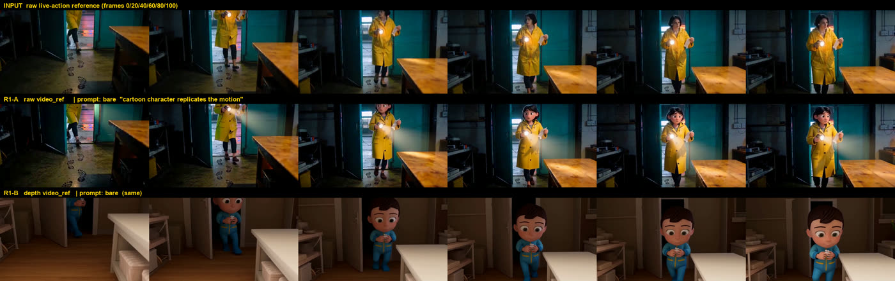
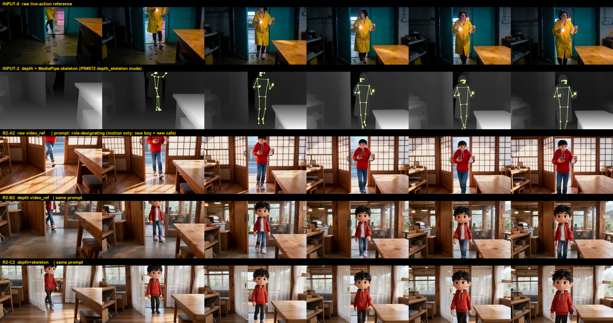

# 动作参考该喂原始视频还是深度/骨架视频？（一次真实生成的裁决）

日期：2026-09-07 · 基线：`origin/main@0ad7d97ef`
性质：调研 + 真实付费 A/B（5 次真生成 + 2 次 VLM 打分）
服务对象：**PR #572 / `docs/plan/2026-09-06-depth-video-canvas-node.md`（深度视频处理节点）的去留裁决**

> 一句话：#572 的 v1 验收门写的是「深度产物能被 `video_ref` 消费，真人视频 → 深度参考 → 生成新角色演绎片」。
> 本文用同一模型、同一素材、同一提示词，把这条门**真跑了一遍**，并加跑了社区实际在用的 `depth+skeleton` 配置。

---

## 0. 要回答的问题（先写死）

1. 四家一手契约（火山方舟 Seedance / MiniMax H3 / 可灵 Motion Control / Runway Act-Two）到底**接受**什么样的参考视频？有没有任何一家声明支持 depth / pose / skeleton 控制视频？
2. 同模型同提示词下，**原始视频**当 `video_ref` 与**深度视频**当 `video_ref`，谁的动作更准、身份更稳、画面更稳？
3. 加上骨架叠加（#572 的 `depth_skeleton` 模式）能不能把差距补回来？
4. #572 该关掉、改成 ComfyUI 工作流，还是保留？

---

## 1. 结论先行

1. **四家官方文档，零家声明接受深度/骨架/pose 控制视频。** 参考视频这一栏，四家写的都是「原始表演素材」，模型自己从里面提动作。见 §2.1 逐条原文。
2. **对 Seedance 2.0（本文实测的模型），原始视频在两轮里都赢，且赢在最贵的那一项——具体手部动作。** 深度臂丢的不是「像不像」，是**「他在干什么」**：参考里「举起手电 + 另一手拿纸」这个动作，两条深度臂（纯深度 / 深度+骨架）都退化成「双手自然下垂地走进来」。VLM 独立打分同判（§4）。
3. **加骨架叠加**（#572 `depth_skeleton` 模式，MediaPipe 33 点、`#d9ff8f`、lineWidth 3 / jointRadius 5 / confidence 0.35，逐项照抄 PR #572 常量）**在本用例上边际收益 = 0**：C2 与 B2 三项分数完全相同，手部动作一样没回来。
4. **社区（抖音/X）确实在热炒「深度视频当动作参考」，但他们买的不是动作精度，是「不串味」——而这一点方舟官方提示词契约本来就能给。** 社区的核心论点是「原片的色调/背景/人物会污染生成」，所以要用深度洗掉。本文第 2 轮把方舟官方文档写死的做法（`@视频1 …说明每份素材具体提供什么…以及不采用什么`）用上去之后，**原始视频臂照样换掉了角色、场景、色彩、材质，同时把手部动作留住了**——社区那条动机在 Seedance 2.0 上不成立，用提示词就够。见 §3。
5. **处置建议：#572 按「video_ref 闭环」这个立项理由应当关掉**（v1 验收门已被实测证伪）。深度/骨架真正成立的场景是 ComfyUI 侧的 ControlNet 类条件注入，与 `video_ref` 是两条不同的线；若要留，必须改立项理由并重写验收门。详见 §5。

**诚实边界（这几条会推翻上面的结论，本文没覆盖）**：只测了 1 段素材、1 个模型、1 个提示词模板、480p、每格 n=1、未控 seed；素材是**慢速走位**——而社区自称收益最大的是「快动作、旋转、大幅度舞蹈」和「夜拍/噪点素材」，这两类**没测**。

---

## 2. 一手来源

### 2.1 论文 / 官方文档

| 来源 | URL | 日期 | 这条证明了什么 |
|---|---|---|---|
| 火山方舟《视频生成教程》§使用限制 | https://docs.volcengine.com/docs/82379/2298881 | 页面标注 2026-09-01 更新 | 参考视频只按**容器/编码/尺寸/时长**约束：`视频格式：mp4、mov` · `Seedance 2.0 系列：单个视频时长 [2, 15] s，最多传入 3 个参考视频` · `帧率 (FPS)：[24, 60]` · `单个视频不超过 200 MB`。**全篇零处**提 depth / 骨架 / pose |
| 同上（能力表） | 同上 | 同上 | 「全模态参考」一行只分 `图片参考 / 视频参考 / 音频参考`，没有「控制视频」这一档 |
| 同上（肖像限制） | 同上 | 同上 | 原文：「Seedance 2.5 和 Seedance 2.0 系列模型**不支持直接上传含有真人人脸的参考图/视频**」——这是深度派最硬的一条现实动机（§3），但 APIMart 侧的 `seedance-2.0-face` 变体已经解掉 |
| 火山方舟《Doubao Seedance 2.5 教程》§提示词规则 | https://docs.volcengine.com/docs/82379/2607688 | 同上 | **动作是「靠提示词指派职责」拿的，不是靠换输入格式**。原文：「明确素材职责：使用 @图片1、@视频1、@音频1 指代参考素材，说明每份素材具体提供什么（如外貌、动作、音色），**以及不采用什么**」 |
| MiniMax 平台《视频生成 v2 · 创建》 | https://platform.minimaxi.com/docs/api-reference/video-generation-v2-create | 2026-09-07 抓 | 参考视频以 `role: reference_video` 传入，注为「参考视频（仅多模态参考场景）」；约束同样只有 mp4/mov、H.264/H.265、≤50 MB、[2,15]s、宽高比 [0.4,2.5]。**未提** depth/pose/skeleton |
| KIE 镜像的 Seedance 2 契约 | https://docs.kie.ai/market/bytedance/seedance-2.md | 2026-09-07 抓 | 同上口径（`reference video ... maximum 3 reference videos`），**未提**任何控制信号类型 |
| 可灵 Motion Control（fal 一手字段说明） | https://fal.ai/models/fal-ai/kling-video/v2.6/standard/motion-control/api | 2026-09-07 抓 | `video_url` 原文：「Reference video URL. The character actions in the generated video will be consistent with this reference video. **Should contain a realistic style character** with entire body or upper body visible, including head, without obstruction.」——**明确要求真人表演素材**，与深度/骨架正相反 |
| Runway Act-Two（官方帮助中心） | https://help.runwayml.com/hc/en-us/articles/42311337895827-Performance-Capture-with-Act-Two | 2026-09-07 抓 | 输入是 driving performance video（手机/摄像头拍的一段真人表演）＋ character 图/视频；官方最佳实践讲的是「构图干净、手和脸可见、动作平稳」。**未提** depth/pose 输入 |

> **§2.1 的裁决**：`video_ref` 这条线在四家眼里都是「原始表演素材进，模型自己做姿态估计」。
> 没有任何一家把 depth/skeleton 列为受支持的输入形态——喂进去只是「一段恰好长这样的视频」，不是被识别的控制信号。
> （可灵那条甚至是**反向**要求：必须是 realistic style character。）

### 2.2 开源近邻（R6）

| 项目 | file:line | 它怎么做的 | 我们能不能抄 |
|---|---|---|---|
| Nomi 自己的 scene3d「灰模运镜片」 | `tests/ux/b1-camera-move.walk.mjs:147`、`tests/ux/walk-ref-e2e.mjs:1` | 本地 WebGL 渲染灰模 → ffmpeg 拼 mp4 → **自动喂进目标节点 `meta.referenceVideoUrls` 并切到 omni 模式** | **已经有了**。深度节点想干的「本地生成一段结构参考片 → 喂 video_ref」，这条管线在 main 上跑通并有 e2e。#572 是在这条已存在的管线旁边再造一个产源 |
| Nomi 能力档案对「动作参考」的建模 | `electron/shared/videoCapabilities/seedanceApimart.ts:34-40` | `MOTION_REFERENCE_CHANNEL = { signal: "motion_reference", via: "reference_slot", slotKind: "video_ref" }` | 仓库既有模型就是「动作参考 = 原始视频进 video_ref 槽」，与 §2.1 四家契约一致 |
| PR #572 的深度/骨架实现 | `electron/shared/canvas/videoDepthModels.ts`（PR 分支） | DA2-small fp16 ONNX + MediaPipe PoseLandmarker full | 本文的深度臂/骨架臂**逐项照抄它的常量**跑出来（模型 sha256 一致，见 §6），所以结论直接适用于 #572 的产物 |

### 2.3 自媒体来源（TikHub）

抓取命令：

```bash
export TIKHUB_API_KEY="…"        # 只从环境变量读，别写进任何文件
node scripts/research/tikhub-search.mjs \
  --q "动作参考 视频 深度图 骨架 AI视频生成" --platform all --limit 20 --since 2026-03-01 \
  --out docs/research/2026-09-07-motion-ref-raw-vs-depth/tikhub/
```

产物附件：`docs/research/2026-09-07-motion-ref-raw-vs-depth/tikhub/tikhub-search.json` · `…/tikhub-search.md`
（抖音 20 · B站 20 · X 20 · 小红书 0 —— 小红书端点 HTTP 400，已记在附件的对账表里，未重试掩盖。）

| 平台 | 出处 URL | 作者 | 发布时间 | 观点摘要（原文，不改写） | 提到的框架/工具 |
|---|---|---|---|---|---|
| 抖音 | https://www.douyin.com/video/7667078251226942763 | 诺皮克NovaPix | 2026-07-27 | 「用K3做了一个视频转深度视频+骨骼绑定的skill，用来做动作迁移。……【@video1 为动作与空间参考：骨骼轨迹定义动作与时序，须严格还原，不得增删动作或改变节奏；深度图仅表达空间纵深与运镜，禁止模仿其颜色与质感。】优点：1. 动作保真度更高…… 2. 杜绝风格串味…… 3. 背景不粘连…… 4. 弱光/低质素材可用…… 5. 规避肖像与版权。缺点：丢失手指细节、面部表情、衣物飘动这些骨骼和深度都不承载的信息；人与物体交互（踢球、持剑）的关系变弱——深度图里有物体轮廓但没有语义。」 | Seedance、kimi/K3、即梦 |
| 抖音 | https://www.douyin.com/video/7667879742560914740 | 白无常C4D | 2026-07-29 | 「做了一个视频转深度图skill……就可以转深度图与带人物动作骨骼。」 | （无） |
| 抖音 | https://www.douyin.com/video/7680915189902965477 | 刘量AI | 2026-09-02 | 「一段深度视频，AI就能精准复刻所有动作」 | （无） |
| X | https://x.com/joshesye/status/2095042332089368692 | 行者AI视频 | 2026-09-02 | 「LibTV……上线了「深度动作捕捉」功能……一键提取视频里的深度动态信息，动作、走位、运镜和空间关系全部转成干净的参考，原视频的人物、服装、场景、画风都不会带进来。」 | LibTV |
| X | https://x.com/liyue_ai/status/2094940870147559891 | 李岳 | 2026-09-02 | 「昨天这个用Codex本地生成深度视频火了……可以使用LibTV的在线【深度动作捕捉】……关键是免费。不过我对比了一下在线生成的精度没有我本地的高，当然如果只是捕捉动作的话够用了。」 | LibTV、Codex |
| X | https://x.com/laowangbabababa/status/2095318275391709436 | 产品经理老王霸 | 2026-09-03 | 「复杂动作的复刻只用提示词是很难完整还原的，所以需要到白模做参考复刻。白模是一套没有任何材质贴图的三维灰模……画面上剩下的只有三样：人物在空间里的位置、人物的运动轨迹、机位的运动轨迹。」 | LibTV、Codex |
| X | https://x.com/Magncsans/status/2096530480548172245 | Foyege | 2026-09-06 | 「白模的精细度**最好不要太精致**，否则会大大约束了模型的发挥空间……除了你必须要求的一些特定动作或者运镜，其他一律生成粗模……然后提示词补强，这才是最佳用法」 | GPT 6 |
| B站 | https://www.bilibili.com/video/BV1yKta6iEn3 | 设计门外憨 | 2026-09-01 | 「ComfyUI 构图控制：OpenPose 与深度图的选型逻辑与实操对比」 | ComfyUI |

**读到的真实摩擦**（他们在骂什么/夸什么）：

- **他们要的是「不串味」，不是「更准」。** 五条优点里三条（杜绝风格串味 / 背景不粘连 / 规避肖像与版权）都是**减法诉求**——嫌原片带进来的东西太多。
- **肖像限制是真痛点。** 「规避肖像与版权」对上了方舟白纸黑字的「不支持直接上传含有真人人脸的参考图/视频」（§2.1）。这不是玄学，是被平台审核逼出来的绕路。
- **代价他们自己也说清楚了**：丢手指细节/表情/衣物飘动，**人与物体交互变弱**——「深度图里有物体轮廓但没有语义」。本文实测复现的正是这一条（§4：手电 + 纸这组「人-物交互」在两条深度臂里整个消失）。
- **市面上已经有免费现成品**（LibTV「深度动作捕捉」在线、一堆 Codex 本地脚本），这是 R20 build-vs-buy 的直接信号：这不是护城河能力。
- **「太精细反而更差」** 这条与 §4 的结果同向：结构参考越硬，模型自由发挥空间越小，而它恰恰不承载语义。

---

## 3. 反方视角

| 别人的做法 | 出处 | 它为什么这么选 | 对我们成立吗 |
|---|---|---|---|
| 深度+骨架当 Seedance 动作参考 | 抖音 诺皮克NovaPix / 刘量AI；X 行者AI视频、李岳 | 怕原片的色调、背景、人物「串味」进生成结果；躲肖像审核 | **不成立（在 Seedance 2.0 上）**。§4 第 2 轮证明：原始视频 + 方舟官方文档写死的角色指派提示词（「不采用它的外貌、色彩、材质与场景」）**照样换掉了角色和场景**，而且把手部动作留住了。串味是提示词没写对，不是输入格式的问题 |
| 白模（三维灰模）当结构参考 | X 产品经理老王霸、Foyege | 只留位置/轨迹/机位三样，其余交给提示词 | **成立，而且我们已经有了**：`scene3d` 的灰模运镜片 → 自动喂 `video_ref`（§2.2）。#572 不是在补空白，是在这条既有管线旁再开一个产源 |
| 「精细度不要太高」 | X Foyege | 太硬的结构参考会锁死模型 | 与 §4 同向：深度+骨架比纯深度**没有更好**，动作反而一样丢 |
| LibTV 在线「深度动作捕捉」（免费） | X 行者AI视频、李岳 | 用户不想装环境 | R20 直接命中：通用能力、已有免费现成品、不在护城河上 |

---

## 4. 真实 A/B（付费实跑）

**共同条件**：APIMart → `doubao-seedance-2.0-face`（`seedance-2.0-face`，真人变体；非 face 变体会被方舟的真人人脸限制拦掉）· `image_to_video` / omni 模式 · `video_urls` 单槽 · 480p · 5s · 16:9 · 每格 n=1 · 走 app 金路径（`window.nomiDesktop.tasks.grantSpend` → `tasks.run` → `tasks.result`），key 由 app 的 safeStorage 自解密，未落盘未进日志。

**素材**：`tests/ux/fixtures/real-shot-640x360.mp4`（仓库既有真人素材，5s）→ 升到 1280×720 / 24fps（方舟对参考视频有总像素下限 `[407696, 8295044]`，640×360 = 230400 不够）。
**深度臂**：Depth-Anything-V2-small fp16 ONNX，**官方 HF 端点**下载，`sha256=2df6223f…5b04` —— 与 PR #572 `videoDepthModels.ts` 里 pin 的哈希**逐字节相同**，故本文的深度产物 = #572 会产出的东西。normalize/EMA(α=0.35)/nearWhite 灰度映射逐项照抄 `depthRenderUtils.ts`；`maxResolution=768`、`processingFps=30→24`。
**骨架臂**：MediaPipe BlazePose 33 点（`model_complexity=1` = full 档），拓扑 35 条边，样式取 `VIDEO_DEPTH_FIXED_SKELETON`（`#d9ff8f` / lineWidth 3 / jointRadius 5 / confidence 0.35）。120 帧里 107 帧检出人体。

### 第 1 轮 — 裸提示词（任务给定的原句）

提示词（两臂逐字相同）：`一个卡通角色复刻参考视频中的动作`



| 臂 | 输入 | 动作对不对 | 角色身份保不保 | 画面稳不稳 |
|---|---|---|---|---|
| **A** | 原始视频 | **5** — 走进门、停在中景、举手电、另一手拿纸，节奏与机位逐帧对得上 | **5** — 黄雨衣、手电光束、纸、木桌、青绿色门、地上脚印全在，只是转成卡通渲染 | **5** |
| **B** | 深度视频 | **3** — 只剩「从门口走向镜头并停住」这个大走位；举手电 + 拿纸整组动作消失 | **1** — 换成蓝背带裤男童、道具没了、场景换成米白色泛用房间、木地板 | **4** |

VLM（gemini-3.5-flash，独立打分）：A 5/5/5，B 3/1/5，`verdict: A_better`，理由原文：「Output B ... loses all color, texture, and prop identity, resulting in a completely different character and scene.」

> **第 1 轮的问题**：这一轮**两臂都被同一个坏提示词坑了**——它没有按方舟文档的要求「说明每份素材提供什么、不采用什么」。
> 原始臂不受影响（原片什么都带，模型直接照抄就赢），深度臂却被饿死（深度只带几何，提示词又没给内容描述，模型只能自己编）。
> 所以第 1 轮**不能**单独当裁决，必须补第 2 轮。

### 第 2 轮 — 方舟官方角色指派提示词（社区实际用法）

提示词（三臂逐字相同）：

> `@视频1 提供动作与空间参考：严格还原其中人物的动作、时序与镜头运动，不得增删动作或改变节奏；不采用它的外貌、色彩、材质与场景。生成内容：一个穿红色连帽衫的卡通男孩，在一间明亮的日式木质咖啡馆里，按上述动作走向镜头。3D 卡通渲染风格。`



| 臂 | 输入 | 动作对不对 | 角色身份保不保（这轮＝指定的新角色稳不稳） | 画面稳不稳 |
|---|---|---|---|---|
| **A2** | 原始视频 | **5** — 走进推拉门、停中景，**并且把「双手在胸前举起两样东西」这组手部动作迁移过来**（手电+纸 → 杯子+卡片） | **5** — 红帽衫男孩 + 日式木质咖啡馆，逐帧一致，原片的黄雨衣/工厂/青绿门**一点没带进来** | **5** |
| **B2** | 深度视频 | **3** — 走位与停位对，手臂全程自然下垂，举物动作没了 | **5** | **5** |
| **C2** | 深度 + 骨架 | **3** — 与 B2 相同，骨架**没有**把手部动作救回来 | **5** | **5** |

VLM（gemini-3.5-flash，独立打分，提示词里明说「抄参考的外观算失败」）：
A 4/4/4 · B 2/4/4 · C 2/4/4 · `ranking: [A, B, C]` · `does_depth_or_skeleton_beat_raw: "no"`，理由原文：「The raw reference in A successfully guided the model to generate the hand-held objects and raised arm pose, which both the depth and skeleton models completely missed.」

> **第 2 轮的裁决**：给对提示词之后，**原始视频臂同时拿到了两样东西**——彻底更换的角色/场景 **和** 精确的手部动作。
> 深度臂只拿到前者。社区那条「必须用深度才能不串味」的动机，在 Seedance 2.0 上被提示词替代掉了。
> 骨架叠加的边际收益为 0：三项分数与纯深度完全一致。

---

## 5. 对 #572 的处置建议

| 项 | 落不落地 | 理由（D2 结构与约束） | 代价 |
|---|---|---|---|
| #572 按现立项理由（深度产物 → `video_ref` 闭环） | **关掉** | 它的 v1 验收门就是这条闭环，而本文实测把这条门证伪了：同模型同提示词下深度臂在唯一有区分度的那一项（具体手部动作）上稳定更差，骨架也补不回来。四家契约也没有一家承认这是控制信号（§2.1）。R20 三问全不过：① 通用问题 ② 已有免费现成品（LibTV / 一堆 Codex 脚本）③ 不在护城河上 | 已写的 ~2000 行实现作废；plan 文档与本文一起留档，不删 |
| 改立项理由为「ComfyUI 侧结构条件注入」 | **可以，但必须重写方案** | 深度/OpenPose 真正被当控制信号消费的是 ControlNet 一族，而那条线在 Nomi 里是 `comfyui-local`（`http://127.0.0.1:8188`，素材走它自己的 `/upload/image`，不走公网中转）。这与 `video_ref` 是**两条不同的线缆**，档案、槽位、验收门全要换 | 等于重新立项，不是改几行 |
| 「本地生成结构参考片 → 喂 video_ref」这个能力本身 | **已经有了，别重造** | `scene3d` 灰模运镜片走的就是这条：本地 WebGL 渲染 → ffmpeg → 自动写 `meta.referenceVideoUrls` + 切 omni（`tests/ux/b1-camera-move.walk.mjs`、`walk-ref-e2e.mjs`）。P1：加新必删旧 | — |
| 把「素材职责指派」写进提示词组装层 | **建议单开一件** | 这是本文里**唯一被证明有效**的改动：方舟文档写死了「@视频1 …提供什么…不采用什么」，而我们现在挂 `video_ref` 时不生成这段。第 1 轮 vs 第 2 轮同一臂的差距（角色/场景照抄 → 完全换掉）全部来自这句话 | 小 |

**顺手记的两条 PR #572 代码问题**（本文为了复刻它的产物逐行读了那几个文件）：

1. `videoDepthModels.ts` 三个权重全部从 **`hf-mirror.com`**（第三方镜像）下载。`depth_small` 有 pin 死的 sha256 所以安全（本文用官方 HF 下同一文件，哈希逐字节相同，可换端点零成本）；但 `depth_base` 的 `sha256` 是空的，只有一个 `sizeBytesApprox`，注释写「self-bootstrapped into userData manifest on first download」——**首下即信任**，等于没有防线（R28：安全关键依赖不许「登记代替防线」）。
2. `skeletonRenderUtils.ts` 的 `POSE_CONNECTIONS_33` 含 `[31, 33]`，而 33 点模型的合法下标是 0..32 —— 官方 MediaPipe `POSE_CONNECTIONS` 里没有这条边。注释说 35 条、PR 描述说 36 条，两处也对不上。

---

## 6. 诚实记分

**真跑了的**
- 四家官方/一手契约页逐条抓取与摘录（方舟两页走浏览器渲染后取文，其余 WebFetch）。
- Depth-Anything-V2-small fp16 从**官方 HF** 下载，`shasum -a 256` = `2df6223f206b5164e21f664ace61dabeb9bb6a49b8b5a3e00510b4807d0f5b04`，与 PR #572 pin 值一致。
- 120 帧真实深度推理（onnxruntime CPU）+ 120 帧 MediaPipe 姿态（107 帧检出）+ ffmpeg 编码，逐项照抄 #572 的默认参数与常量。
- **5 次真实付费生成**（APIMart / Seedance 2.0-face / 480p / 5s），全部 `succeeded` 并下载产物。
- 2 次独立 VLM 打分（`gemini-3.5-flash`，temperature 0，走 app 的 `image_to_prompt` 通道），两轮都与人眼判定同向。
- TikHub 三平台自媒体检索（小红书端点 400，如实记录未掩盖）。

**只读没跑的**
- MiniMax H3、可灵 Motion Control、Runway Act-Two 的行为**只读了契约，一次没跑**。结论 §1.1 对这三家只是「文档没写」，不是「实测更差」。

**没覆盖到的（会推翻结论的方向）**
- 快动作 / 旋转 / 大幅度舞蹈素材 —— 社区自称收益最大的场景，**没测**。
- 弱光 / 高噪点素材 —— 社区第 4 条优点，**没测**。
- 多人（`maxPeople` 2–4），**没测**（本素材单人）。
- `depth_skeleton` 之外的 `original_skeleton` 模式，**没测**。
- 每格 n=1、未控 seed；480p 单一档位；单一提示词模板。
- MediaPipe 用的是 `0.10.21` 的 legacy `solutions.pose`（`model_complexity=1`）：Tasks API 的 `PoseLandmarker` 在本机 macOS 上崩在 `graph_service.h:139 Check failed: service_ Service is unavailable`（Metal 服务不可用）。同一族 BlazePose full 权重，但**不是** #572 运行时那条 `.task` 通路。

**花费（逐项，APIMart 响应里的 `cost` 字段实读，非估算）**

| 项 | 次数 | 单价 | 小计 |
|---|---|---|---|
| Seedance 2.0-face 480p/5s 生成（R1-A、R1-B、R2-A2、R2-B2、R2-C2） | 5 | ¥0.40（`credits_cost: 4`） | **¥2.00** |
| `gemini-3.5-flash` VLM 打分（3–4 张缩略图 + ~600 token） | 3（含一次被截断的重跑） | 响应未回计费字段，按 apimart flash 档估 | **≤¥0.05（估）** |
| 模型权重下载（DA2-small 49.6 MB + PoseLandmarker 9.4 MB） | — | 免费 | ¥0 |
| **合计** | | | **≈¥2.05**（预算上限 ¥10） |

**产物**（临时目录，未入库；仓库内只留两张缩图对照）
`…/scratchpad/motion-ref-ab/`：`armA_raw.mp4`（原始输入）· `armB_depth.mp4`（深度输入）· `armC_depthskel.mp4`（深度+骨架输入）· `armA_out.mp4` `armB_out.mp4`（第 1 轮产物）· `armA2_out.mp4` `armB2_out.mp4` `armC2_out.mp4`（第 2 轮产物）· `round1-contact-sheet.png` `round2-contact-sheet.png`（全分辨率对照图）。
