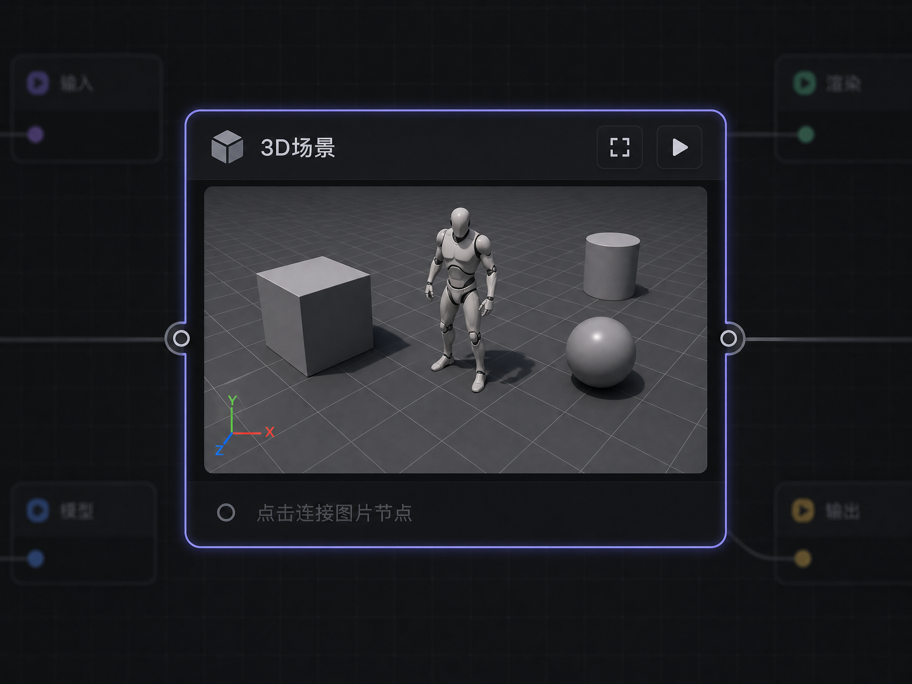

# 3D 场景编辑器节点 — 需求文档

## 1. 概述

在 Nomi 生成画布（generationCanvasV2）中新增「3D 场景编辑器」节点类型（kind: `scene3d`）。

**核心工作流**：用户在画布上创建 3D 节点 → 点击全屏按钮进入沉浸式 3D 编辑器 → 在场景中摆放模型、设置相机 → 截图输出 → 截图结果自动创建一个连接的图片节点显示在画布上。

**设计原则**：
- 节点在画布上仅显示静态缩略图/占位元素，全屏后才启动 WebGL 渲染，保证画布性能
- 每个 3D 节点独立维护自己的场景状态（序列化到 `node.meta`），关闭后重新打开可恢复上次场景
- 相机控制采用双模式：编辑模式（OrbitControls 环绕）+ 飞行模式（PointerLock + WASD 自由移动）

---

### 1.1 当前实现状态（2026-05-22）

> 本节用于记录需求文档与当前代码实现的同步状态，避免后续开发误判进度。

| 模块 | 当前状态 | 备注 |
|------|----------|------|
| 节点注册与画布态 | 已完成 | `scene3d` 已注册到生成画布，默认尺寸 480×320，画布态只显示占位/缩略图，不启动 WebGL |
| 3D 依赖加载 | 已完成 | `Scene3DEditor`、`Scene3DFullscreen`、`three`、`@react-three/*` 已按需分包；工作区也改为当前 Tab 按需挂载 |
| 全屏编辑器 | 已完成 MVP | Portal 全屏、顶部工具栏、右侧对象/属性面板、底部添加栏已实现 |
| 编辑/飞行模式 | 已完成 | 使用 Tab 切换编辑/飞行；飞行模式使用 PointerLock + WASD，并通过 ref 提交相机状态，避免频繁 store 更新造成回退 |
| 基础对象 | 已完成 | 支持立方体、球体、圆柱体、平面、灯光、拍摄相机、GLB 假人 |
| 变换控制 | 已完成 | 支持移动/旋转/缩放 TransformControls |
| 场景状态持久化 | 已完成 | 通过 `node.meta.scene3dState` 保存对象、相机、环境和编辑相机状态 |
| 当前视口截图 | 已完成 | 截图后自动创建图片节点，并连接到 3D 节点 |
| 相机截图 | 已完成 | 选中拍摄相机后可按相机画幅输出截图；截图时会隐藏相机 Helper |
| 缩略图更新 | 已完成 | 截图成功后更新 3D 节点最近缩略图 |
| GLB/GLTF 导入 | 部分完成 | 内置假人已使用 `public/humanoid+figure+3d+model.glb`；用户自定义 GLB/GLTF 导入流程尚未完成 |
| 相机 PiP 实时预览 | 未完成 | 当前 PiP 只显示相机名称、画幅和截图入口，预览区域仍是占位 |
| 批量截图 | 未完成 | 尚未实现从所有相机一键截图 |
| 独立 undo/redo | 未完成 | 编辑器内部 undo/redo 栈仍在 Phase 4 |

**已处理的运行问题**：
- 画布滚轮缩放已改为原生 `{ passive: false }` wheel listener，避免 `Unable to preventDefault inside passive event listener invocation` 警告。
- 3D 全屏状态同步已加去重，避免 `Maximum update depth exceeded`。

---

## 2. 功能需求

### 2.1 节点画布态（缩略图模式）

| 功能 | 说明 |
|------|------|
| 占位显示 | 未截图时显示 3D 图标 + "点击进入 3D 编辑器" 提示文字 |
| 缩略图显示 | 截图后显示最近一次截图的静态图片 |
| 全屏入口 | 节点右上角提供全屏按钮（复用 `IconMaximize` 交互模式，参考 PanoramaViewer） |
| 节点尺寸 | 默认 480×320，支持拖拽调整 |

### 2.2 全屏 3D 编辑器

#### 2.2.1 场景视口（主区域）

| 功能 | 说明 |
|------|------|
| 3D 渲染画布 | 占据全屏弹窗的主体区域，使用 React Three Fiber `<Canvas>` 渲染 |
| 网格地面 | 默认显示无限网格（drei `<Grid>`），辅助空间定位 |
| 环境光照 | 默认提供 HDRI 环境光（drei `<Environment preset="city" />`） |
| 天空盒 | 可选开启天空背景 |
| 坐标轴辅助 | 左下角显示 XYZ 坐标轴指示器 |

#### 2.2.2 相机控制（双模式切换）

提供两种互补的相机控制模式，用户可随时切换：

**编辑模式（默认）** — 适合精细操作

| 操作 | 行为 |
|------|------|
| 左键拖动 | 环绕旋转（OrbitControls） |
| 中键拖动 | 平移视角 |
| 鼠标滚轮 | 缩放 |
| 左键点击物体 | 选中物体，显示 TransformControls |
| 右键按住 + 移动 | 临时自由视角旋转（松开恢复） |

**飞行模式** — 适合浏览大场景（F 键锁定进入，右键按住为临时旋转）

| 操作 | 行为 |
|------|------|
| 鼠标移动（右键按住时） | 控制相机朝向（Yaw/Pitch 旋转） |
| W / ↑ | 相机向前移动 |
| S / ↓ | 相机向后移动 |
| A / ← | 相机向左平移 |
| D / → | 相机向右平移 |
| Space | 相机上升 |
| Shift | 相机下降 |
| 鼠标滚轮 | 调整移动速度 |

**模式切换逻辑**：
- 默认处于编辑模式，鼠标自由操作
- 按住右键 + 移动鼠标 = 自由视角旋转（自定义实现，不使用 PointerLock），松开右键回到编辑模式
- 按 F 键可锁定切换到飞行模式（PointerLock），按 ESC 退回编辑模式
- 飞行模式下 WASD 移动才生效
- 状态栏显示当前模式指示

**技术实现**：编辑模式使用 drei `OrbitControls`（右键平移已禁用，改为自由旋转）；飞行模式使用 `PointerLockControls` + `KeyboardControls` 组合。两者通过状态切换互斥激活。按住右键的临时旋转通过自定义 `onPointerDown`/`onPointerMove` 实现，不依赖 PointerLock API。

#### 2.2.3 场景相机（拍摄用，多相机）

支持在场景中放置**多个**拍摄相机，从不同角度快速截图。

| 功能 | 说明 |
|------|------|
| 添加相机 | 用户可在场景中放置多个"拍摄相机"对象，每个独立命名 |
| 相机可视化 | 场景中以线框锥体（Camera Helper）显示相机视锥 |
| 画幅比例设置 | 每个相机独立设置输出比例：16:9、9:16、4:3、3:4、1:1 |
| 相机预览 | 选中相机时，视口右上角显示该相机的实时画面预览（Picture-in-Picture） |
| 相机截图 | 从选中相机的视角进行截图输出 |
| 批量截图 | 支持一键从所有相机截图，批量创建图片节点 |

**重要规则：相机截图时不渲染其他相机对象**。即使其他相机的 Helper 线框在当前相机视野内，截图输出中也不会包含任何相机辅助线框。实现方式：截图前将所有 CameraHelper 对象设为 `visible = false`，截图完成后恢复。

#### 2.2.4 模型管理

| 功能 | 说明 |
|------|------|
| 导入模型 | 支持拖拽或文件选择导入 GLB/GLTF 格式模型 |
| 模型变换 | 选中模型后显示 TransformControls（平移/旋转/缩放切换） |
| 基础几何体 | 提供快速添加：立方体、球体、圆柱体、平面 |
| 预制假人模型 | 提供内置的人形假人（Mannequin），用于场景比例参考和角色占位 |
| 模型列表 | 右侧面板显示场景中所有对象的树形列表 |

**预制假人模型说明**：

| 属性 | 说明 |
|------|------|
| 外观 | 简化人形模型（类似木偶人/Mannequin），T-pose 站姿，无面部细节 |
| 比例 | 默认身高约 1.75m（场景单位），符合真实人体比例 |
| 颜色可修改 | 支持自定义假人颜色（默认中性灰色），通过属性面板修改 |
| 名称可修改 | 支持重命名（默认名称 "假人"），方便区分多个假人 |
| 多实例 | 可在场景中放置多个假人，每个独立设置颜色和名称 |
| 用途 | 作为角色占位、场景比例参考、构图辅助 |

**技术实现**：假人模型使用项目内置的 GLB 文件 `public/humanoid+figure+3d+model.glb`，通过 drei 的 `useGLTF` 加载，并使用 drei `Clone` 渲染实例。颜色修改通过 `Clone` 的 `inject` 为 mesh 注入独立 `MeshStandardMaterial` 实现，确保多个假人可以设置不同颜色互不影响。

#### 2.2.5 场景节点列表（右侧面板）

| 功能 | 说明 |
|------|------|
| 树形结构 | 显示场景中所有对象（模型、相机、灯光）的层级关系 |
| 选中聚焦 | 点击列表中的节点，视口相机快速飞行聚焦到该对象 |
| 可见性切换 | 每个节点旁提供眼睛图标，切换显示/隐藏 |
| 重命名 | 双击节点名称可重命名 |

#### 2.2.6 属性面板（右侧面板下半部分）

选中对象时显示其可编辑属性，实时生效：

| 对象类型 | 显示属性 |
|---------|---------|
| 通用 | 名称、位置 XYZ、旋转 XYZ、缩放 XYZ、可见性 |
| mesh（几何体） | 通用 + 颜色 |
| mannequin（假人） | 通用 + 颜色 |
| model（导入模型） | 通用 + 模型文件路径（只读） |
| light（灯光） | 通用 + 灯光类型、颜色、强度 |
| camera（相机） | 通用 + FOV、画幅比例、近/远裁剪面 |

属性输入使用数字输入框（支持拖拽调整值），颜色使用颜色选择器。

#### 2.2.7 工具栏

| 位置 | 功能 |
|------|------|
| 顶部左侧 | 变换模式切换（移动 / 旋转 / 缩放）、坐标系切换（世界 / 局部） |
| 顶部右侧 | 截图按钮、设置按钮、关闭按钮 |
| 底部 | 添加对象菜单（几何体、假人、相机、灯光、导入模型） |

#### 2.2.8 截图输出

| 功能 | 说明 |
|------|------|
| 当前视口截图 | 截取编辑视口当前画面 |
| 相机视角截图 | 从选中的拍摄相机视角截图，按设定比例输出 |
| 输出行为 | 截图后自动在画布上创建一个新的图片节点，并与当前 3D 节点建立连接边（edge mode: `reference`） |
| 图片格式 | PNG，分辨率跟随相机比例设置（默认 1920px 宽） |

**截图输出完整数据流**：

```
截图触发
  → gl.render() 渲染到离屏 RenderTarget
  → 导出为 PNG DataURL
  → 写入文件: project/assets/screenshots/scene3d-{nodeId}-{timestamp}.png
  → 调用 store.addNode() 创建图片节点:
      kind: 'image'
      title: '3D截图 - {相机名称}'
      position: { x: 当前3D节点.x + 节点宽度 + 60, y: 当前3D节点.y }
      status: 'success'
      result: { id: nanoid(), type: 'image', url: 文件路径, createdAt: Date.now() }
      history: [result]
  → 调用 store.connectNodes() 创建连接边:
      source: scene3d 节点 ID
      target: newNode.id（addNode 返回值）
      mode: 'reference'
  → 更新 3D 节点 meta.scene3dState.lastThumbnail = 缩略图路径
```

**多次截图行为**：每次截图都创建新的图片节点（不覆盖已有节点），方便用户对比不同角度的截图。

---

## 3. 技术方案

### 3.1 技术选型

| 用途 | 库 | 版本建议 |
|------|-----|---------|
| React 3D 渲染 | `@react-three/fiber` | ^8.x |
| 场景工具集 | `@react-three/drei` | ^9.x |
| 底层引擎 | `three` | ^0.170.x (peer dep) |
| 模型加载 | drei `useGLTF` | 内置 |
| 键盘控制 | drei `KeyboardControls` | 内置 |

### 3.2 节点注册

在 `registry.ts` 中新增插件定义：

```typescript
{
  kind: 'scene3d',
  label: '3D Scene',
  menuLabel: '3D场景',
  component: loadBaseGenerationNode,  // 复用 BaseGenerationNode 壳，内部根据 kind 渲染 3D 缩略图
  icon: 'scene3d',
  defaultTitle: '3D场景',
  defaultSize: { width: 480, height: 320 },
  catalogKind: 'text',       // 不参与 AI 生成计费，与 shot/output 一致
  // executionKind 不设置 — 3D 节点的截图是本地操作，不走 AI 生成管线
  quickAdd: true,
  agentCreatable: false,
  providesImageReference: true,
  promptPlaceholder: '在3D场景中摆放模型并截图...',
}
```

需同步扩展：
- `registry.ts` 中 `GenerationNodeIconKey` 联合类型添加 `'scene3d'`（手动添加，这是手写的联合类型）
- `renderRegistry.tsx` 中 `NODE_ICONS` 映射添加 `scene3d: IconCube`（来自 `@tabler/icons-react`）
- `GENERATION_NODE_PLUGINS` 数组添加新插件定义（`GenerationNodeKind` 会自动从数组推导，无需手动修改）

**组件架构说明**：复用 `BaseGenerationNode` 作为节点外壳（标题栏、状态指示、连接点等），内部根据 `node.kind === 'scene3d'` 渲染 3D 缩略图组件（参考 PanoramaViewer 的嵌入模式）。全屏 3D 编辑器通过 Portal 独立渲染到 `document.body`，与节点壳解耦。

### 3.3 场景状态持久化

场景数据序列化到 `node.meta.scene3dState`，结构如下：

```typescript
type Scene3DState = {
  // 场景对象列表
  objects: Scene3DObject[]
  // 拍摄相机列表
  cameras: Scene3DCamera[]
  // 环境设置
  environment: {
    preset: string        // HDRI 预设名
    showGrid: boolean
    showAxes: boolean
    backgroundColor: string
  }
  // 编辑相机位置（恢复上次视角）
  editorCamera: {
    position: [number, number, number]
    target: [number, number, number]   // OrbitControls 观察目标点（编辑模式用）
    rotation: [number, number, number] // 相机欧拉角（飞行模式用）
    mode: 'edit' | 'fly'               // 上次使用的控制模式
  }
  // 最近截图缩略图（存储为文件相对路径，非 base64）
  lastThumbnail?: string  // 如 'assets/thumbnails/scene3d-{nodeId}.jpg'
}

type Scene3DObject = {
  id: string
  name: string
  type: 'mesh' | 'model' | 'light' | 'group' | 'mannequin'
  visible: boolean
  position: [number, number, number]
  rotation: [number, number, number]
  scale: [number, number, number]
  parentId?: string             // 父对象 ID，用于树形结构
  color?: string                // 通用颜色（mesh、mannequin 使用），默认 '#808080'
  // mesh 类型的几何体参数
  geometry?: 'box' | 'sphere' | 'cylinder' | 'plane'
  // model 类型的资源路径（用户导入的模型）
  modelUrl?: string
  // mannequin 类型使用内置模型 public/humanoid+figure+3d+model.glb，不需要 modelUrl 字段
  // light 类型的参数
  lightType?: 'point' | 'directional' | 'spot'
  lightColor?: string
  lightIntensity?: number
  children?: string[]  // 子对象 ID
}

type Scene3DCamera = {
  id: string
  name: string
  visible: boolean              // 控制 CameraHelper 线框是否显示
  position: [number, number, number]
  rotation: [number, number, number]
  fov: number
  aspectRatio: '16:9' | '9:16' | '4:3' | '3:4' | '1:1'
  near: number
  far: number
}
```

### 3.4 组件架构

当前实现采用较扁平的 MVP 结构，多个子模块暂时合并在 `Scene3DFullscreen.tsx` 内：

```
nodes/
  Scene3DEditor.tsx              -- 节点组件入口（缩略图 + 全屏触发 + 截图落盘/创建图片节点）
  scene3d/
    Scene3DFullscreen.tsx        -- 全屏编辑器、R3F Canvas、控制器、对象列表、属性面板、截图绑定
    scene3dSerializer.ts         -- 场景序列化/反序列化
    scene3dScreenshot.ts         -- 截图持久化到项目资产
    scene3dTypes.ts              -- 3D 场景类型定义
```

目标拆分结构如下，后续在功能继续扩展时可逐步拆出：

```
nodes/
  Scene3DEditor.tsx          -- 节点组件入口（缩略图 + 全屏触发）
  scene3d/
    Scene3DFullscreen.tsx    -- 全屏编辑器容器（Portal 到 document.body）
    Scene3DCanvas.tsx        -- R3F Canvas 包装
    Scene3DViewport.tsx      -- 主视口（渲染场景 + 编辑相机）
    Scene3DControls.tsx      -- 双模式相机控制器（OrbitControls + PointerLock + WASD）
    Scene3DToolbar.tsx       -- 顶部工具栏
    Scene3DObjectPanel.tsx   -- 右侧场景节点列表
    Scene3DPropertyPanel.tsx -- 右侧属性面板（位置/旋转/缩放/颜色等）
    Scene3DAddMenu.tsx       -- 底部添加对象菜单
    Scene3DCameraPreview.tsx -- 相机 PiP 预览
    Scene3DTransform.tsx     -- TransformControls 封装
    scene3dStore.ts          -- 编辑器内部 Zustand store
    scene3dSerializer.ts     -- 场景序列化/反序列化
    scene3dScreenshot.ts     -- 截图逻辑（gl.toDataURL）
```

### 3.5 性能策略

| 策略 | 说明 |
|------|------|
| 懒加载 | 3D 相关依赖通过动态 import 加载，不影响主 bundle |
| 按需渲染 | 全屏时才创建 Canvas，关闭时销毁 WebGL 上下文 |
| Vite 分包 | 在 vite.config 中将 `three`、`@react-three/*` 拆为独立 chunk |
| 工作区分包 | 创作/生成/预览工作区按当前 Tab 加载，访问过后复用模块缓存 |
| 帧率控制 | 待完成：编辑器空闲时降低渲染帧率（`frameloop="demand"`） |
| 缩略图缓存 | 已完成：截图成功后将最近截图路径写入 meta，画布态直接显示静态图 |

### 3.6 截图实现

```typescript
// 核心截图逻辑 — 支持多相机，截图时隐藏所有 CameraHelper
function captureFromCamera(
  gl: THREE.WebGLRenderer,
  scene: THREE.Scene,
  camera: THREE.PerspectiveCamera,
  width: number,
  height: number,
  cameraHelpers: THREE.CameraHelper[],
): string {
  // 截图前隐藏所有相机辅助线框
  const helperVisibility = cameraHelpers.map(h => h.visible)
  cameraHelpers.forEach(h => { h.visible = false })

  // 创建离屏 RenderTarget（禁用 premultiplied alpha 避免半透明物体颜色偏差）
  const renderTarget = new THREE.WebGLRenderTarget(width, height, {
    format: THREE.RGBAFormat,
    type: THREE.UnsignedByteType,
    colorSpace: THREE.SRGBColorSpace,
  })
  
  gl.setRenderTarget(renderTarget)
  gl.render(scene, camera)
  gl.setRenderTarget(null)
  
  // 恢复 CameraHelper 可见性
  cameraHelpers.forEach((h, i) => { h.visible = helperVisibility[i] })
  
  // 读取像素并转为 DataURL
  const buffer = new Uint8Array(width * height * 4)
  gl.readRenderTargetPixels(renderTarget, 0, 0, width, height, buffer)
  
  const canvas = document.createElement('canvas')
  canvas.width = width
  canvas.height = height
  const ctx = canvas.getContext('2d')!
  const imageData = ctx.createImageData(width, height)
  // WebGL Y轴翻转
  for (let y = 0; y < height; y++) {
    const srcRow = (height - y - 1) * width * 4
    const dstRow = y * width * 4
    imageData.data.set(buffer.slice(srcRow, srcRow + width * 4), dstRow)
  }
  ctx.putImageData(imageData, 0, 0)
  
  renderTarget.dispose()
  return canvas.toDataURL('image/png')
}
```

### 3.7 双模式相机控制器实现方案

编辑模式使用 OrbitControls，飞行模式使用 PointerLockControls + KeyboardControls：

```tsx
import { KeyboardControls, PointerLockControls, OrbitControls } from '@react-three/drei'
import { useFrame, useThree } from '@react-three/fiber'
import { useKeyboardControls } from '@react-three/drei'
import * as THREE from 'three'
import { useState, useRef } from 'react'

// 键位映射
const EDITOR_KEY_MAP = [
  { name: 'forward', keys: ['KeyW', 'ArrowUp'] },
  { name: 'backward', keys: ['KeyS', 'ArrowDown'] },
  { name: 'left', keys: ['KeyA', 'ArrowLeft'] },
  { name: 'right', keys: ['KeyD', 'ArrowRight'] },
  { name: 'up', keys: ['Space'] },
  { name: 'down', keys: ['ShiftLeft', 'ShiftRight'] },
]

type CameraMode = 'edit' | 'fly'

function DualModeControls({ speed = 5 }) {
  const { camera } = useThree()
  const [mode, setMode] = useState<CameraMode>('edit')
  const [, getKeys] = useKeyboardControls()
  const direction = useRef(new THREE.Vector3())
  const orbitRef = useRef<any>(null)
  const pointerLockRef = useRef<any>(null)

  // 飞行模式下的 WASD 移动
  useFrame((_, delta) => {
    if (mode !== 'fly') return
    const { forward, backward, left, right, up, down } = getKeys()
    const dir = direction.current.set(0, 0, 0)
    
    if (forward) dir.z -= 1
    if (backward) dir.z += 1
    if (left) dir.x -= 1
    if (right) dir.x += 1
    if (up) dir.y += 1
    if (down) dir.y -= 1
    
    if (dir.lengthSq() > 0) {
      dir.normalize().multiplyScalar(speed * delta)
      dir.applyQuaternion(camera.quaternion)
      camera.position.add(dir)
    }
  })

  return (
    <>
      {/* 编辑模式：OrbitControls（左键旋转、中键平移、右键禁用交给自定义旋转） */}
      <OrbitControls
        ref={orbitRef}
        enabled={mode === 'edit'}
        makeDefault={mode === 'edit'}
        enableDamping
        dampingFactor={0.1}
        mouseButtons={{ LEFT: THREE.MOUSE.ROTATE, MIDDLE: THREE.MOUSE.PAN, RIGHT: null }}
      />
      {/* 飞行模式：PointerLockControls（按 F 键触发 lock()，ESC 自动 unlock） */}
      <PointerLockControls
        ref={pointerLockRef}
        onLock={() => setMode('fly')}
        onUnlock={() => setMode('edit')}
      />
      {/* 注意：右键按住临时旋转通过 Canvas 外层 onPointerDown/Move 自定义实现 */}
      {/* 注意：F 键切换通过 useEffect 监听 keydown 'KeyF' 调用 pointerLockRef.current.lock() */}
    </>
  )
}
```

---

### 3.8 模型文件生命周期管理

```typescript
// 模型文件存储路径规范
// 项目根路径通过 Electron IPC 获取（参考 assetImportAdapter.ts）
const MODEL_DIR = 'assets/models'
const THUMBNAIL_DIR = 'assets/thumbnails'
const SCREENSHOT_DIR = 'assets/screenshots'

// 导入模型时的处理流程
async function importModel(sourcePath: string, projectRoot: string): Promise<string> {
  const fileName = `${nanoid()}-${path.basename(sourcePath)}`
  const destPath = path.join(projectRoot, MODEL_DIR, fileName)
  
  // 检查文件大小（限制 50MB）
  const stats = await fs.stat(sourcePath)
  if (stats.size > 50 * 1024 * 1024) {
    throw new Error('模型文件超过 50MB 限制')
  }
  
  // 复制到项目目录
  await fs.copyFile(sourcePath, destPath)
  return `${MODEL_DIR}/${fileName}`  // 返回相对路径存入 meta
}

// 删除 3D 节点时清理关联资源
function cleanupScene3DAssets(nodeId: string, scene3dState: Scene3DState, projectRoot: string) {
  // 清理模型文件（仅清理未被其他节点引用的）
  // 清理缩略图
  // 清理截图文件
}
```

**去重策略**：导入时计算文件 MD5，如果项目中已存在相同 hash 的模型文件，直接复用路径而不重复复制。

**清理规则**：仅清理 `modelUrl` 字段非空且路径前缀为 `assets/models/` 的用户导入模型。内置资源（假人模型 `public/humanoid+figure+3d+model.glb`）不参与清理。

---

### 3.9 错误处理

| 场景 | 处理方式 |
|------|---------|
| WebGL 上下文创建失败 | 显示降级提示："当前设备不支持 3D 渲染，请检查 GPU 驱动"，节点保持缩略图态 |
| 模型文件加载失败 | 在场景中显示红色占位方块 + 错误提示，不阻塞其他对象渲染 |
| 模型文件过大（>50MB） | 导入时拦截，弹出提示建议压缩模型 |
| 场景对象数量上限 | 限制单场景最多 100 个对象，达到上限时禁用添加按钮并提示 |
| 截图失败 | Toast 提示"截图失败，请重试"，不创建空图片节点 |
| 场景状态反序列化失败 | 回退到空场景，Toast 提示"场景数据损坏，已重置" |

### 3.10 键盘事件隔离

全屏编辑器通过 Portal 渲染到 `document.body`，并在容器层拦截所有键盘事件：

```tsx
// 防止 WASD/Space/Shift 等键冒泡到画布层
<div
  onKeyDown={(e) => e.stopPropagation()}
  onKeyUp={(e) => e.stopPropagation()}
  onPointerDown={(e) => e.stopPropagation()}
  tabIndex={0}  // 确保可聚焦以接收键盘事件
>
  <KeyboardControls map={EDITOR_KEY_MAP}>
    <Canvas>...</Canvas>
  </KeyboardControls>
</div>
```

---

## 4. UI 布局设计

### 4.1 全屏编辑器布局

```
┌─────────────────────────────────────────────────────────────────┐
│  工具栏：[移动|旋转|缩放] [世界|局部]          [截图] [设置] [✕] │
├─────────────────────────────────────────────────┬───────────────┤
│                                                 │  场景节点列表  │
│                                                 │               │
│                                                 │  ▸ 场景       │
│                                                 │    ├ 立方体   │
│              3D 视口（主渲染区域）                │    ├ 角色模型 │
│                                                 │    ├ 地面     │
│                                                 │    ├ 点光源   │
│                                                 │    └ 相机1    │
│                                                 │               │
│                                    ┌─────────┐  │───────────────│
│                                    │相机预览  │  │  属性面板     │
│                                    │(PiP)    │  │  (选中对象时)  │
│                                    └─────────┘  │               │
├─────────────────────────────────────────────────┴───────────────┤
│  添加菜单：[+ 立方体] [+ 球体] [+ 假人] [+ 相机] [+ 灯光] [+ 导入模型]│
└─────────────────────────────────────────────────────────────────┘
```

### 4.2 节点画布态



```
┌──────────────────────────────┐
│  3D场景          [⛶] [▶]    │  ← 标题栏 + 全屏/运行按钮
├──────────────────────────────┤
│                              │
│     [3D 缩略图 / 占位图]     │  ← 静态图片，不启动 WebGL
│                              │
├──────────────────────────────┤
│  ○ 输出 → 图片节点           │  ← 连接指示
└──────────────────────────────┘
```

### 4.3 相机 PiP 预览

选中场景中的拍摄相机时，视口右上角浮现 PiP 预览窗口：
- 窗口尺寸约 240×135px，带半透明边框
- 顶部显示相机名称和画幅比例（如 "相机1 · 16:9"）
- 右上角提供截图按钮
- 下方显示画幅比例切换按钮组：[16:9] [9:16] [4:3] [1:1]
- 预览内容实时跟随相机位置/朝向更新

---

## 5. 交互流程

### 5.1 创建与编辑流程

```
用户点击画布工具栏 "+" → 选择 "3D场景"
    → 画布上创建 scene3d 节点（显示占位图）
    → 用户点击全屏按钮
    → 打开全屏 3D 编辑器（Portal 覆盖层）
    → 用户操作：导入模型、摆放位置、设置相机
    → 用户点击截图
    → 系统从相机视角渲染截图
    → 自动创建图片节点 + 连接边
    → 缩略图更新到 3D 节点的画布态显示
    → 用户按 ESC 或点击关闭按钮退出编辑器
```

### 5.2 相机预览交互

```
用户在场景节点列表中选中 "相机1"
    → 视口右上角出现 PiP 预览窗口（约 240×135px）
    → 预览窗口实时显示该相机视角画面
    → 用户可拖动相机的 TransformControls 调整位置
    → PiP 画面实时更新
    → 用户点击 PiP 上的截图按钮 → 输出该相机视角截图
```

### 5.3 聚焦交互

```
用户在场景节点列表中双击某个对象
    → 编辑相机平滑飞行到该对象附近
    → 对象居中显示在视口中
    → 自动选中该对象，显示 TransformControls
```

---

## 6. 数据流

```
┌─────────────┐     meta.scene3dState      ┌──────────────────┐
│  Canvas     │ ◄──────────────────────────► │  scene3dStore    │
│  Node Store │     (序列化/反序列化)         │  (编辑器内部)     │
└─────────────┘                             └──────────────────┘
                                                     │
                                                     │ 截图
                                                     ▼
                                            ┌──────────────────┐
                                            │  store:          │
                                            │  addNode()       │
                                            │  connectNodes()  │
                                            └──────────────────┘
                                                     │
                                                     ▼
                                            ┌──────────────────┐
                                            │  新图片节点       │
                                            │  (result.url =   │
                                            │   screenshot)    │
                                            └──────────────────┘
```

---

## 7. 非功能需求

| 维度 | 要求 |
|------|------|
| 性能 | 画布上有多个 3D 节点时不能影响画布流畅度（仅全屏时渲染） |
| 内存 | 关闭编辑器后释放 WebGL 上下文和 GPU 资源 |
| 包体积 | Three.js 相关代码独立分包，不影响首屏加载 |
| 兼容性 | 需要 WebGL2 支持（Electron 31 内置 Chromium 支持） |
| 持久化 | 场景状态随项目保存/加载，模型文件存储在项目资源目录 |
| 模型格式 | 仅支持 GLB/GLTF（业界标准，drei 原生支持） |
| 模型存储 | 导入的模型文件复制到项目本地目录 `project/assets/models/`，meta 中存相对路径 |

---

## 8. 开发分期建议

### Phase 1 — 基础框架（MVP）
- [x] 节点注册（kind、icon、component）
- [x] 全屏编辑器骨架（Canvas + Grid + 环境光）
- [x] 双模式相机控制（编辑模式 OrbitControls + 飞行模式 WASD）
- [x] 基础几何体添加（Box、Sphere、Cylinder、Plane）
- [x] 预制假人模型（使用 `public/humanoid+figure+3d+model.glb`，支持修改颜色和名称）
- [x] TransformControls（移动/旋转/缩放）
- [x] 场景状态持久化（保存/恢复，关闭后重新打开可恢复上次场景）
- [x] 当前视口截图 → 创建图片节点

### Phase 2 — 相机系统与场景面板
- [x] 场景节点列表面板（基础列表、选中、聚焦、可见性切换；树形层级待完善）
- [x] 属性面板（选中对象时显示可编辑属性）
- [x] 场景相机对象添加与可视化
- [x] 相机画幅比例设置
- [ ] 相机 PiP 实时预览（当前为占位预览）
- [x] 相机视角截图输出

### Phase 3 — 模型导入与交互完善
- [ ] 用户 GLB/GLTF 模型导入（文件选择 + 拖拽；内置假人 GLB 已接入）
- [ ] 选中聚焦飞行（当前已支持聚焦，但不是平滑飞行）
- [x] 对象重命名
- [ ] 批量截图（一键从所有相机截图）

### Phase 4 — 完善与优化
- [ ] 编辑器内部独立 undo/redo 栈（与画布 history 完全独立，关闭编辑器后清空）
- [x] 编辑器环境设置（网格、坐标轴、天空盒、背景色；独立设置弹窗未做）
- [x] 灯光对象管理（添加灯光、类型、颜色、强度）
- [ ] 性能优化（资源释放已随全屏卸载完成；`frameloop="demand"` 待完成）
- [x] 缩略图自动更新（截图成功后更新最近缩略图）

---

## 9. 已确认决策

| 决策项 | 结论 |
|--------|------|
| 相机控制模式 | 双模式切换：编辑模式（OrbitControls）+ 飞行模式（PointerLock + WASD） |
| 模型文件存储 | 本地项目目录（`project/assets/models/`），离线可用 |
| 相机数量 | 支持多相机，截图时不渲染其他相机的 Helper 线框 |
| 撤销/重做 | Phase 1 不做，Phase 4 加入编辑器内部独立 undo 栈 |

---

## 10. 参考资料

- [React Three Fiber 文档](https://docs.pmnd.rs/react-three-fiber)
- [Drei 工具集文档](https://github.com/pmndrs/drei)
- [Three.js 官方文档](https://threejs.org/docs/)
- 项目内参考：`PanoramaViewer.tsx`（全屏弹窗 + 截图模式）
- 项目内参考：`registry.ts`（节点插件注册模式）
